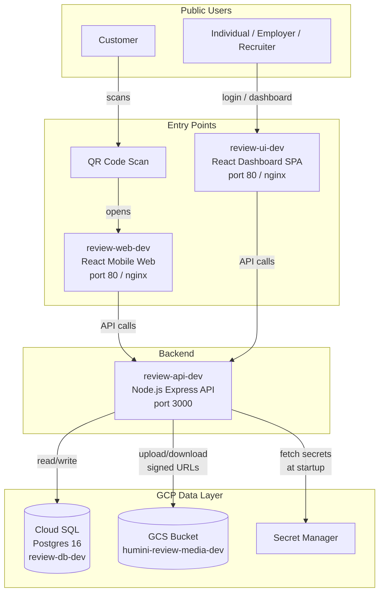

# Review App - Deployment Guide

**Project:** review-app (Portable Individual Review/Reputation App)
**GCP Project:** humini-review (Project ID: `humini-review`, Number: `1049089489429`)
**Region:** asia-southeast1 (Singapore)
**Last Updated:** 2026-04-14

---

## 1. Architecture Overview

### System Architecture



### Request Flow: Customer Review Submission

```
Customer scans QR Code
  -> review-web-dev (React mobile-first SPA)
    -> POST /api/v1/verification/initiate (phone + OTP)
    -> POST /api/v1/verification/verify-otp
    -> POST /api/v1/reviews (quality picks + thumbs up + optional media)
      -> review-api-dev validates review token
      -> Stores review in Cloud SQL (review-db-dev)
      -> Uploads media to GCS (humini-review-media-dev)
      -> Returns confirmation
```

### Request Flow: Dashboard Users

```
Individual / Employer / Recruiter opens dashboard
  -> review-ui-dev (React desktop SPA)
    -> POST /api/v1/auth/login (Firebase Auth)
    -> GET /api/v1/profiles/me, GET /api/v1/reviews/profile/:id, etc.
      -> review-api-dev authenticates JWT, checks RBAC role
      -> Queries Cloud SQL
      -> Returns data
```

---

## 2. GCP Resources Inventory

### Cloud Run Services

| Service | Type | Port | Image Base | Description |
|---------|------|------|------------|-------------|
| `review-api-dev` | Cloud Run Service | 3000 | `node:23-alpine` | Node.js Express API backend |
| `review-web-dev` | Cloud Run Service | 80 | `nginx:alpine` | React mobile web for QR review flow |
| `review-ui-dev` | Cloud Run Service | 80 | `nginx:alpine` | React dashboard SPA for individuals, employers, recruiters |

### Cloud SQL

| Property | Value |
|----------|-------|
| Instance Name | `review-db-dev` |
| Engine | PostgreSQL 16 |
| Tier | `db-f1-micro` |
| Public IP | `35.185.181.255` |
| Connection Name | `humini-review:asia-southeast1:review-db-dev` |
| Database | `dev_review_db` |
| User | `review_user` |
| Region | `asia-southeast1` |

### Artifact Registry

| Property | Value |
|----------|-------|
| Repository | `review-apps` |
| Format | Docker |
| Region | `asia-southeast1` |
| Full Path | `asia-southeast1-docker.pkg.dev/humini-review/review-apps/` |

### Cloud Storage

| Property | Value |
|----------|-------|
| Bucket Name | `humini-review-media-dev` |
| Location | `asia-southeast1` |
| Access | Private (signed URLs only) |
| Structure | `qr-codes/`, `voice/`, `video/`, `avatars/`, `tmp/` |

### Full Resource Summary

| Resource | Name | Type | Region | Connection/Path |
|----------|------|------|--------|-----------------|
| GCP Project | `humini-review` | Project | -- | ID: `humini-review`, Number: `1049089489429` |
| Cloud SQL | `review-db-dev` | PostgreSQL 16 | `asia-southeast1` | `humini-review:asia-southeast1:review-db-dev` |
| GCS Bucket | `humini-review-media-dev` | Cloud Storage | `asia-southeast1` | `gs://humini-review-media-dev` |
| Artifact Registry | `review-apps` | Docker Registry | `asia-southeast1` | `asia-southeast1-docker.pkg.dev/humini-review/review-apps/` |
| API Service | `review-api-dev` | Cloud Run | `asia-southeast1` | Port 3000 |
| Web Service | `review-web-dev` | Cloud Run | `asia-southeast1` | Port 80 |
| UI Service | `review-ui-dev` | Cloud Run | `asia-southeast1` | Port 80 |

---

## 3. Secret Manager

### Secrets Stored

| Secret Name | Description |
|-------------|-------------|
| `review-jwt-secret` | HS256 signing key for custom JWTs |
| `review-db-password` | Cloud SQL database password for `review_user` |
| `review-db-host` | Cloud SQL host / connection path |
| `review-db-name` | Database name (`dev_review_db`) |
| `review-db-user` | Database username (`review_user`) |
| `review-stripe-secret` | Stripe API secret key |
| `review-stripe-webhook-secret` | Stripe webhook endpoint signing secret |

### Reading Secrets

```bash
# List all secrets
gcloud secrets list --project=humini-review

# Read the latest version of a secret
gcloud secrets versions access latest --secret=review-jwt-secret --project=humini-review

# Read a specific version
gcloud secrets versions access 1 --secret=review-db-password --project=humini-review

# List all versions of a secret
gcloud secrets versions list review-jwt-secret --project=humini-review
```

### Updating Secrets

```bash
# Add a new version (previous versions are preserved)
echo -n "new-secret-value" | gcloud secrets versions add review-jwt-secret \
  --data-file=- \
  --project=humini-review

# Disable an old version (optional, prevents access but doesn't delete)
gcloud secrets versions disable 1 --secret=review-jwt-secret --project=humini-review
```

### How Secrets Are Injected into Cloud Run

Secrets are injected as environment variables at deploy time using Cloud Run's secret references. The Cloud Run service account must have the `roles/secretmanager.secretAccessor` role.

```bash
# Deploy with secret references (example for review-api-dev)
gcloud run deploy review-api-dev \
  --region=asia-southeast1 \
  --set-secrets="JWT_SECRET=review-jwt-secret:latest,\
POSTGRES_PASSWORD=review-db-password:latest,\
STRIPE_SECRET_KEY=review-stripe-secret:latest,\
STRIPE_WEBHOOK_SECRET=review-stripe-webhook-secret:latest"
```

Alternatively, secrets can be fetched at application startup using the `@google-cloud/secret-manager` SDK (see `src/shared/storage/secrets.ts`).

---

## 4. Local Development Setup

### Prerequisites

| Tool | Version | Install |
|------|---------|---------|
| Node.js | 23 | `nvm install 23 && nvm use 23` |
| Docker | Latest | [Docker Desktop](https://www.docker.com/products/docker-desktop/) or Colima |
| gcloud CLI | Latest | `brew install google-cloud-sdk` |
| Git | Latest | `brew install git` |

### Clone the Repository

```bash
git clone <repo-url> review-app
cd review-app/apps/api
```

### Start Local Postgres with Docker Compose

The project includes a `docker-compose.yaml` at `apps/api/` that runs Postgres 16 on port **6132** (mapped from container port 5432).

```bash
cd apps/api

# Start Postgres
docker compose up -d postgres

# Verify it's running
docker compose ps
# Should show review-db as "healthy"
```

### Install Dependencies

```bash
npm ci
```

### Configure Environment Variables

```bash
# Copy the example env file
cp .env.example .env

# Edit .env with local values (key differences from example):
#   POSTGRES_HOST=localhost
#   POSTGRES_PORT=6132          # Docker maps 6132 -> 5432
#   POSTGRES_DB=review_app
#   POSTGRES_USER=review_user
#   POSTGRES_PASSWORD=changeme
#   SMS_PROVIDER=mock
```

**`.env` vs `.env.dev`:**
- `.env` -- used for local development. Loaded by `tsx --env-file=.env`. Never committed to git.
- `.env.example` -- template with all required variables and safe defaults. Committed to git.
- Staging/production environments do NOT use `.env` files. All configuration is injected via Cloud Run environment variables and Secret Manager.

### Run Migrations and Seed Data

```bash
# Run all pending migrations
npm run db:migrate

# Seed initial data (qualities + subscription tiers)
npm run db:seed

# Verify migration status
npm run db:migrate:status
```

### Start the Development Server

```bash
npm run dev
```

The API will start on `http://localhost:3000` with hot reload enabled via `tsx watch`.

Verify it is running:

```bash
curl http://localhost:3000/health
# Should return: {"status":"healthy", ...}
```

### API Documentation

Swagger UI is available at `http://localhost:3000/api-docs` when the server is running.

---

## 5. Deployment with deploy.js

The project uses a deployment script to build, tag, push Docker images, and deploy to Cloud Run.

### Prerequisites

```bash
# Authenticate with GCP
gcloud auth login
gcloud config set project humini-review

# Configure Docker for Artifact Registry
gcloud auth configure-docker asia-southeast1-docker.pkg.dev --quiet
```

### Usage

```bash
node deploy.js <service> <env>
```

| Argument | Values | Description |
|----------|--------|-------------|
| `<service>` | `api`, `web`, `ui`, `all` | Which service to deploy |
| `<env>` | `dev`, `staging`, `prod` | Target environment |

### What Each Step Does

1. **Build** -- Builds the Docker image from the service's Dockerfile
2. **Tag** -- Tags the image with the git SHA and `latest` for the target environment
3. **Push** -- Pushes the tagged image to Artifact Registry (`asia-southeast1-docker.pkg.dev/humini-review/review-apps/`)
4. **Deploy** -- Deploys the new image to the Cloud Run service with the correct environment configuration

### Example Commands

```bash
# Deploy API to dev
node deploy.js api dev

# Deploy web (customer-facing React app) to dev
node deploy.js web dev

# Deploy UI (dashboard SPA) to dev
node deploy.js ui dev

# Deploy all three services to dev
node deploy.js all dev
```

### Manual Deployment (Without deploy.js)

If you need to deploy manually, here are the individual steps for the API service:

```bash
# 1. Build the Docker image
docker build -t review-api:latest apps/api

# 2. Tag for Artifact Registry
IMAGE="asia-southeast1-docker.pkg.dev/humini-review/review-apps/api:$(git rev-parse --short HEAD)"
docker tag review-api:latest "$IMAGE"

# 3. Push to Artifact Registry
docker push "$IMAGE"

# 4. Deploy to Cloud Run
gcloud run deploy review-api-dev \
  --image="$IMAGE" \
  --region=asia-southeast1 \
  --port=3000 \
  --allow-unauthenticated \
  --set-secrets="JWT_SECRET=review-jwt-secret:latest,\
POSTGRES_PASSWORD=review-db-password:latest" \
  --set-env-vars="NODE_ENV=production,PORT=3000"
```

For the frontend services (web, ui):

```bash
# Build and deploy review-web-dev
docker build -t review-web:latest apps/web
IMAGE_WEB="asia-southeast1-docker.pkg.dev/humini-review/review-apps/web:$(git rev-parse --short HEAD)"
docker tag review-web:latest "$IMAGE_WEB"
docker push "$IMAGE_WEB"
gcloud run deploy review-web-dev \
  --image="$IMAGE_WEB" \
  --region=asia-southeast1 \
  --port=80 \
  --allow-unauthenticated

# Build and deploy review-ui-dev
docker build -t review-ui:latest apps/ui
IMAGE_UI="asia-southeast1-docker.pkg.dev/humini-review/review-apps/ui:$(git rev-parse --short HEAD)"
docker tag review-ui:latest "$IMAGE_UI"
docker push "$IMAGE_UI"
gcloud run deploy review-ui-dev \
  --image="$IMAGE_UI" \
  --region=asia-southeast1 \
  --port=80 \
  --allow-unauthenticated
```

---

## 6. GitHub Actions CI/CD

### Workflow Overview

| Workflow | File | Trigger | Purpose |
|----------|------|---------|---------|
| CI | `ci.yml` | Push to `main`, PRs to `main` | Lint, type check, unit tests, integration tests, Docker build check |
| Deploy Staging | `deploy-staging.yml` | Manual trigger (`workflow_dispatch`) | Deploy all services to staging environment |
| Deploy Prod | `deploy-prod.yml` | Manual trigger with confirmation | Deploy all services to production with canary rollout |

### ci.yml -- Continuous Integration

Runs on every push to `main` and on pull requests targeting `main`.

**Jobs:**
1. **Lint & Type Check** -- `eslint src/ --max-warnings=0` and `tsc --noEmit`
2. **Unit Tests** -- `vitest run --coverage` with 80% minimum coverage threshold
3. **Integration Tests** -- Spins up a Postgres service container, runs migrations, executes integration test suite
4. **Docker Build Check** -- Verifies the Docker image builds successfully

### deploy-staging.yml -- Staging Deployment

Triggered manually via GitHub Actions UI (`workflow_dispatch`).

**Steps:**
1. Run CI checks (reuses `ci.yml`)
2. Authenticate with GCP using service account key
3. Build and push Docker image to Artifact Registry
4. Run database migrations via Cloud Run Job
5. Deploy new revision to Cloud Run
6. Run smoke tests (health check + public endpoint)

### deploy-prod.yml -- Production Deployment

Triggered manually via GitHub Actions UI or by pushing a `v*` git tag. Requires typing `deploy-prod` as confirmation.

**Steps:**
1. Validate confirmation input
2. Run CI checks
3. Build and push Docker image
4. Run database migrations
5. Deploy new revision with **no traffic** (canary)
6. Health check the new revision
7. If healthy: route 100% traffic to new revision
8. If unhealthy: keep traffic on previous revision (automatic rollback)

### Required GitHub Secrets

These secrets must be configured in **GitHub Repository Settings > Secrets and variables > Actions**.

| Secret | Description | Example Value |
|--------|-------------|---------------|
| `GCP_PROJECT_ID` | GCP project ID | `humini-review` |
| `GCP_SA_KEY` | Service account JSON key (base64 or raw JSON) | `{"type":"service_account",...}` |
| `CLOUDSQL_CONNECTION_NAME` | Cloud SQL instance connection name | `humini-review:asia-southeast1:review-db-dev` |
| `POSTGRES_PORT` | Database port | `5432` |
| `POSTGRES_DB` | Database name | `dev_review_db` |
| `POSTGRES_USER` | Database user | `review_user` |
| `POSTGRES_PASSWORD` | Database password | (from Secret Manager) |
| `JWT_SECRET` | JWT signing secret | (from Secret Manager) |
| `JWT_EXPIRATION_TIME_IN_MINUTES` | Token expiry in minutes | `60` |
| `FIREBASE_PROJECT_ID` | Firebase project ID | `humini-review` |
| `GCS_BUCKET_NAME` | GCS bucket name | `humini-review-media-dev` |
| `STRIPE_SECRET_KEY` | Stripe API secret key | `sk_test_...` |
| `STRIPE_WEBHOOK_SECRET` | Stripe webhook secret | `whsec_...` |
| `SMS_PROVIDER` | SMS provider | `mock` or `twilio` |
| `TWILIO_ACCOUNT_SID` | Twilio account SID | `AC...` |
| `TWILIO_AUTH_TOKEN` | Twilio auth token | (secret) |
| `TWILIO_PHONE_NUMBER` | Twilio sender number | `+1...` |
| `APP_BASE_URL` | Frontend base URL | `https://review-web-dev-xxx.run.app` |

### How to Set Up GitHub Secrets (Step by Step)

1. Go to your GitHub repository page
2. Click **Settings** > **Secrets and variables** > **Actions**
3. Click **New repository secret**
4. Enter the secret name (e.g., `GCP_PROJECT_ID`) and value (e.g., `humini-review`)
5. Click **Add secret**
6. Repeat for each secret listed above

For environment-specific secrets (staging vs production):

1. Go to **Settings** > **Environments**
2. Click **New environment** and create `staging` and `production`
3. Add environment-specific secrets under each environment
4. Optionally add required reviewers for the `production` environment

### How to Create a GCP Service Account for CI/CD

```bash
PROJECT_ID="humini-review"
SA_NAME="github-actions-deploy"

# 1. Create the service account
gcloud iam service-accounts create $SA_NAME \
  --display-name="GitHub Actions Deploy" \
  --project=$PROJECT_ID

SA_EMAIL="$SA_NAME@$PROJECT_ID.iam.gserviceaccount.com"

# 2. Grant required roles
gcloud projects add-iam-policy-binding $PROJECT_ID \
  --member="serviceAccount:$SA_EMAIL" \
  --role="roles/run.admin"

gcloud projects add-iam-policy-binding $PROJECT_ID \
  --member="serviceAccount:$SA_EMAIL" \
  --role="roles/artifactregistry.writer"

gcloud projects add-iam-policy-binding $PROJECT_ID \
  --member="serviceAccount:$SA_EMAIL" \
  --role="roles/cloudsql.client"

gcloud projects add-iam-policy-binding $PROJECT_ID \
  --member="serviceAccount:$SA_EMAIL" \
  --role="roles/storage.admin"

gcloud projects add-iam-policy-binding $PROJECT_ID \
  --member="serviceAccount:$SA_EMAIL" \
  --role="roles/secretmanager.secretAccessor"

gcloud projects add-iam-policy-binding $PROJECT_ID \
  --member="serviceAccount:$SA_EMAIL" \
  --role="roles/iam.serviceAccountUser"

# 3. Create and download the JSON key
gcloud iam service-accounts keys create sa-key.json \
  --iam-account=$SA_EMAIL

# 4. Copy the contents of sa-key.json and paste as the GCP_SA_KEY GitHub secret
cat sa-key.json

# 5. Delete the local key file (do NOT commit it)
rm sa-key.json
```

---

## 7. Database Management

### Running Migrations

```bash
# From apps/api directory

# Run all pending migrations
npm run db:migrate

# Check migration status (which migrations have been applied)
npm run db:migrate:status
```

For Cloud Run deploys via Taskfile, `task dev:deploy:api` and `task dev:deploy:all` (and prod mirrors) run `migrate` as a dependency before deploy. If migrations fail, the deploy step does not run.

### Seeding Data

```bash
# Run all seed files (qualities + subscription tiers)
npm run db:seed

# Check seed status
npm run db:seed:status
```

### Rolling Back

```bash
# Rollback the last migration
npm run db:migrate:down

# Rollback seeds
npm run db:seed:down
```

### Connecting to Cloud SQL Directly

**Option 1: Cloud SQL Auth Proxy (recommended for local access)**

```bash
# Install the proxy
brew install cloud-sql-proxy

# Start the proxy (connects to dev database)
cloud-sql-proxy humini-review:asia-southeast1:review-db-dev \
  --port=5433

# In another terminal, connect via psql
psql -h localhost -p 5433 -U review_user -d dev_review_db
# Enter password from: gcloud secrets versions access latest --secret=review-db-password
```

**Option 2: Direct connection via public IP**

```bash
# Connect directly (if public IP is enabled and your IP is authorized)
psql -h 35.185.181.255 -U review_user -d dev_review_db
# Enter password from Secret Manager
```

**Option 3: From within a Cloud Run service or Cloud Shell**

```bash
# From Cloud Shell
gcloud sql connect review-db-dev --user=review_user --database=dev_review_db
```

### Running Migrations Against Cloud SQL

To run migrations against the dev Cloud SQL instance from your local machine:

```bash
# Start Cloud SQL Auth Proxy
cloud-sql-proxy humini-review:asia-southeast1:review-db-dev --port=5433 &

# Set environment variables for the remote database
export POSTGRES_HOST=localhost
export POSTGRES_PORT=5433
export POSTGRES_DB=dev_review_db
export POSTGRES_USER=review_user
export POSTGRES_PASSWORD=$(gcloud secrets versions access latest --secret=review-db-password --project=humini-review)

# Run migrations
npm run db:migrate

# Check status
npm run db:migrate:status
```

---

## 8. Monitoring & Logs

### Cloud Run Logs

```bash
# Read logs for the API service (last 100 entries)
gcloud run services logs read review-api-dev \
  --region=asia-southeast1 \
  --limit=100

# Stream logs in real time
gcloud run services logs tail review-api-dev \
  --region=asia-southeast1

# Filter logs by severity
gcloud logging read 'resource.type="cloud_run_revision" AND resource.labels.service_name="review-api-dev" AND severity>=ERROR' \
  --project=humini-review \
  --limit=50 \
  --format="table(timestamp, severity, textPayload)"

# Read logs for web and UI services
gcloud run services logs read review-web-dev --region=asia-southeast1 --limit=50
gcloud run services logs read review-ui-dev --region=asia-southeast1 --limit=50
```

### Cloud SQL Monitoring

```bash
# Check Cloud SQL instance status
gcloud sql instances describe review-db-dev --project=humini-review

# View active connections
gcloud sql operations list --instance=review-db-dev --project=humini-review --limit=10
```

Cloud SQL metrics are available in the GCP Console at:
`Console > SQL > review-db-dev > Monitoring`

Key metrics to watch:
- Active connections
- CPU utilization
- Memory utilization
- Disk utilization
- Query latency (p95)

### Health Check Endpoint

The API exposes a health check at `GET /health`:

```bash
# Check health of the deployed API
curl https://<review-api-dev-url>/health
```

Response when healthy (HTTP 200):

```json
{
  "status": "healthy",
  "timestamp": "2026-04-14T10:00:00.000Z",
  "version": "0.1.0",
  "uptime": 3600,
  "checks": {
    "database": "connected",
    "storage": "accessible"
  }
}
```

Response when unhealthy (HTTP 503): same structure with `"status": "unhealthy"` and failing checks indicated.

### Cloud Run Dashboard

View all service metrics in the GCP Console:

```
Console > Cloud Run > review-api-dev > Metrics
```

Key metrics:
- Request count and latency (p50, p95, p99)
- Error rate (4xx, 5xx)
- Container instance count
- Memory and CPU utilization
- Container startup latency

---

## 9. Troubleshooting

### Common Issues and Fixes

**1. "Connection refused" to local Postgres**

```bash
# Check if Docker container is running
docker compose ps

# If not running, start it
docker compose up -d postgres

# Verify the port mapping (should be 6132:5432)
docker compose port postgres 5432
```

**2. Migration fails with "relation already exists"**

```bash
# Check which migrations have been applied
npm run db:migrate:status

# If the migration table is corrupted, check directly
psql -h localhost -p 6132 -U review_user -d review_app \
  -c "SELECT * FROM sequelize_meta ORDER BY name;"
```

**3. Cloud Run deployment fails with "container failed to start"**

```bash
# Check the revision logs
gcloud run revisions list --service=review-api-dev --region=asia-southeast1

# Read logs for the failed revision
gcloud logging read 'resource.type="cloud_run_revision" AND resource.labels.service_name="review-api-dev" AND severity>=ERROR' \
  --project=humini-review \
  --limit=20

# Common causes:
# - Missing environment variable (check Zod validation errors in logs)
# - Database connection failure (check Cloud SQL connection name)
# - Secret Manager access denied (check service account permissions)
```

**4. "Permission denied" accessing Secret Manager**

```bash
# Verify the Cloud Run service account has the correct role
gcloud projects get-iam-policy humini-review \
  --flatten="bindings[].members" \
  --filter="bindings.role:roles/secretmanager.secretAccessor"

# Grant the role if missing
gcloud projects add-iam-policy-binding humini-review \
  --member="serviceAccount:<SA_EMAIL>" \
  --role="roles/secretmanager.secretAccessor"
```

**5. "Cannot push to Artifact Registry"**

```bash
# Reconfigure Docker authentication
gcloud auth configure-docker asia-southeast1-docker.pkg.dev --quiet

# Verify the repository exists
gcloud artifacts repositories list --location=asia-southeast1 --project=humini-review
```

**6. Stripe webhook failures**

```bash
# Verify the webhook secret matches
gcloud secrets versions access latest --secret=review-stripe-webhook-secret --project=humini-review

# Check webhook logs in Stripe Dashboard > Developers > Webhooks
# Common causes: wrong webhook secret, endpoint URL mismatch, request timeout
```

### How to Rollback a Deployment

**Rollback Cloud Run to a previous revision (instant, zero downtime):**

```bash
# List recent revisions
gcloud run revisions list \
  --service=review-api-dev \
  --region=asia-southeast1 \
  --format="table(name, status.conditions[0].status, spec.containers[0].image)"

# Route 100% traffic to a specific previous revision
gcloud run services update-traffic review-api-dev \
  --region=asia-southeast1 \
  --to-revisions=<REVISION_NAME>=100

# Or route back to the latest revision after a fix
gcloud run services update-traffic review-api-dev \
  --region=asia-southeast1 \
  --to-latest
```

**Rollback a database migration:**

```bash
# Rollback the last migration
npm run db:migrate:down

# Verify
npm run db:migrate:status
```

### How to Connect to Cloud SQL from Local

```bash
# 1. Install Cloud SQL Auth Proxy (one-time)
brew install cloud-sql-proxy

# 2. Authenticate with GCP
gcloud auth login
gcloud config set project humini-review

# 3. Start the proxy
cloud-sql-proxy humini-review:asia-southeast1:review-db-dev --port=5433

# 4. Connect with psql (in a new terminal)
PGPASSWORD=$(gcloud secrets versions access latest --secret=review-db-password --project=humini-review) \
  psql -h localhost -p 5433 -U review_user -d dev_review_db

# 5. Useful queries once connected
\dt                          -- List all tables
\d+ users                   -- Describe users table
SELECT count(*) FROM users;  -- Count users
SELECT * FROM sequelize_meta ORDER BY name;  -- Check applied migrations
```

---

## 10. Environment Matrix

| Environment | API URL | Web URL | UI URL | Database | DB Port | Branch |
|---|---|---|---|---|---|---|
| Local | `http://localhost:3000` | `http://localhost:5173` | `http://localhost:5174` | `localhost:6132/review_app` | 6132 | any |
| Dev | `review-api-dev` Cloud Run URL | `review-web-dev` Cloud Run URL | `review-ui-dev` Cloud Run URL | `review-db-dev` / `dev_review_db` | 5432 | `main` |

### Per-Environment Configuration Differences

| Variable | Local | Dev (Cloud Run) |
|----------|-------|-----------------|
| `NODE_ENV` | `development` | `production` |
| `PORT` | `3000` | `3000` (API), `80` (web/ui) |
| `POSTGRES_HOST` | `localhost` | Cloud SQL connection or `35.185.181.255` |
| `POSTGRES_PORT` | `6132` | `5432` |
| `POSTGRES_DB` | `review_app` | `dev_review_db` |
| `SMS_PROVIDER` | `mock` | `mock` or `twilio` |
| `STRIPE_SECRET_KEY` | `sk_test_xxx` | `sk_test_xxx` |
| `GCS_BUCKET_NAME` | local or emulated | `humini-review-media-dev` |
| `APP_BASE_URL` | `http://localhost:5173` | `review-web-dev` Cloud Run URL |

### Cloud Run Service URLs

To get the current URLs for all deployed services:

```bash
gcloud run services list --region=asia-southeast1 --project=humini-review \
  --format="table(name, status.url)"
```
