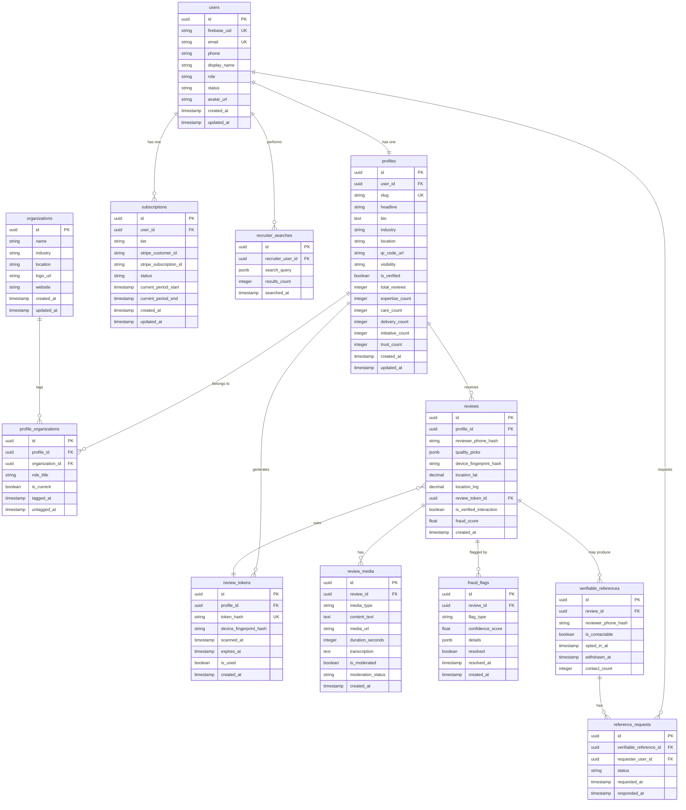

# Spec 02: Database Schema

**Product:** Every Individual is a Brand -- Portable Individual Review App
**Author:** Muthukumaran Navaneethakrishnan
**Date:** 2026-04-14
**Status:** Draft
**Database:** PostgreSQL 15+
**ORM:** Sequelize v6 (TypeScript)
**Convention:** snake_case DB columns, camelCase TypeScript fields (using `field: 'snake_case'` mapping)

---

## ER Diagram



---

## Table Definitions

### 1. `users`

Stores all registered users across roles. Authentication is via Firebase; the `firebase_uid` links the app user to their Firebase identity.

```typescript
import { DataTypes, Model, Sequelize } from 'sequelize';

export interface UserAttributes {
  id: string;
  firebaseUid: string;
  email: string;
  phone: string | null;
  displayName: string;
  role: 'INDIVIDUAL' | 'RECRUITER' | 'EMPLOYER' | 'ADMIN';
  status: 'active' | 'inactive' | 'pending' | 'suspended';
  avatarUrl: string | null;
  createdAt: Date;
  updatedAt: Date;
}

export class User extends Model<UserAttributes> implements UserAttributes {
  declare id: string;
  declare firebaseUid: string;
  declare email: string;
  declare phone: string | null;
  declare displayName: string;
  declare role: 'INDIVIDUAL' | 'RECRUITER' | 'EMPLOYER' | 'ADMIN';
  declare status: 'active' | 'inactive' | 'pending' | 'suspended';
  declare avatarUrl: string | null;
  declare createdAt: Date;
  declare updatedAt: Date;
}

export function initUserModel(sequelize: Sequelize): void {
  User.init(
    {
      id: {
        type: DataTypes.UUID,
        primaryKey: true,
        defaultValue: DataTypes.UUIDV4,
      },
      firebaseUid: {
        type: DataTypes.STRING(128),
        unique: true,
        allowNull: false,
        field: 'firebase_uid',
      },
      email: {
        type: DataTypes.STRING(255),
        unique: true,
        allowNull: false,
      },
      phone: {
        type: DataTypes.STRING(20),
        allowNull: true,
      },
      displayName: {
        type: DataTypes.STRING(255),
        allowNull: false,
        field: 'display_name',
      },
      role: {
        type: DataTypes.STRING(20),
        allowNull: false,
        defaultValue: 'INDIVIDUAL',
        validate: {
          isIn: [['INDIVIDUAL', 'RECRUITER', 'EMPLOYER', 'ADMIN']],
        },
      },
      status: {
        type: DataTypes.STRING(20),
        allowNull: false,
        defaultValue: 'active',
        validate: {
          isIn: [['active', 'inactive', 'pending', 'suspended']],
        },
      },
      avatarUrl: {
        type: DataTypes.STRING(512),
        allowNull: true,
        field: 'avatar_url',
      },
      createdAt: {
        type: DataTypes.DATE,
        allowNull: false,
        defaultValue: DataTypes.NOW,
        field: 'created_at',
      },
      updatedAt: {
        type: DataTypes.DATE,
        allowNull: false,
        defaultValue: DataTypes.NOW,
        field: 'updated_at',
      },
    },
    {
      sequelize,
      tableName: 'users',
      timestamps: true,
      createdAt: 'created_at',
      updatedAt: 'updated_at',
    },
  );
}
```

**Indexes:**

| Index Name | Columns | Type | Notes |
|------------|---------|------|-------|
| `users_pkey` | `id` | PRIMARY KEY | UUID v4 |
| `users_firebase_uid_unique` | `firebase_uid` | UNIQUE | Firebase identity lookup |
| `users_email_unique` | `email` | UNIQUE | Unique email constraint |
| `users_role_idx` | `role` | B-TREE | Filter by role |
| `users_status_idx` | `status` | B-TREE | Filter by status |

---

### 2. `profiles`

One-to-one with `users`. Contains the public-facing reputation profile, quality counters, and QR code metadata. The `slug` is the URL-safe identifier used in QR codes (e.g., `https://app.example.com/r/{slug}`).

```typescript
import { DataTypes, Model, Sequelize } from 'sequelize';

export interface ProfileAttributes {
  id: string;
  userId: string;
  slug: string;
  headline: string | null;
  bio: string | null;
  industry: string | null;
  location: string | null;
  qrCodeUrl: string | null;
  visibility: 'private' | 'recruiter_visible' | 'public';
  isVerified: boolean;
  totalReviews: number;
  expertiseCount: number;
  careCount: number;
  deliveryCount: number;
  initiativeCount: number;
  trustCount: number;
  createdAt: Date;
  updatedAt: Date;
}

export class Profile extends Model<ProfileAttributes> implements ProfileAttributes {
  declare id: string;
  declare userId: string;
  declare slug: string;
  declare headline: string | null;
  declare bio: string | null;
  declare industry: string | null;
  declare location: string | null;
  declare qrCodeUrl: string | null;
  declare visibility: 'private' | 'recruiter_visible' | 'public';
  declare isVerified: boolean;
  declare totalReviews: number;
  declare expertiseCount: number;
  declare careCount: number;
  declare deliveryCount: number;
  declare initiativeCount: number;
  declare trustCount: number;
  declare createdAt: Date;
  declare updatedAt: Date;
}

export function initProfileModel(sequelize: Sequelize): void {
  Profile.init(
    {
      id: {
        type: DataTypes.UUID,
        primaryKey: true,
        defaultValue: DataTypes.UUIDV4,
      },
      userId: {
        type: DataTypes.UUID,
        allowNull: false,
        unique: true,
        references: {
          model: 'users',
          key: 'id',
        },
        onDelete: 'CASCADE',
        field: 'user_id',
      },
      slug: {
        type: DataTypes.STRING(12),
        unique: true,
        allowNull: false,
        comment: 'URL-safe 8-12 char identifier for QR code URLs',
      },
      headline: {
        type: DataTypes.STRING(255),
        allowNull: true,
      },
      bio: {
        type: DataTypes.TEXT,
        allowNull: true,
      },
      industry: {
        type: DataTypes.STRING(100),
        allowNull: true,
      },
      location: {
        type: DataTypes.STRING(255),
        allowNull: true,
      },
      qrCodeUrl: {
        type: DataTypes.STRING(512),
        allowNull: true,
        field: 'qr_code_url',
      },
      visibility: {
        type: DataTypes.STRING(20),
        allowNull: false,
        defaultValue: 'private',
        validate: {
          isIn: [['private', 'recruiter_visible', 'public']],
        },
      },
      isVerified: {
        type: DataTypes.BOOLEAN,
        allowNull: false,
        defaultValue: false,
        field: 'is_verified',
      },
      totalReviews: {
        type: DataTypes.INTEGER,
        allowNull: false,
        defaultValue: 0,
        field: 'total_reviews',
      },
      expertiseCount: {
        type: DataTypes.INTEGER,
        allowNull: false,
        defaultValue: 0,
        field: 'expertise_count',
      },
      careCount: {
        type: DataTypes.INTEGER,
        allowNull: false,
        defaultValue: 0,
        field: 'care_count',
      },
      deliveryCount: {
        type: DataTypes.INTEGER,
        allowNull: false,
        defaultValue: 0,
        field: 'delivery_count',
      },
      initiativeCount: {
        type: DataTypes.INTEGER,
        allowNull: false,
        defaultValue: 0,
        field: 'initiative_count',
      },
      trustCount: {
        type: DataTypes.INTEGER,
        allowNull: false,
        defaultValue: 0,
        field: 'trust_count',
      },
      createdAt: {
        type: DataTypes.DATE,
        allowNull: false,
        defaultValue: DataTypes.NOW,
        field: 'created_at',
      },
      updatedAt: {
        type: DataTypes.DATE,
        allowNull: false,
        defaultValue: DataTypes.NOW,
        field: 'updated_at',
      },
    },
    {
      sequelize,
      tableName: 'profiles',
      timestamps: true,
      createdAt: 'created_at',
      updatedAt: 'updated_at',
    },
  );
}
```

**Indexes:**

| Index Name | Columns | Type | Notes |
|------------|---------|------|-------|
| `profiles_pkey` | `id` | PRIMARY KEY | UUID v4 |
| `profiles_user_id_unique` | `user_id` | UNIQUE | One profile per user |
| `profiles_slug_unique` | `slug` | UNIQUE | QR code URL lookup, must be fast |
| `profiles_visibility_idx` | `visibility` | B-TREE | Recruiter search filtering |
| `profiles_industry_idx` | `industry` | B-TREE | Recruiter search filtering |
| `profiles_total_reviews_idx` | `total_reviews` | B-TREE | Sorting by review count |

---

### 3. `organizations`

Stores employer/org entities. Organizations are independent records that get linked to profiles via `profile_organizations`.

```typescript
import { DataTypes, Model, Sequelize } from 'sequelize';

export interface OrganizationAttributes {
  id: string;
  name: string;
  industry: string | null;
  location: string | null;
  logoUrl: string | null;
  website: string | null;
  createdAt: Date;
  updatedAt: Date;
}

export class Organization extends Model<OrganizationAttributes> implements OrganizationAttributes {
  declare id: string;
  declare name: string;
  declare industry: string | null;
  declare location: string | null;
  declare logoUrl: string | null;
  declare website: string | null;
  declare createdAt: Date;
  declare updatedAt: Date;
}

export function initOrganizationModel(sequelize: Sequelize): void {
  Organization.init(
    {
      id: {
        type: DataTypes.UUID,
        primaryKey: true,
        defaultValue: DataTypes.UUIDV4,
      },
      name: {
        type: DataTypes.STRING(255),
        allowNull: false,
      },
      industry: {
        type: DataTypes.STRING(100),
        allowNull: true,
      },
      location: {
        type: DataTypes.STRING(255),
        allowNull: true,
      },
      logoUrl: {
        type: DataTypes.STRING(512),
        allowNull: true,
        field: 'logo_url',
      },
      website: {
        type: DataTypes.STRING(512),
        allowNull: true,
      },
      createdAt: {
        type: DataTypes.DATE,
        allowNull: false,
        defaultValue: DataTypes.NOW,
        field: 'created_at',
      },
      updatedAt: {
        type: DataTypes.DATE,
        allowNull: false,
        defaultValue: DataTypes.NOW,
        field: 'updated_at',
      },
    },
    {
      sequelize,
      tableName: 'organizations',
      timestamps: true,
      createdAt: 'created_at',
      updatedAt: 'updated_at',
    },
  );
}
```

**Indexes:**

| Index Name | Columns | Type | Notes |
|------------|---------|------|-------|
| `organizations_pkey` | `id` | PRIMARY KEY | UUID v4 |
| `organizations_name_idx` | `name` | B-TREE | Search by org name |

---

### 4. `profile_organizations`

Join table linking profiles to organizations. Supports multiple concurrent org associations and historical tracking (tagged_at / untagged_at).

```typescript
import { DataTypes, Model, Sequelize } from 'sequelize';

export interface ProfileOrganizationAttributes {
  id: string;
  profileId: string;
  organizationId: string;
  roleTitle: string | null;
  isCurrent: boolean;
  taggedAt: Date;
  untaggedAt: Date | null;
}

export class ProfileOrganization extends Model<ProfileOrganizationAttributes> implements ProfileOrganizationAttributes {
  declare id: string;
  declare profileId: string;
  declare organizationId: string;
  declare roleTitle: string | null;
  declare isCurrent: boolean;
  declare taggedAt: Date;
  declare untaggedAt: Date | null;
}

export function initProfileOrganizationModel(sequelize: Sequelize): void {
  ProfileOrganization.init(
    {
      id: {
        type: DataTypes.UUID,
        primaryKey: true,
        defaultValue: DataTypes.UUIDV4,
      },
      profileId: {
        type: DataTypes.UUID,
        allowNull: false,
        references: {
          model: 'profiles',
          key: 'id',
        },
        onDelete: 'CASCADE',
        field: 'profile_id',
      },
      organizationId: {
        type: DataTypes.UUID,
        allowNull: false,
        references: {
          model: 'organizations',
          key: 'id',
        },
        onDelete: 'CASCADE',
        field: 'organization_id',
      },
      roleTitle: {
        type: DataTypes.STRING(255),
        allowNull: true,
        field: 'role_title',
      },
      isCurrent: {
        type: DataTypes.BOOLEAN,
        allowNull: false,
        defaultValue: true,
        field: 'is_current',
      },
      taggedAt: {
        type: DataTypes.DATE,
        allowNull: false,
        defaultValue: DataTypes.NOW,
        field: 'tagged_at',
      },
      untaggedAt: {
        type: DataTypes.DATE,
        allowNull: true,
        field: 'untagged_at',
      },
    },
    {
      sequelize,
      tableName: 'profile_organizations',
      timestamps: false,
    },
  );
}
```

**Indexes:**

| Index Name | Columns | Type | Notes |
|------------|---------|------|-------|
| `profile_organizations_pkey` | `id` | PRIMARY KEY | UUID v4 |
| `profile_organizations_profile_org_unique` | `profile_id, organization_id, tagged_at` | UNIQUE | Prevent duplicate associations for the same time period |
| `profile_organizations_profile_id_idx` | `profile_id` | B-TREE | Look up orgs for a profile |
| `profile_organizations_organization_id_idx` | `organization_id` | B-TREE | Look up profiles for an org (employer dashboard) |
| `profile_organizations_is_current_idx` | `is_current` | B-TREE | Filter current associations |

---

### 5. `reviews`

Core review table. Each row represents one customer review with quality picks, fraud metadata, and verification data. The `quality_picks` field is a JSON array of picked quality strings (e.g., `["expertise", "care"]`).

```typescript
import { DataTypes, Model, Sequelize } from 'sequelize';

export type QualityPick = 'expertise' | 'care' | 'delivery' | 'initiative' | 'trust';

export interface ReviewAttributes {
  id: string;
  profileId: string;
  reviewerPhoneHash: string;
  qualityPicks: QualityPick[];
  deviceFingerprintHash: string;
  locationLat: number | null;
  locationLng: number | null;
  reviewTokenId: string | null;
  isVerifiedInteraction: boolean;
  fraudScore: number;
  createdAt: Date;
}

export class Review extends Model<ReviewAttributes> implements ReviewAttributes {
  declare id: string;
  declare profileId: string;
  declare reviewerPhoneHash: string;
  declare qualityPicks: QualityPick[];
  declare deviceFingerprintHash: string;
  declare locationLat: number | null;
  declare locationLng: number | null;
  declare reviewTokenId: string | null;
  declare isVerifiedInteraction: boolean;
  declare fraudScore: number;
  declare createdAt: Date;
}

export function initReviewModel(sequelize: Sequelize): void {
  Review.init(
    {
      id: {
        type: DataTypes.UUID,
        primaryKey: true,
        defaultValue: DataTypes.UUIDV4,
      },
      profileId: {
        type: DataTypes.UUID,
        allowNull: false,
        references: {
          model: 'profiles',
          key: 'id',
        },
        onDelete: 'CASCADE',
        field: 'profile_id',
      },
      reviewerPhoneHash: {
        type: DataTypes.STRING(128),
        allowNull: false,
        field: 'reviewer_phone_hash',
        comment: 'Salted SHA-256 hash of reviewer phone number',
      },
      qualityPicks: {
        type: DataTypes.JSONB,
        allowNull: false,
        field: 'quality_picks',
        comment: 'Array of 1-2 quality strings: expertise, care, delivery, initiative, trust',
      },
      deviceFingerprintHash: {
        type: DataTypes.STRING(128),
        allowNull: false,
        field: 'device_fingerprint_hash',
        comment: 'Composite hash of browser/OS/screen/language',
      },
      locationLat: {
        type: DataTypes.DECIMAL(10, 7),
        allowNull: true,
        field: 'location_lat',
      },
      locationLng: {
        type: DataTypes.DECIMAL(10, 7),
        allowNull: true,
        field: 'location_lng',
      },
      reviewTokenId: {
        type: DataTypes.UUID,
        allowNull: true,
        references: {
          model: 'review_tokens',
          key: 'id',
        },
        onDelete: 'SET NULL',
        field: 'review_token_id',
      },
      isVerifiedInteraction: {
        type: DataTypes.BOOLEAN,
        allowNull: false,
        defaultValue: false,
        field: 'is_verified_interaction',
      },
      fraudScore: {
        type: DataTypes.FLOAT,
        allowNull: false,
        defaultValue: 0.0,
        field: 'fraud_score',
        comment: '0-100 composite fraud risk score; lower is better',
      },
      createdAt: {
        type: DataTypes.DATE,
        allowNull: false,
        defaultValue: DataTypes.NOW,
        field: 'created_at',
      },
    },
    {
      sequelize,
      tableName: 'reviews',
      timestamps: false,
    },
  );
}
```

**Indexes:**

| Index Name | Columns | Type | Notes |
|------------|---------|------|-------|
| `reviews_pkey` | `id` | PRIMARY KEY | UUID v4 |
| `reviews_profile_id_idx` | `profile_id` | B-TREE | Fetch all reviews for a profile |
| `reviews_profile_id_created_at_idx` | `profile_id, created_at DESC` | B-TREE | Profile page reverse-chronological listing |
| `reviews_reviewer_phone_hash_idx` | `reviewer_phone_hash` | B-TREE | Enforce one-review-per-phone-per-window |
| `reviews_device_fingerprint_hash_idx` | `device_fingerprint_hash` | B-TREE | Device-level fraud detection |
| `reviews_review_token_id_idx` | `review_token_id` | B-TREE | Token lookup |
| `reviews_created_at_idx` | `created_at` | B-TREE | Recency queries, admin dashboards |
| `reviews_fraud_score_idx` | `fraud_score` | B-TREE | Fraud queue filtering |

---

### 6. `review_media`

Stores the optional rich media attachment (text, voice, or video) for a review. One media record per review. Media files (voice/video) are stored in S3; this table holds the URL reference and metadata.

```typescript
import { DataTypes, Model, Sequelize } from 'sequelize';

export interface ReviewMediaAttributes {
  id: string;
  reviewId: string;
  mediaType: 'text' | 'voice' | 'video';
  contentText: string | null;
  mediaUrl: string | null;
  durationSeconds: number | null;
  transcription: string | null;
  isModerated: boolean;
  moderationStatus: 'pending' | 'approved' | 'rejected' | 'flagged';
  createdAt: Date;
}

export class ReviewMedia extends Model<ReviewMediaAttributes> implements ReviewMediaAttributes {
  declare id: string;
  declare reviewId: string;
  declare mediaType: 'text' | 'voice' | 'video';
  declare contentText: string | null;
  declare mediaUrl: string | null;
  declare durationSeconds: number | null;
  declare transcription: string | null;
  declare isModerated: boolean;
  declare moderationStatus: 'pending' | 'approved' | 'rejected' | 'flagged';
  declare createdAt: Date;
}

export function initReviewMediaModel(sequelize: Sequelize): void {
  ReviewMedia.init(
    {
      id: {
        type: DataTypes.UUID,
        primaryKey: true,
        defaultValue: DataTypes.UUIDV4,
      },
      reviewId: {
        type: DataTypes.UUID,
        allowNull: false,
        references: {
          model: 'reviews',
          key: 'id',
        },
        onDelete: 'CASCADE',
        field: 'review_id',
      },
      mediaType: {
        type: DataTypes.STRING(10),
        allowNull: false,
        field: 'media_type',
        validate: {
          isIn: [['text', 'voice', 'video']],
        },
      },
      contentText: {
        type: DataTypes.TEXT,
        allowNull: true,
        field: 'content_text',
        comment: 'Text content for text reviews (280 char max enforced in app layer)',
      },
      mediaUrl: {
        type: DataTypes.STRING(512),
        allowNull: true,
        field: 'media_url',
        comment: 'S3 URL for voice/video files',
      },
      durationSeconds: {
        type: DataTypes.INTEGER,
        allowNull: true,
        field: 'duration_seconds',
        comment: 'Duration for voice (max 15s) or video (max 30s)',
      },
      transcription: {
        type: DataTypes.TEXT,
        allowNull: true,
        comment: 'Server-side auto-transcription of voice/video for search and accessibility',
      },
      isModerated: {
        type: DataTypes.BOOLEAN,
        allowNull: false,
        defaultValue: false,
        field: 'is_moderated',
      },
      moderationStatus: {
        type: DataTypes.STRING(20),
        allowNull: false,
        defaultValue: 'pending',
        field: 'moderation_status',
        validate: {
          isIn: [['pending', 'approved', 'rejected', 'flagged']],
        },
      },
      createdAt: {
        type: DataTypes.DATE,
        allowNull: false,
        defaultValue: DataTypes.NOW,
        field: 'created_at',
      },
    },
    {
      sequelize,
      tableName: 'review_media',
      timestamps: false,
    },
  );
}
```

**Indexes:**

| Index Name | Columns | Type | Notes |
|------------|---------|------|-------|
| `review_media_pkey` | `id` | PRIMARY KEY | UUID v4 |
| `review_media_review_id_idx` | `review_id` | B-TREE | Fetch media for a review |
| `review_media_media_type_idx` | `media_type` | B-TREE | Filter by media type (e.g., "has video") |
| `review_media_moderation_status_idx` | `moderation_status` | B-TREE | Moderation queue queries |

---

### 7. `review_tokens`

Time-bound, single-use tokens generated on QR scan. Each token is valid for 48 hours and binds to one review submission.

```typescript
import { DataTypes, Model, Sequelize } from 'sequelize';

export interface ReviewTokenAttributes {
  id: string;
  profileId: string;
  tokenHash: string;
  deviceFingerprintHash: string;
  scannedAt: Date;
  expiresAt: Date;
  isUsed: boolean;
  createdAt: Date;
}

export class ReviewToken extends Model<ReviewTokenAttributes> implements ReviewTokenAttributes {
  declare id: string;
  declare profileId: string;
  declare tokenHash: string;
  declare deviceFingerprintHash: string;
  declare scannedAt: Date;
  declare expiresAt: Date;
  declare isUsed: boolean;
  declare createdAt: Date;
}

export function initReviewTokenModel(sequelize: Sequelize): void {
  ReviewToken.init(
    {
      id: {
        type: DataTypes.UUID,
        primaryKey: true,
        defaultValue: DataTypes.UUIDV4,
      },
      profileId: {
        type: DataTypes.UUID,
        allowNull: false,
        references: {
          model: 'profiles',
          key: 'id',
        },
        onDelete: 'CASCADE',
        field: 'profile_id',
      },
      tokenHash: {
        type: DataTypes.STRING(128),
        unique: true,
        allowNull: false,
        field: 'token_hash',
        comment: 'SHA-256 hash of the generated token',
      },
      deviceFingerprintHash: {
        type: DataTypes.STRING(128),
        allowNull: false,
        field: 'device_fingerprint_hash',
      },
      scannedAt: {
        type: DataTypes.DATE,
        allowNull: false,
        field: 'scanned_at',
      },
      expiresAt: {
        type: DataTypes.DATE,
        allowNull: false,
        field: 'expires_at',
        comment: '48 hours from scanned_at',
      },
      isUsed: {
        type: DataTypes.BOOLEAN,
        allowNull: false,
        defaultValue: false,
        field: 'is_used',
      },
      createdAt: {
        type: DataTypes.DATE,
        allowNull: false,
        defaultValue: DataTypes.NOW,
        field: 'created_at',
      },
    },
    {
      sequelize,
      tableName: 'review_tokens',
      timestamps: false,
    },
  );
}
```

**Indexes:**

| Index Name | Columns | Type | Notes |
|------------|---------|------|-------|
| `review_tokens_pkey` | `id` | PRIMARY KEY | UUID v4 |
| `review_tokens_token_hash_unique` | `token_hash` | UNIQUE | Fast token validation lookup |
| `review_tokens_profile_id_idx` | `profile_id` | B-TREE | Tokens for a profile |
| `review_tokens_expires_at_idx` | `expires_at` | B-TREE | Cleanup expired tokens |
| `review_tokens_is_used_idx` | `is_used` | B-TREE | Filter unused tokens |

---

### 8. `verifiable_references`

Created when a customer opts in to be contactable for reference verification after leaving a review.

```typescript
import { DataTypes, Model, Sequelize } from 'sequelize';

export interface VerifiableReferenceAttributes {
  id: string;
  reviewId: string;
  reviewerPhoneHash: string;
  isContactable: boolean;
  optedInAt: Date;
  withdrawnAt: Date | null;
  contactCount: number;
}

export class VerifiableReference extends Model<VerifiableReferenceAttributes> implements VerifiableReferenceAttributes {
  declare id: string;
  declare reviewId: string;
  declare reviewerPhoneHash: string;
  declare isContactable: boolean;
  declare optedInAt: Date;
  declare withdrawnAt: Date | null;
  declare contactCount: number;
}

export function initVerifiableReferenceModel(sequelize: Sequelize): void {
  VerifiableReference.init(
    {
      id: {
        type: DataTypes.UUID,
        primaryKey: true,
        defaultValue: DataTypes.UUIDV4,
      },
      reviewId: {
        type: DataTypes.UUID,
        allowNull: false,
        unique: true,
        references: {
          model: 'reviews',
          key: 'id',
        },
        onDelete: 'CASCADE',
        field: 'review_id',
      },
      reviewerPhoneHash: {
        type: DataTypes.STRING(128),
        allowNull: false,
        field: 'reviewer_phone_hash',
      },
      isContactable: {
        type: DataTypes.BOOLEAN,
        allowNull: false,
        defaultValue: true,
        field: 'is_contactable',
      },
      optedInAt: {
        type: DataTypes.DATE,
        allowNull: false,
        field: 'opted_in_at',
      },
      withdrawnAt: {
        type: DataTypes.DATE,
        allowNull: true,
        field: 'withdrawn_at',
      },
      contactCount: {
        type: DataTypes.INTEGER,
        allowNull: false,
        defaultValue: 0,
        field: 'contact_count',
      },
    },
    {
      sequelize,
      tableName: 'verifiable_references',
      timestamps: false,
    },
  );
}
```

**Indexes:**

| Index Name | Columns | Type | Notes |
|------------|---------|------|-------|
| `verifiable_references_pkey` | `id` | PRIMARY KEY | UUID v4 |
| `verifiable_references_review_id_unique` | `review_id` | UNIQUE | One opt-in per review |
| `verifiable_references_reviewer_phone_hash_idx` | `reviewer_phone_hash` | B-TREE | Rate-limit queries per customer |
| `verifiable_references_is_contactable_idx` | `is_contactable` | B-TREE | Filter active references |

---

### 9. `reference_requests`

Tracks recruiter requests to contact a verifiable reference. Status flows: `pending` -> `approved`/`expired` -> `completed`.

```typescript
import { DataTypes, Model, Sequelize } from 'sequelize';

export interface ReferenceRequestAttributes {
  id: string;
  verifiableReferenceId: string;
  requesterUserId: string;
  status: 'pending' | 'approved' | 'completed' | 'expired';
  requestedAt: Date;
  respondedAt: Date | null;
}

export class ReferenceRequest extends Model<ReferenceRequestAttributes> implements ReferenceRequestAttributes {
  declare id: string;
  declare verifiableReferenceId: string;
  declare requesterUserId: string;
  declare status: 'pending' | 'approved' | 'completed' | 'expired';
  declare requestedAt: Date;
  declare respondedAt: Date | null;
}

export function initReferenceRequestModel(sequelize: Sequelize): void {
  ReferenceRequest.init(
    {
      id: {
        type: DataTypes.UUID,
        primaryKey: true,
        defaultValue: DataTypes.UUIDV4,
      },
      verifiableReferenceId: {
        type: DataTypes.UUID,
        allowNull: false,
        references: {
          model: 'verifiable_references',
          key: 'id',
        },
        onDelete: 'CASCADE',
        field: 'verifiable_reference_id',
      },
      requesterUserId: {
        type: DataTypes.UUID,
        allowNull: false,
        references: {
          model: 'users',
          key: 'id',
        },
        onDelete: 'CASCADE',
        field: 'requester_user_id',
      },
      status: {
        type: DataTypes.STRING(20),
        allowNull: false,
        defaultValue: 'pending',
        validate: {
          isIn: [['pending', 'approved', 'completed', 'expired']],
        },
      },
      requestedAt: {
        type: DataTypes.DATE,
        allowNull: false,
        defaultValue: DataTypes.NOW,
        field: 'requested_at',
      },
      respondedAt: {
        type: DataTypes.DATE,
        allowNull: true,
        field: 'responded_at',
      },
    },
    {
      sequelize,
      tableName: 'reference_requests',
      timestamps: false,
    },
  );
}
```

**Indexes:**

| Index Name | Columns | Type | Notes |
|------------|---------|------|-------|
| `reference_requests_pkey` | `id` | PRIMARY KEY | UUID v4 |
| `reference_requests_verifiable_reference_id_idx` | `verifiable_reference_id` | B-TREE | Requests per reference |
| `reference_requests_requester_user_id_idx` | `requester_user_id` | B-TREE | Requests by recruiter |
| `reference_requests_status_idx` | `status` | B-TREE | Filter by status |
| `reference_requests_requester_ref_unique` | `requester_user_id, verifiable_reference_id` | UNIQUE | Prevent duplicate requests from same recruiter |

---

### 10. `subscriptions`

Tracks Stripe subscriptions for Pro, Employer, and Recruiter tiers.

```typescript
import { DataTypes, Model, Sequelize } from 'sequelize';

export interface SubscriptionAttributes {
  id: string;
  userId: string;
  tier: 'free' | 'pro' | 'employer' | 'recruiter';
  stripeCustomerId: string | null;
  stripeSubscriptionId: string | null;
  status: 'active' | 'past_due' | 'cancelled' | 'trialing' | 'incomplete';
  currentPeriodStart: Date | null;
  currentPeriodEnd: Date | null;
  createdAt: Date;
  updatedAt: Date;
}

export class Subscription extends Model<SubscriptionAttributes> implements SubscriptionAttributes {
  declare id: string;
  declare userId: string;
  declare tier: 'free' | 'pro' | 'employer' | 'recruiter';
  declare stripeCustomerId: string | null;
  declare stripeSubscriptionId: string | null;
  declare status: 'active' | 'past_due' | 'cancelled' | 'trialing' | 'incomplete';
  declare currentPeriodStart: Date | null;
  declare currentPeriodEnd: Date | null;
  declare createdAt: Date;
  declare updatedAt: Date;
}

export function initSubscriptionModel(sequelize: Sequelize): void {
  Subscription.init(
    {
      id: {
        type: DataTypes.UUID,
        primaryKey: true,
        defaultValue: DataTypes.UUIDV4,
      },
      userId: {
        type: DataTypes.UUID,
        allowNull: false,
        references: {
          model: 'users',
          key: 'id',
        },
        onDelete: 'CASCADE',
        field: 'user_id',
      },
      tier: {
        type: DataTypes.STRING(20),
        allowNull: false,
        defaultValue: 'free',
        validate: {
          isIn: [['free', 'pro', 'employer', 'recruiter']],
        },
      },
      stripeCustomerId: {
        type: DataTypes.STRING(255),
        allowNull: true,
        field: 'stripe_customer_id',
      },
      stripeSubscriptionId: {
        type: DataTypes.STRING(255),
        allowNull: true,
        unique: true,
        field: 'stripe_subscription_id',
      },
      status: {
        type: DataTypes.STRING(20),
        allowNull: false,
        defaultValue: 'active',
        validate: {
          isIn: [['active', 'past_due', 'cancelled', 'trialing', 'incomplete']],
        },
      },
      currentPeriodStart: {
        type: DataTypes.DATE,
        allowNull: true,
        field: 'current_period_start',
      },
      currentPeriodEnd: {
        type: DataTypes.DATE,
        allowNull: true,
        field: 'current_period_end',
      },
      createdAt: {
        type: DataTypes.DATE,
        allowNull: false,
        defaultValue: DataTypes.NOW,
        field: 'created_at',
      },
      updatedAt: {
        type: DataTypes.DATE,
        allowNull: false,
        defaultValue: DataTypes.NOW,
        field: 'updated_at',
      },
    },
    {
      sequelize,
      tableName: 'subscriptions',
      timestamps: true,
      createdAt: 'created_at',
      updatedAt: 'updated_at',
    },
  );
}
```

**Indexes:**

| Index Name | Columns | Type | Notes |
|------------|---------|------|-------|
| `subscriptions_pkey` | `id` | PRIMARY KEY | UUID v4 |
| `subscriptions_user_id_idx` | `user_id` | B-TREE | Lookup subscription for a user |
| `subscriptions_stripe_subscription_id_unique` | `stripe_subscription_id` | UNIQUE | Stripe webhook idempotency |
| `subscriptions_stripe_customer_id_idx` | `stripe_customer_id` | B-TREE | Stripe customer lookup |
| `subscriptions_status_idx` | `status` | B-TREE | Filter active subscriptions |

---

### 11. `recruiter_searches`

Audit log of recruiter search activity. Used for analytics, billing validation, and feature usage tracking.

```typescript
import { DataTypes, Model, Sequelize } from 'sequelize';

export interface RecruiterSearchAttributes {
  id: string;
  recruiterUserId: string;
  searchQuery: Record<string, any>;
  resultsCount: number;
  searchedAt: Date;
}

export class RecruiterSearch extends Model<RecruiterSearchAttributes> implements RecruiterSearchAttributes {
  declare id: string;
  declare recruiterUserId: string;
  declare searchQuery: Record<string, any>;
  declare resultsCount: number;
  declare searchedAt: Date;
}

export function initRecruiterSearchModel(sequelize: Sequelize): void {
  RecruiterSearch.init(
    {
      id: {
        type: DataTypes.UUID,
        primaryKey: true,
        defaultValue: DataTypes.UUIDV4,
      },
      recruiterUserId: {
        type: DataTypes.UUID,
        allowNull: false,
        references: {
          model: 'users',
          key: 'id',
        },
        onDelete: 'CASCADE',
        field: 'recruiter_user_id',
      },
      searchQuery: {
        type: DataTypes.JSONB,
        allowNull: false,
        field: 'search_query',
        comment: 'Search filters: qualities, industry, location, min_reviews, etc.',
      },
      resultsCount: {
        type: DataTypes.INTEGER,
        allowNull: false,
        defaultValue: 0,
        field: 'results_count',
      },
      searchedAt: {
        type: DataTypes.DATE,
        allowNull: false,
        defaultValue: DataTypes.NOW,
        field: 'searched_at',
      },
    },
    {
      sequelize,
      tableName: 'recruiter_searches',
      timestamps: false,
    },
  );
}
```

**Indexes:**

| Index Name | Columns | Type | Notes |
|------------|---------|------|-------|
| `recruiter_searches_pkey` | `id` | PRIMARY KEY | UUID v4 |
| `recruiter_searches_recruiter_user_id_idx` | `recruiter_user_id` | B-TREE | Search history per recruiter |
| `recruiter_searches_searched_at_idx` | `searched_at` | B-TREE | Chronological listing, analytics |
| `recruiter_searches_search_query_idx` | `search_query` | GIN | JSONB query optimization |

---

### 12. `fraud_flags`

Records fraud detection signals from the AI pattern detection layer (Layer 4) and manual flags. One review can have multiple fraud flags of different types.

```typescript
import { DataTypes, Model, Sequelize } from 'sequelize';

export interface FraudFlagAttributes {
  id: string;
  reviewId: string;
  flagType: string;
  confidenceScore: number;
  details: Record<string, any>;
  resolved: boolean;
  resolvedAt: Date | null;
  createdAt: Date;
}

export class FraudFlag extends Model<FraudFlagAttributes> implements FraudFlagAttributes {
  declare id: string;
  declare reviewId: string;
  declare flagType: string;
  declare confidenceScore: number;
  declare details: Record<string, any>;
  declare resolved: boolean;
  declare resolvedAt: Date | null;
  declare createdAt: Date;
}

export function initFraudFlagModel(sequelize: Sequelize): void {
  FraudFlag.init(
    {
      id: {
        type: DataTypes.UUID,
        primaryKey: true,
        defaultValue: DataTypes.UUIDV4,
      },
      reviewId: {
        type: DataTypes.UUID,
        allowNull: false,
        references: {
          model: 'reviews',
          key: 'id',
        },
        onDelete: 'CASCADE',
        field: 'review_id',
      },
      flagType: {
        type: DataTypes.STRING(50),
        allowNull: false,
        field: 'flag_type',
        comment: 'velocity_spike, device_clustering, location_clustering, quality_pattern, text_similarity, timing_pattern, cross_individual',
      },
      confidenceScore: {
        type: DataTypes.FLOAT,
        allowNull: false,
        field: 'confidence_score',
        comment: '0.0-1.0 confidence that the flag is valid',
      },
      details: {
        type: DataTypes.JSONB,
        allowNull: false,
        defaultValue: {},
        comment: 'Contextual data: triggering signals, thresholds exceeded, related review IDs',
      },
      resolved: {
        type: DataTypes.BOOLEAN,
        allowNull: false,
        defaultValue: false,
      },
      resolvedAt: {
        type: DataTypes.DATE,
        allowNull: true,
        field: 'resolved_at',
      },
      createdAt: {
        type: DataTypes.DATE,
        allowNull: false,
        defaultValue: DataTypes.NOW,
        field: 'created_at',
      },
    },
    {
      sequelize,
      tableName: 'fraud_flags',
      timestamps: false,
    },
  );
}
```

**Indexes:**

| Index Name | Columns | Type | Notes |
|------------|---------|------|-------|
| `fraud_flags_pkey` | `id` | PRIMARY KEY | UUID v4 |
| `fraud_flags_review_id_idx` | `review_id` | B-TREE | Flags per review |
| `fraud_flags_flag_type_idx` | `flag_type` | B-TREE | Filter by flag type |
| `fraud_flags_resolved_idx` | `resolved` | B-TREE | Unresolved flags queue |
| `fraud_flags_confidence_score_idx` | `confidence_score` | B-TREE | Priority ordering in admin queue |
| `fraud_flags_created_at_idx` | `created_at` | B-TREE | Chronological admin view |

---

## Relationships Summary

| Relationship | Type | FK Column | On Delete |
|-------------|------|-----------|-----------|
| `users` -> `profiles` | One-to-One | `profiles.user_id` | CASCADE |
| `users` -> `subscriptions` | One-to-Many | `subscriptions.user_id` | CASCADE |
| `users` -> `recruiter_searches` | One-to-Many | `recruiter_searches.recruiter_user_id` | CASCADE |
| `users` -> `reference_requests` | One-to-Many | `reference_requests.requester_user_id` | CASCADE |
| `profiles` -> `profile_organizations` | One-to-Many | `profile_organizations.profile_id` | CASCADE |
| `profiles` -> `reviews` | One-to-Many | `reviews.profile_id` | CASCADE |
| `profiles` -> `review_tokens` | One-to-Many | `review_tokens.profile_id` | CASCADE |
| `organizations` -> `profile_organizations` | One-to-Many | `profile_organizations.organization_id` | CASCADE |
| `reviews` -> `review_media` | One-to-Many | `review_media.review_id` | CASCADE |
| `reviews` -> `verifiable_references` | One-to-One | `verifiable_references.review_id` | CASCADE |
| `reviews` -> `fraud_flags` | One-to-Many | `fraud_flags.review_id` | CASCADE |
| `reviews` -> `review_tokens` | Many-to-One | `reviews.review_token_id` | SET NULL |
| `verifiable_references` -> `reference_requests` | One-to-Many | `reference_requests.verifiable_reference_id` | CASCADE |

---

## Migration Files

Following the iepapp naming convention: `YYYYMMDD-NNNN-description.ts`.

| Order | File Name | Description |
|-------|-----------|-------------|
| 1 | `20260414-0000-create-extensions.ts` | Enable `uuid-ossp` and `pgcrypto` extensions |
| 2 | `20260414-0001-create-users.ts` | Create `users` table with indexes |
| 3 | `20260414-0002-create-profiles.ts` | Create `profiles` table with FK to `users` |
| 4 | `20260414-0003-create-organizations.ts` | Create `organizations` table |
| 5 | `20260414-0004-create-profile-organizations.ts` | Create `profile_organizations` join table with FKs |
| 6 | `20260414-0005-create-review-tokens.ts` | Create `review_tokens` table (must exist before `reviews` for FK) |
| 7 | `20260414-0006-create-reviews.ts` | Create `reviews` table with FKs to `profiles` and `review_tokens` |
| 8 | `20260414-0007-create-review-media.ts` | Create `review_media` table with FK to `reviews` |
| 9 | `20260414-0008-create-verifiable-references.ts` | Create `verifiable_references` table with FK to `reviews` |
| 10 | `20260414-0009-create-reference-requests.ts` | Create `reference_requests` table with FKs |
| 11 | `20260414-0010-create-subscriptions.ts` | Create `subscriptions` table with FK to `users` |
| 12 | `20260414-0011-create-recruiter-searches.ts` | Create `recruiter_searches` table with FK to `users` |
| 13 | `20260414-0012-create-fraud-flags.ts` | Create `fraud_flags` table with FK to `reviews` |

---

## Design Notes

### Quality Picks Storage

Quality picks are stored as a JSONB array on the `reviews` table (e.g., `["expertise", "care"]`) rather than a separate join table. Rationale:

- Maximum 2 picks per review -- the data is small and fixed-size.
- Eliminates a join for the most common read path (fetching reviews for a profile).
- JSONB supports indexing via GIN if query-by-quality becomes a hot path.
- Denormalized counters on `profiles` (`expertise_count`, `care_count`, etc.) provide O(1) lookups for the heat map display, updated via application-level increment on review creation.

### Phone Hash Strategy

Reviewer phone numbers are never stored in plain text. The `reviewer_phone_hash` column contains a salted SHA-256 hash. The salt is per-environment (not per-row) to allow duplicate detection across reviews while preventing rainbow table attacks. This supports the "one review per phone per individual per 7-day window" constraint from PRD 06.

### Profile Slug Generation

The `slug` on `profiles` is an 8-12 character URL-safe string (alphanumeric, lowercase) generated at profile creation. It is the permanent identifier in QR code URLs (`/r/{slug}`). It never changes, even when the user changes orgs or names. Collision is checked at generation time against the unique index.

### Timestamps Convention

- Tables with both `created_at` and `updated_at` use Sequelize `timestamps: true` with explicit field mapping.
- Tables with only `created_at` (reviews, review_media, review_tokens, fraud_flags) use `timestamps: false` and define `created_at` manually to avoid an unnecessary `updated_at` column on append-only data.
- The `profile_organizations` table uses `tagged_at` / `untagged_at` instead of generic timestamps to convey domain meaning.
