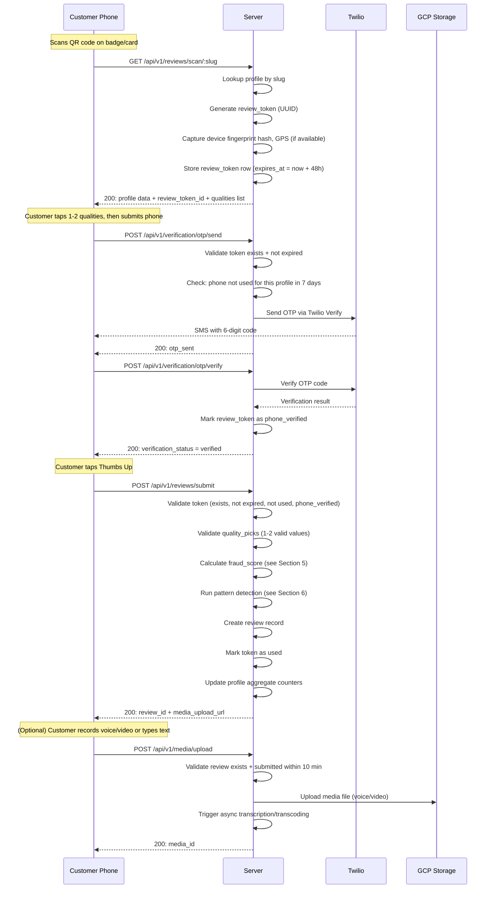
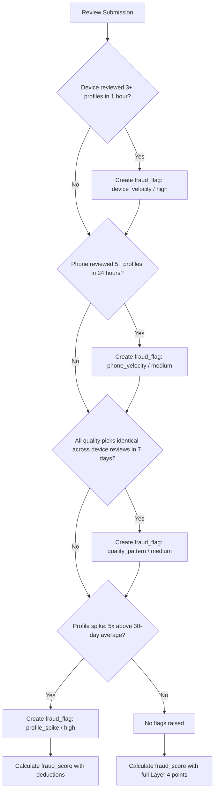
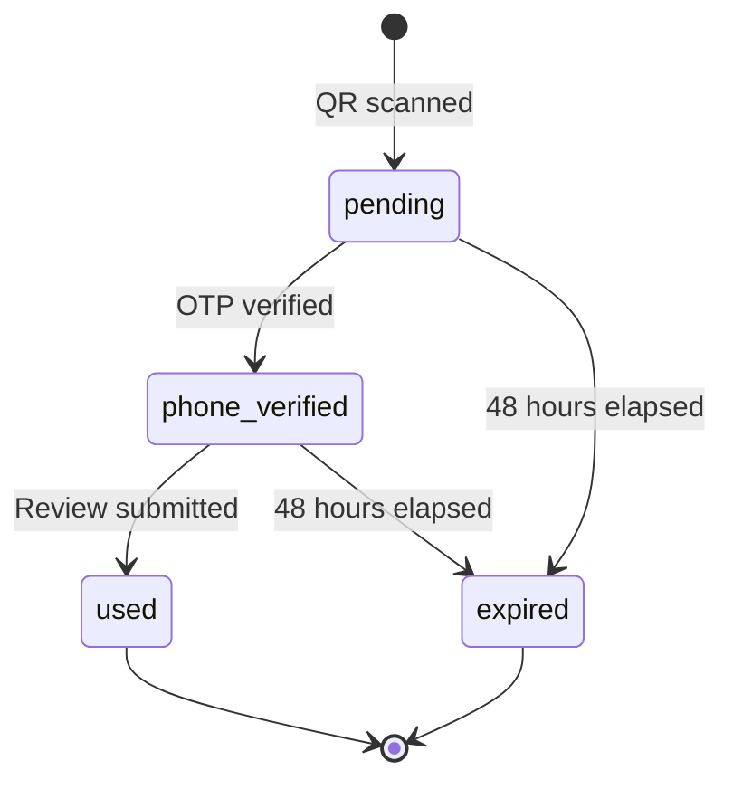

# Spec 06: QR Code Review Flow & Anti-Fraud System

**Product:** Every Individual is a Brand — Portable Individual Review App
**Author:** Muthukumaran Navaneethakrishnan
**Date:** 2026-04-14
**Status:** Draft
**PRD References:** PRD-03 (The 10-Second Review Flow), PRD-06 (Trust & Anti-Fraud)

---

## 1. Scope

This spec defines the end-to-end technical implementation of:

1. The static QR code system and scan-to-review flow
2. The four-endpoint review submission pipeline (scan, OTP send, OTP verify, submit)
3. The optional media upload endpoint
4. The anti-fraud scoring algorithm (100-point scale)
5. Pattern detection rules (Layer 4)
6. Badge display logic

This is the core review loop. Every review in the system passes through this pipeline.

---

## 2. QR Code System

### 2.1 Static QR Encoding

Each individual profile gets a permanent QR code on creation. The QR encodes a single, stable URL:

```
https://{domain}/r/{slug}
```

- `{slug}` is an 8-12 character, URL-safe, non-sequential identifier (e.g., `k7x9m2p4`).
- The slug is permanent. It never changes, even if the individual changes jobs or organizations.
- The QR is printable on badges, lanyards, business cards, and counter tents without risk of expiration.

### 2.2 Why Static, Not Rotating

PRD-06 mentions a rotating token component (60-second TTL) in the QR URL. This spec **does not** use rotating QR codes. Rationale:

- Static QR codes can be printed once and used indefinitely. Rotating codes require a live screen, which eliminates the badge/lanyard/business-card use cases that are central to the product (PRD-03, Section 3).
- The anti-fraud value of a rotating QR is replicated by the server-side review token (generated on scan, 48-hour TTL, single-use). The token provides the same freshness guarantee without requiring the QR itself to change.
- A screenshot of a static QR still requires the attacker to go through OTP verification, device fingerprinting, and pattern detection. The five-layer stack does not depend on QR rotation.

### 2.3 QR Technical Requirements

| Property | Value |
|----------|-------|
| Encoded URL | `https://{domain}/r/{slug}` |
| Error correction | Level H (30% recovery) — supports logo overlay and physical wear |
| Minimum print size | 25x25mm at 300 DPI |
| Digital size | 300x300px PNG minimum |
| Formats available | PNG (300px, 600px), SVG, PDF |

---

## 3. Database Schema

### 3.1 `review_tokens` Table

Stores one row per QR scan. This is the central tracking record for the entire review flow.

```sql
CREATE TABLE review_tokens (
    id                      UUID PRIMARY KEY DEFAULT gen_random_uuid(),
    profile_id              UUID NOT NULL REFERENCES profiles(id),
    token_hash              VARCHAR(64) NOT NULL UNIQUE,  -- SHA-256 of the token
    device_fingerprint_hash VARCHAR(64) NOT NULL,         -- SHA-256 of browser+OS+screen+language
    ip_address_hash         VARCHAR(64),                  -- SHA-256, for pattern detection only
    gps_latitude            DECIMAL(10, 7),               -- NULL if permission denied
    gps_longitude           DECIMAL(10, 7),               -- NULL if permission denied
    gps_accuracy_meters     DECIMAL(8, 2),                -- NULL if permission denied
    scanned_at              TIMESTAMPTZ NOT NULL DEFAULT now(),
    expires_at              TIMESTAMPTZ NOT NULL,          -- scanned_at + 48 hours
    phone_hash              VARCHAR(64),                  -- populated after OTP verification
    phone_verified_at       TIMESTAMPTZ,                  -- NULL until OTP verified
    used_at                 TIMESTAMPTZ,                  -- NULL until review submitted
    review_id               UUID REFERENCES reviews(id),  -- populated on submission
    status                  VARCHAR(20) NOT NULL DEFAULT 'pending',
                            -- pending | phone_verified | used | expired
    created_at              TIMESTAMPTZ NOT NULL DEFAULT now()
);

CREATE INDEX idx_review_tokens_profile_id ON review_tokens(profile_id);
CREATE INDEX idx_review_tokens_device_fingerprint ON review_tokens(device_fingerprint_hash);
CREATE INDEX idx_review_tokens_phone_hash ON review_tokens(phone_hash);
CREATE INDEX idx_review_tokens_expires_at ON review_tokens(expires_at);
CREATE INDEX idx_review_tokens_status ON review_tokens(status);
```

### 3.2 `reviews` Table

```sql
CREATE TABLE reviews (
    id                  UUID PRIMARY KEY DEFAULT gen_random_uuid(),
    profile_id          UUID NOT NULL REFERENCES profiles(id),
    review_token_id     UUID NOT NULL UNIQUE REFERENCES review_tokens(id),
    quality_picks       VARCHAR(20)[] NOT NULL,  -- e.g., ARRAY['care', 'expertise']
    fraud_score         SMALLINT NOT NULL,       -- 0-100
    badge_type          VARCHAR(30) NOT NULL,    -- verified_interaction | standard | low_confidence | held
    is_held             BOOLEAN NOT NULL DEFAULT false,
    submitted_at        TIMESTAMPTZ NOT NULL DEFAULT now(),
    created_at          TIMESTAMPTZ NOT NULL DEFAULT now()
);

CREATE INDEX idx_reviews_profile_id ON reviews(profile_id);
CREATE INDEX idx_reviews_badge_type ON reviews(badge_type);
CREATE INDEX idx_reviews_submitted_at ON reviews(submitted_at);

-- Constraint: quality_picks must have 1-2 elements
ALTER TABLE reviews ADD CONSTRAINT chk_quality_picks_count
    CHECK (array_length(quality_picks, 1) BETWEEN 1 AND 2);
```

### 3.3 `review_media` Table

```sql
CREATE TABLE review_media (
    id              UUID PRIMARY KEY DEFAULT gen_random_uuid(),
    review_id       UUID NOT NULL REFERENCES reviews(id),
    media_type      VARCHAR(10) NOT NULL,  -- text | voice | video
    content_text    TEXT,                   -- populated for text type
    media_url       VARCHAR(500),           -- GCP bucket URL for voice/video
    transcription   TEXT,                   -- async-populated for voice/video
    duration_secs   SMALLINT,              -- for voice/video
    processing_status VARCHAR(20) NOT NULL DEFAULT 'pending',
                      -- pending | processing | complete | failed
    created_at      TIMESTAMPTZ NOT NULL DEFAULT now()
);

CREATE INDEX idx_review_media_review_id ON review_media(review_id);
```

### 3.4 `otp_attempts` Table

```sql
CREATE TABLE otp_attempts (
    id              UUID PRIMARY KEY DEFAULT gen_random_uuid(),
    review_token_id UUID NOT NULL REFERENCES review_tokens(id),
    phone_hash      VARCHAR(64) NOT NULL,
    attempt_count   SMALLINT NOT NULL DEFAULT 0,
    last_attempt_at TIMESTAMPTZ,
    locked_until    TIMESTAMPTZ,           -- set after 3 failed attempts
    verified        BOOLEAN NOT NULL DEFAULT false,
    created_at      TIMESTAMPTZ NOT NULL DEFAULT now()
);

CREATE INDEX idx_otp_attempts_phone_hash ON otp_attempts(phone_hash);
CREATE INDEX idx_otp_attempts_review_token_id ON otp_attempts(review_token_id);
```

### 3.5 `fraud_flags` Table

```sql
CREATE TABLE fraud_flags (
    id              UUID PRIMARY KEY DEFAULT gen_random_uuid(),
    review_id       UUID REFERENCES reviews(id),
    profile_id      UUID REFERENCES profiles(id),
    flag_type       VARCHAR(50) NOT NULL,
                    -- device_velocity | phone_velocity | quality_pattern |
                    -- profile_spike | location_cluster | timing_pattern | text_similarity
    flag_details    JSONB NOT NULL,         -- structured detail per flag type
    severity        VARCHAR(10) NOT NULL,   -- low | medium | high
    resolved        BOOLEAN NOT NULL DEFAULT false,
    resolved_by     UUID,                   -- admin user ID
    resolved_at     TIMESTAMPTZ,
    created_at      TIMESTAMPTZ NOT NULL DEFAULT now()
);

CREATE INDEX idx_fraud_flags_review_id ON fraud_flags(review_id);
CREATE INDEX idx_fraud_flags_profile_id ON fraud_flags(profile_id);
CREATE INDEX idx_fraud_flags_resolved ON fraud_flags(resolved);
```

---

## 4. API Endpoints — Review Submission Pipeline

### 4.1 Sequence Overview



---

### 4.2 Endpoint 1: Scan QR Code

```
GET /api/v1/reviews/scan/:slug
```

**Purpose:** Load the profile and initialize a review session.

**Path Parameters:**

| Param | Type | Description |
|-------|------|-------------|
| `slug` | string | The individual's permanent URL slug (8-12 chars) |

**Query Parameters (sent by client-side JS after page load):**

| Param | Type | Required | Description |
|-------|------|----------|-------------|
| `dfp` | string | Yes | Device fingerprint hash (SHA-256 of `navigator.userAgent + screen.width + screen.height + navigator.language + navigator.platform`) |
| `lat` | decimal | No | GPS latitude (if permission granted) |
| `lon` | decimal | No | GPS longitude (if permission granted) |
| `acc` | decimal | No | GPS accuracy in meters |

**Server-Side Logic:**

1. Lookup `profiles` table by `slug`. Return `404` if not found.
2. Generate a review token: `token = UUID v4`.
3. Compute `token_hash = SHA-256(token)`.
4. Insert into `review_tokens`:
   - `profile_id` = matched profile
   - `token_hash` = computed hash
   - `device_fingerprint_hash` = `dfp` param
   - `gps_latitude`, `gps_longitude`, `gps_accuracy_meters` = from params (nullable)
   - `scanned_at` = `now()`
   - `expires_at` = `now() + INTERVAL '48 hours'`
   - `status` = `'pending'`
5. Return response.

**Response (200):**

```json
{
  "profile": {
    "id": "uuid",
    "name": "Ramesh Kumar",
    "photo_url": "https://...",
    "current_org": "ABC Motors",
    "current_role": "Service Advisor"
  },
  "review_token_id": "uuid",
  "qualities": ["expertise", "care", "delivery", "initiative", "trust"],
  "token_expires_at": "2026-04-16T14:30:00Z"
}
```

**Error Responses:**

| Status | Condition |
|--------|-----------|
| 404 | Slug not found |
| 400 | Missing `dfp` parameter |

---

### 4.3 Endpoint 2: Send OTP

```
POST /api/v1/verification/otp/send
```

**Purpose:** Send a phone OTP to verify the reviewer's identity.

**Request Body:**

```json
{
  "phone": "+14155551234",
  "review_token_id": "uuid"
}
```

**Server-Side Logic:**

1. Lookup `review_tokens` by `id = review_token_id`.
   - If not found: `404`.
   - If `status` != `'pending'`: `409 Conflict` ("Token already used or verified").
   - If `expires_at < now()`: `410 Gone` ("Token expired").
2. Compute `phone_hash = SHA-256(phone + per_profile_salt)`.
3. **Duplicate check:** Query `review_tokens` for rows where:
   - `profile_id` = same profile
   - `phone_hash` = computed hash
   - `used_at` IS NOT NULL
   - `used_at > now() - INTERVAL '7 days'`
   - If any rows found: `429 Too Many Requests` ("You have already reviewed this person recently. You can review again after {date}.").
4. **Device rate limit:** Query `review_tokens` for rows where:
   - `device_fingerprint_hash` = same device
   - `phone_hash` IS NOT NULL
   - Count distinct `phone_hash` values in last 30 days
   - If count >= 3: `429` ("Too many verifications from this device").
5. **OTP lockout check:** Query `otp_attempts` for this `phone_hash`:
   - If `locked_until > now()`: `429` ("Too many attempts. Try again after {time}.").
6. Send OTP via Twilio Verify API (`/v2/Services/{sid}/Verifications`).
7. Upsert into `otp_attempts`:
   - `review_token_id`, `phone_hash`, `attempt_count` = 0, `verified` = false.
8. Return success.

**Response (200):**

```json
{
  "status": "otp_sent",
  "phone_last_four": "1234",
  "expires_in_seconds": 300
}
```

**Error Responses:**

| Status | Condition |
|--------|-----------|
| 404 | Token not found |
| 409 | Token already used or verified |
| 410 | Token expired |
| 429 | Phone reviewed this profile within 7 days, or device rate limit hit, or OTP lockout |
| 422 | Invalid phone number format |

---

### 4.4 Endpoint 3: Verify OTP

```
POST /api/v1/verification/otp/verify
```

**Purpose:** Verify the OTP code and mark the review token as phone-verified.

**Request Body:**

```json
{
  "phone": "+14155551234",
  "otp_code": "123456",
  "review_token_id": "uuid"
}
```

**Server-Side Logic:**

1. Lookup `review_tokens` by `id`. Validate: exists, not expired, status = `'pending'`.
2. Lookup `otp_attempts` for this `review_token_id`.
   - If `locked_until > now()`: `429`.
   - Increment `attempt_count`, set `last_attempt_at = now()`.
3. Call Twilio Verify Check API (`/v2/Services/{sid}/VerificationCheck`).
   - If Twilio returns `status != 'approved'`:
     - If `attempt_count >= 3` and `locked_until` IS NULL:
       - Set `locked_until = now() + INTERVAL '15 minutes'`.
     - If `attempt_count >= 6`:
       - Set `locked_until = now() + INTERVAL '24 hours'`.
     - Return `401 Unauthorized` ("Invalid code").
4. On success:
   - Compute `phone_hash = SHA-256(phone + per_profile_salt)`.
   - Update `review_tokens`:
     - `phone_hash` = computed hash
     - `phone_verified_at` = `now()`
     - `status` = `'phone_verified'`
   - Update `otp_attempts`: `verified = true`.
5. Return success.

**Response (200):**

```json
{
  "verification_status": "verified",
  "review_token_id": "uuid"
}
```

**Error Responses:**

| Status | Condition |
|--------|-----------|
| 401 | Invalid OTP code |
| 404 | Token not found |
| 410 | Token expired |
| 429 | Too many failed attempts (locked) |

---

### 4.5 Endpoint 4: Submit Review

```
POST /api/v1/reviews/submit
```

**Purpose:** Create the review record, calculate fraud score, update aggregates.

**Request Body:**

```json
{
  "review_token_id": "uuid",
  "quality_picks": ["care", "expertise"]
}
```

**Server-Side Logic:**

1. Lookup `review_tokens` by `id`.
   - If not found: `404`.
   - If `status` = `'used'`: `409 Conflict` ("Review already submitted").
   - If `expires_at < now()`: `410 Gone`.
   - If `status` != `'phone_verified'`: `403 Forbidden` ("Phone verification required").
2. Validate `quality_picks`:
   - Must be an array of 1-2 elements.
   - Each element must be one of: `expertise`, `care`, `delivery`, `initiative`, `trust`.
   - No duplicates.
   - If invalid: `422 Unprocessable Entity`.
3. **Calculate `fraud_score`** (see Section 5 for full algorithm).
4. **Run pattern detection** (see Section 6). If any flags are raised, create rows in `fraud_flags`.
5. Determine `badge_type` based on `fraud_score` (see Section 7).
6. Determine `is_held`:
   - `true` if `fraud_score < 30` (auto-held for manual review).
   - `true` if any `fraud_flags` with `severity = 'high'` were created.
7. Insert into `reviews`:
   - `profile_id`, `review_token_id`, `quality_picks`, `fraud_score`, `badge_type`, `is_held`.
8. Update `review_tokens`:
   - `used_at = now()`
   - `status = 'used'`
   - `review_id` = new review ID.
9. **Update profile aggregate counters** (atomic increment):
   ```sql
   UPDATE profiles SET
       total_reviews = total_reviews + 1,
       expertise_count = expertise_count + (CASE WHEN 'expertise' = ANY(quality_picks) THEN 1 ELSE 0 END),
       care_count = care_count + (CASE WHEN 'care' = ANY(quality_picks) THEN 1 ELSE 0 END),
       delivery_count = delivery_count + (CASE WHEN 'delivery' = ANY(quality_picks) THEN 1 ELSE 0 END),
       initiative_count = initiative_count + (CASE WHEN 'initiative' = ANY(quality_picks) THEN 1 ELSE 0 END),
       trust_count = trust_count + (CASE WHEN 'trust' = ANY(quality_picks) THEN 1 ELSE 0 END)
   WHERE id = :profile_id;
   ```
10. Return response.

**Response (200):**

```json
{
  "review_id": "uuid",
  "fraud_score": 85,
  "badge_type": "verified_interaction",
  "media_upload_url": "/api/v1/media/upload",
  "media_upload_deadline": "2026-04-14T14:40:00Z"
}
```

**Error Responses:**

| Status | Condition |
|--------|-----------|
| 403 | Phone verification not completed |
| 404 | Token not found |
| 409 | Token already used |
| 410 | Token expired |
| 422 | Invalid quality_picks |

---

### 4.6 Endpoint 5: Upload Media

```
POST /api/v1/media/upload
```

**Purpose:** Attach optional rich media (text, voice, or video) to an existing review.

**Request:** `multipart/form-data`

| Field | Type | Required | Description |
|-------|------|----------|-------------|
| `review_id` | string (UUID) | Yes | The review to attach media to |
| `media_type` | string | Yes | One of: `text`, `voice`, `video` |
| `content` | string | Conditional | Required for `media_type = text`. Max 280 characters. |
| `file` | binary | Conditional | Required for `media_type = voice` or `video`. |

**Server-Side Logic:**

1. Lookup `reviews` by `review_id`.
   - If not found: `404`.
   - If `submitted_at < now() - INTERVAL '10 minutes'`: `410 Gone` ("Upload window expired").
2. Check if media already exists for this review: query `review_media` where `review_id` matches.
   - If exists: `409 Conflict` ("Media already attached").
3. Based on `media_type`:

   **Text:**
   - Validate `content` is present and <= 280 characters.
   - Insert into `review_media`: `media_type = 'text'`, `content_text = content`, `processing_status = 'complete'`.

   **Voice:**
   - Validate `file` is present.
   - Validate file format: WebM (Opus) expected. Max file size: 2MB.
   - Upload to GCP Cloud Storage: `gs://{bucket}/voice/{review_id}/{uuid}.webm`.
   - Insert into `review_media`: `media_type = 'voice'`, `media_url = GCS URL`, `processing_status = 'pending'`.
   - Enqueue async job: **transcribe voice** (Google Speech-to-Text or Whisper).
     - On completion: update `review_media.transcription` and `processing_status = 'complete'`.

   **Video:**
   - Validate `file` is present.
   - Validate file format: WebM or MP4. Max file size: 50MB.
   - Upload to GCP Cloud Storage: `gs://{bucket}/video/{review_id}/{uuid}.{ext}`.
   - Insert into `review_media`: `media_type = 'video'`, `media_url = GCS URL`, `processing_status = 'pending'`.
   - Enqueue async job: **transcode video** (720p source to 480p output, H.264/AAC in MP4 container).
     - On completion: update `media_url` to transcoded file, `processing_status = 'complete'`.
   - Enqueue async job: **transcribe audio track**.

4. **Recalculate fraud score** for the review: add +5 points for media attachment (see Section 5, Layer 5). Update `reviews.fraud_score` and potentially upgrade `badge_type`.
5. Return response.

**Response (200):**

```json
{
  "media_id": "uuid",
  "processing_status": "pending",
  "estimated_processing_seconds": 30
}
```

**Error Responses:**

| Status | Condition |
|--------|-----------|
| 404 | Review not found |
| 409 | Media already attached to this review |
| 410 | Upload window expired (>10 min since submission) |
| 413 | File too large |
| 422 | Invalid media_type, missing content/file, or invalid format |

---

## 5. Anti-Fraud Score Calculation

### 5.1 Scoring Algorithm

The fraud score is calculated at review submission time (`POST /api/v1/reviews/submit`) and updated if media is later attached. The score is an integer from 0 to 100.

| Layer | Check | Points | Max | When Evaluated |
|-------|-------|--------|-----|----------------|
| 1 | Valid QR token scanned (token exists and not expired) | +30 | 30 | At submission |
| 1 | GPS location captured (lat/lon present on review_token) | +10 | 10 | At submission |
| 2 | Phone OTP verified (phone_verified_at IS NOT NULL) | +25 | 25 | At submission |
| 2 | Phone not seen for this profile in last 7 days (no prior used token with same phone_hash for same profile_id in 7 days) | +5 | 5 | At submission |
| 3 | Token used within 1 hour of scan (used_at - scanned_at <= 1 hour) | +10 | 10 | At submission |
| 4 | Device not flagged for rapid reviews (no device_velocity flag raised) | +10 | 10 | At submission |
| 4 | No pattern anomalies detected (no fraud_flags created for this review) | +5 | 5 | At submission |
| 5 | Voice or video media attached | +5 | 5 | At media upload |
| **Total** | | | **100** | |

### 5.2 Implementation (Pseudocode)

```python
def calculate_fraud_score(review_token: ReviewToken, quality_picks: list[str]) -> int:
    score = 0

    # Layer 1: QR Token
    if token_is_valid(review_token):
        score += 30
    if review_token.gps_latitude is not None:
        score += 10

    # Layer 2: Phone OTP
    if review_token.phone_verified_at is not None:
        score += 25
    if not phone_reviewed_profile_recently(
        phone_hash=review_token.phone_hash,
        profile_id=review_token.profile_id,
        window_days=7
    ):
        score += 5

    # Layer 3: Time Window
    time_since_scan = now() - review_token.scanned_at
    if time_since_scan <= timedelta(hours=1):
        score += 10

    # Layer 4: Pattern Detection
    device_flags = check_device_velocity(review_token.device_fingerprint_hash)
    pattern_flags = check_pattern_anomalies(
        review_token=review_token,
        quality_picks=quality_picks
    )
    all_flags = device_flags + pattern_flags

    if not any(f.flag_type == 'device_velocity' for f in all_flags):
        score += 10
    if len(all_flags) == 0:
        score += 5

    # Layer 5: Media (evaluated later, at upload time)
    # score += 5  -- added in media upload endpoint

    return min(score, 100)
```

### 5.3 Fraud Score Thresholds

| Score Range | Classification | Badge Type | Behavior |
|-------------|---------------|------------|----------|
| 80-100 | Verified Interaction | `verified_interaction` | Full display, "Verified Interaction" badge shown |
| 50-79 | Standard | `standard` | Normal display, no special badge |
| 30-49 | Low Confidence | `low_confidence` | Shown but visually de-emphasized, flagged for periodic review |
| 0-29 | Held | `held` | Auto-held, not publicly visible, enters manual review queue |

---

## 6. Pattern Detection Rules (Layer 4)

Pattern detection runs synchronously during review submission. Each rule that triggers creates a row in the `fraud_flags` table.

### 6.1 Rule Definitions

#### Rule 1: Device Velocity

**Trigger:** The same `device_fingerprint_hash` has submitted reviews for 3 or more distinct `profile_id` values within the last 1 hour.

```sql
SELECT COUNT(DISTINCT r.profile_id)
FROM reviews r
JOIN review_tokens rt ON r.review_token_id = rt.id
WHERE rt.device_fingerprint_hash = :current_device_hash
  AND r.submitted_at > now() - INTERVAL '1 hour';
```

- **Threshold:** count >= 3
- **Flag type:** `device_velocity`
- **Severity:** `high`
- **Action:** Flag the current review. All reviews from this device in the last hour are re-evaluated.

#### Rule 2: Phone Velocity

**Trigger:** The same `phone_hash` has submitted reviews for 5 or more distinct `profile_id` values within the last 24 hours.

```sql
SELECT COUNT(DISTINCT r.profile_id)
FROM reviews r
JOIN review_tokens rt ON r.review_token_id = rt.id
WHERE rt.phone_hash = :current_phone_hash
  AND r.submitted_at > now() - INTERVAL '24 hours';
```

- **Threshold:** count >= 5
- **Flag type:** `phone_velocity`
- **Severity:** `medium`
- **Action:** Flag the current review. Require enhanced verification (e.g., CAPTCHA) for subsequent reviews from this phone.

#### Rule 3: Quality Pattern Anomaly

**Trigger:** Across all reviews from the same `device_fingerprint_hash` in the last 7 days, the `quality_picks` are identical in every review.

```sql
SELECT COUNT(DISTINCT quality_picks::text) as distinct_patterns,
       COUNT(*) as total_reviews
FROM reviews r
JOIN review_tokens rt ON r.review_token_id = rt.id
WHERE rt.device_fingerprint_hash = :current_device_hash
  AND r.submitted_at > now() - INTERVAL '7 days';
```

- **Threshold:** `total_reviews >= 3` AND `distinct_patterns = 1`
- **Flag type:** `quality_pattern`
- **Severity:** `medium`
- **Action:** Flag all reviews from this device in the window.

#### Rule 4: Profile Review Spike

**Trigger:** A profile's review count in the last 24 hours exceeds 5x its 30-day daily average.

```sql
WITH daily_avg AS (
    SELECT COUNT(*)::decimal / 30 as avg_reviews_per_day
    FROM reviews
    WHERE profile_id = :profile_id
      AND submitted_at > now() - INTERVAL '30 days'
),
today_count AS (
    SELECT COUNT(*) as reviews_today
    FROM reviews
    WHERE profile_id = :profile_id
      AND submitted_at > now() - INTERVAL '24 hours'
)
SELECT reviews_today, avg_reviews_per_day
FROM today_count, daily_avg
WHERE reviews_today > GREATEST(avg_reviews_per_day * 5, 10);
-- GREATEST ensures new profiles with low averages don't false-flag
```

- **Threshold:** `reviews_today > max(avg * 5, 10)`
- **Flag type:** `profile_spike`
- **Severity:** `high`
- **Action:** Flag the profile. All new reviews for this profile are held for manual review until the spike is investigated.

### 6.2 Pattern Detection Flow



Note: All four rules are evaluated independently. Multiple flags can be raised for a single review.

---

## 7. Badge Display Logic

### 7.1 Review-Level Badges

Badges are assigned based on the `fraud_score` calculated at submission (and potentially updated at media upload).

| Badge | Condition | Visual |
|-------|-----------|--------|
| **Verified Interaction** | `fraud_score >= 80` | Green shield icon |
| **Verified Testimonial** | `fraud_score >= 80` AND review has voice or video media attached | Gold star with shield icon |
| **Verifiable** | Reviewer opted in to be contacted (future feature, separate from fraud score) | Blue checkmark with phone icon |

The "Verified Testimonial" badge supersedes "Verified Interaction" -- a review displays one badge, not both. Priority order:

1. **Verified Testimonial** (highest)
2. **Verified Interaction**
3. No badge (standard reviews, score 50-79)

Reviews with score 30-49 are shown with a subtle "unverified" indicator. Reviews with score 0-29 are not shown publicly.

### 7.2 Badge Assignment Logic (Pseudocode)

```python
def assign_badge(review: Review) -> str:
    if review.fraud_score >= 80:
        media = get_media_for_review(review.id)
        if media and media.media_type in ('voice', 'video'):
            return 'verified_testimonial'
        return 'verified_interaction'
    elif review.fraud_score >= 50:
        return 'standard'
    elif review.fraud_score >= 30:
        return 'low_confidence'
    else:
        return 'held'
```

### 7.3 Badge Update on Media Upload

When media is uploaded via `POST /api/v1/media/upload`:

1. Add +5 to the review's `fraud_score` (capped at 100).
2. Re-evaluate badge:
   - A review at score 75 (standard) that gains +5 = 80 upgrades to `verified_interaction`.
   - A review at score 80 (verified_interaction) with voice/video upgrades to `verified_testimonial`.
3. Update the `reviews` row with new `fraud_score` and `badge_type`.

---

## 8. Token Lifecycle & Expiry

### 8.1 Token State Machine



### 8.2 Expiry Cleanup

A scheduled job runs every hour to mark expired tokens:

```sql
UPDATE review_tokens
SET status = 'expired'
WHERE status IN ('pending', 'phone_verified')
  AND expires_at < now();
```

This is a soft update -- expired tokens remain in the database for analytics and pattern detection. They are never reactivated.

---

## 9. Rate Limits Summary

| Scope | Limit | Window | Enforcement Point |
|-------|-------|--------|-------------------|
| Phone per profile | 1 review | 7 days rolling | OTP send endpoint |
| Device phone verifications | 3 distinct phones | 30 days rolling | OTP send endpoint |
| OTP attempts per phone | 3 attempts, then 15 min lock; 6 attempts, then 24 hr lock | Per verification session | OTP verify endpoint |
| Device review velocity | Flag at 3+ profiles | 1 hour | Review submit (pattern detection) |
| Phone review velocity | Flag at 5+ profiles | 24 hours | Review submit (pattern detection) |
| Media upload window | 1 upload per review | 10 minutes after submission | Media upload endpoint |

---

## 10. Privacy & Data Handling

### 10.1 Hashing Strategy

| Data | Hash Algorithm | Salt | Storage |
|------|---------------|------|---------|
| Review token | SHA-256 | None (UUID is random enough) | `review_tokens.token_hash` |
| Device fingerprint | SHA-256 | Global app salt | `review_tokens.device_fingerprint_hash` |
| Phone number | SHA-256 | Per-profile salt (from `profiles.phone_salt`) | `review_tokens.phone_hash` |
| IP address | SHA-256 | Global app salt | `review_tokens.ip_address_hash` |

The per-profile salt for phone hashing ensures that the same phone number produces different hashes across different profiles. This prevents cross-profile tracking of reviewers while still allowing the "one review per phone per profile per 7 days" check.

### 10.2 Data Retention

| Data | Retention |
|------|-----------|
| GPS coordinates | 90 days, then set to NULL |
| IP address hash | 30 days, then set to NULL |
| Review tokens | Permanent (hashed data only) |
| Device fingerprint hash | Permanent (hash only) |
| Phone hash | Permanent (hash only); purged on reviewer deletion request |
| Voice/video media | Permanent unless reviewer requests deletion |

### 10.3 Deletion Behavior

When a reviewer requests deletion (via phone hash lookup):

1. All `review_tokens` rows with their `phone_hash` have `phone_hash` set to NULL and `phone_verified_at` set to NULL.
2. Associated reviews have `fraud_score` recalculated without Layer 2 points (score decreases by up to 30).
3. Badge types are downgraded accordingly.
4. Media files are deleted from GCP storage. `review_media` rows are deleted.
5. The review text/quality picks remain, but the review loses its verification status.

---

## 11. Error Handling & Edge Cases

| Scenario | Behavior |
|----------|----------|
| Customer scans QR, closes browser, scans again within 48h | New token generated. Old token remains valid. Both can be used independently (only one will result in a review due to phone dedup). |
| Customer completes OTP but closes browser before submitting | Token remains in `phone_verified` status. Customer can return to the URL and submit within 48h. Client stores `review_token_id` in `sessionStorage`. |
| Customer submits review, then tries to submit again with same token | `409 Conflict` returned. Token is single-use. |
| Twilio OTP delivery fails | Client shows "SMS not received? Try again." Retry is allowed immediately (does not count as a failed attempt). Twilio's own retry logic handles carrier issues. |
| GPS permission denied | Review proceeds. `gps_latitude` and `gps_longitude` remain NULL. Fraud score loses 10 points (no Layer 1 GPS credit). |
| Device fingerprint changes mid-flow (e.g., browser update) | The fingerprint captured at scan time is the one stored. If the fingerprint at submission differs from the one at scan, the review still proceeds but a note is logged for analytics. |
| Media upload fails after 3 retries | Client shows "Upload failed. Your review was saved without the attachment." The review stands without media. |
| Profile receives a review spike | All new reviews for the profile are held until an admin resolves the `profile_spike` flag. Existing non-held reviews are not retroactively held. |

---

## 12. Async Job Queue

Two async jobs are triggered from the media upload endpoint:

### 12.1 Voice Transcription

- **Trigger:** `review_media` row created with `media_type = 'voice'`.
- **Service:** Google Cloud Speech-to-Text API (or OpenAI Whisper).
- **Input:** WebM (Opus) file from GCS.
- **Output:** Transcription text stored in `review_media.transcription`.
- **Timeout:** 60 seconds.
- **On failure:** Set `processing_status = 'failed'`. Retry up to 3 times with exponential backoff. Transcription is non-blocking -- the review and media are visible without it.

### 12.2 Video Transcoding

- **Trigger:** `review_media` row created with `media_type = 'video'`.
- **Service:** GCP Transcoder API (or ffmpeg on Cloud Run).
- **Input:** WebM/MP4 file (up to 720p) from GCS.
- **Output:** 480p H.264/AAC MP4 file. Stored in GCS, URL updated in `review_media.media_url`.
- **Timeout:** 120 seconds.
- **On failure:** Set `processing_status = 'failed'`. Keep original file as fallback. The original-resolution file is served until transcoding succeeds.
- **Audio transcription** of the video's audio track runs as a parallel job (same as voice transcription).

---

## 13. Performance Requirements

| Metric | Target |
|--------|--------|
| `GET /api/v1/reviews/scan/:slug` response time (p95) | < 300ms |
| `POST /api/v1/reviews/submit` response time (p95) | < 500ms |
| Pattern detection query time (all 4 rules) | < 200ms |
| OTP send-to-delivery latency | < 10 seconds (Twilio SLA dependent) |
| Media upload (voice, 2MB) | < 5 seconds on 4G |
| Media upload (video, 50MB) | < 30 seconds on 4G (chunked) |

### Database Indexes (Critical Path)

The indexes defined in Section 3 are specifically chosen for these query patterns:

- `idx_review_tokens_profile_id` -- scan endpoint profile lookup, pattern detection
- `idx_review_tokens_device_fingerprint` -- device velocity check (Rule 1)
- `idx_review_tokens_phone_hash` -- phone duplicate check, phone velocity check (Rule 2)
- `idx_reviews_profile_id` -- profile spike check (Rule 4), aggregate counter verification
- `idx_reviews_submitted_at` -- time-windowed pattern queries

---

## 14. Open Decisions

1. **Phone hash salt strategy:** The spec uses per-profile salts for phone hashing, which prevents cross-profile reviewer tracking. However, this means Rule 2 (phone velocity across profiles) requires a separate, globally-salted phone hash or a different mechanism. **Decision needed:** use a dual-hash approach (per-profile hash for dedup, global hash for velocity detection)?

2. **OTP placement in the flow:** PRD-06 states OTP appears after quality taps. PRD-03's 10-second flow does not include OTP in the second-by-second breakdown. **This spec assumes OTP happens between quality selection and thumbs-up submission.** The UX team should validate that this does not break the flow completion rate target (>60%).

3. **Media upload window:** This spec uses 10 minutes. PRD-03 mentions 24 hours for media append. **Recommendation:** 10 minutes for the primary flow (in-session), with a separate "add media later" flow (via the same URL) within 24 hours as a P1 feature.

4. **Returning reviewer OTP skip:** PRD-06 specifies that returning reviewers on the same device skip OTP. This spec does not implement this for launch (all reviewers must complete OTP). The skip logic should be added as a post-launch optimization once baseline fraud metrics are established.
