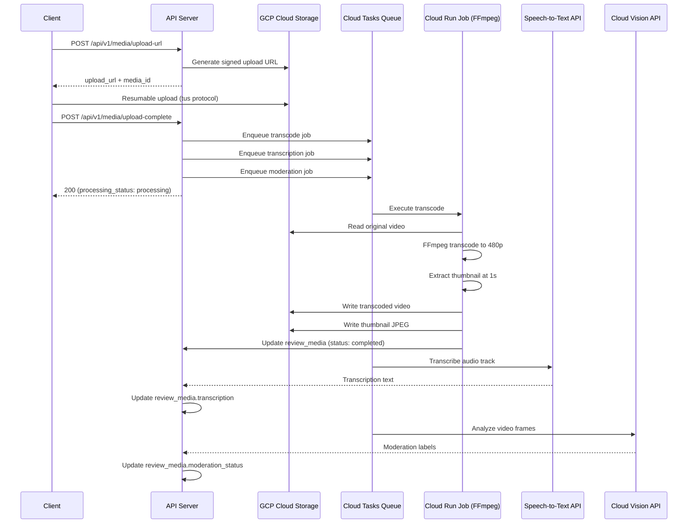
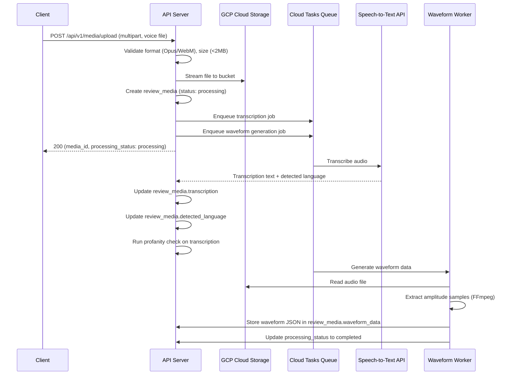

# Spec 10: Media Processing Pipeline

**Product:** Every Individual is a Brand -- Portable Individual Review App
**Author:** Muthukumaran Navaneethakrishnan
**Date:** 2026-04-14
**Status:** Draft
**PRD References:** PRD-04 (Rich Media as Social Proof)
**Spec References:** Spec-02 (Database Schema -- `review_media` table), Spec-06 (QR Review Flow -- `POST /api/v1/media/upload`)

---

## 1. Scope

This spec defines the end-to-end media processing pipeline for the three review expression modes: text, voice, and video. It covers upload mechanics, server-side processing (transcoding, transcription, waveform generation), storage layout in GCP Cloud Storage, CDN delivery, content moderation, and the database schema additions required to track processing state.

The upload endpoint itself (`POST /api/v1/media/upload`) is defined in Spec-06, Section 4.6. This spec extends that endpoint with the processing logic that runs after the file is received.

---

## 2. Upload Pipeline

### 2.1 Client-Side Upload Strategy

**Video (resumable upload via tus protocol):**

Mobile connections are unreliable. Video files up to 20MB require resumable uploads to avoid forcing the user to re-record on a dropped connection.

1. Client records video (H.264/MP4, up to 720p, max 30s).
2. Client requests a signed upload URL from the server: `POST /api/v1/media/upload-url`.
3. Server returns a GCP Cloud Storage resumable upload URI (pre-signed PUT).
4. Client uploads directly to GCS using the [tus protocol](https://tus.io/) via the `tus-js-client` library:
   - Chunk size: 256 KB (optimized for 4G mobile).
   - Automatic retry on failure: 3 attempts with exponential backoff (1s, 2s, 4s).
   - Progress callback drives the client-side progress bar.
5. On completion, client notifies the server: `POST /api/v1/media/upload-complete`.

**Voice (direct upload):**

Voice files are small (<500KB). No chunking or resumable protocol needed.

1. Client records audio (Opus/WebM, max 15s).
2. Client uploads via `POST /api/v1/media/upload` as `multipart/form-data` with the binary file.
3. Server receives via `multer` (in-memory buffer, max 2MB limit) and streams to GCS.

**Text (JSON payload):**

1. Client sends text content in the JSON body of `POST /api/v1/media/upload`.
2. No file upload. Stored directly in `review_media.content_text`.

### 2.2 Pre-Signed Upload URL Endpoint

```
POST /api/v1/media/upload-url
```

**Request Body:**

```json
{
  "review_id": "uuid",
  "media_type": "video",
  "file_name": "recording.mp4",
  "file_size": 18500000,
  "content_type": "video/mp4"
}
```

**Server-Side Logic:**

1. Validate `review_id` exists and was submitted within the last 10 minutes.
2. Validate no media already attached to this review.
3. Validate `file_size` <= 20MB (20,971,520 bytes).
4. Validate `content_type` is `video/mp4` or `video/webm`.
5. Generate a GCS signed upload URL with 10-minute expiry.
6. Create a `review_media` record with `processing_status = 'pending'`.

**Response (200):**

```json
{
  "upload_url": "https://storage.googleapis.com/...",
  "upload_expires_at": "2026-04-14T14:40:00Z",
  "media_id": "uuid"
}
```

### 2.3 Upload Completion Callback

```
POST /api/v1/media/upload-complete
```

**Request Body:**

```json
{
  "media_id": "uuid",
  "review_id": "uuid"
}
```

**Server-Side Logic:**

1. Verify the file exists in GCS at the expected path.
2. Verify file size matches what was declared (within 5% tolerance).
3. Update `review_media.processing_status` to `'processing'`.
4. Enqueue transcoding and transcription jobs.
5. Update `reviews.fraud_score` (+5 for media attachment).

### 2.4 File Validation

All validation runs before storage (for direct uploads) or before signed URL generation (for resumable uploads).

| Check | Text | Voice | Video |
|-------|------|-------|-------|
| Content type | N/A | `audio/webm`, `audio/ogg` | `video/mp4`, `video/webm` |
| Max file size | N/A | 2MB (raw upload limit) | 20MB |
| Target file size | <1KB | <500KB | <5MB (after transcoding) |
| Max duration | N/A | 15 seconds | 30 seconds |
| Min duration | N/A | 2 seconds | 3 seconds |
| Character limit | 280 chars (UTF-8) | N/A | N/A |
| Resolution | N/A | N/A | 720p max |

Duration validation for voice and video is performed server-side using `ffprobe` after upload:

```bash
ffprobe -v error -show_entries format=duration -of csv=p=0 input.webm
```

If duration is out of range, the file is deleted from GCS and the `review_media` record is removed. The client receives a `422` on the completion callback.

---

## 3. Video Processing

### 3.1 Processing Pipeline



### 3.2 Input Constraints

| Property | Value |
|----------|-------|
| Max resolution | 720p (1280x720) |
| Codec | H.264 (AVC) |
| Container | MP4 or WebM |
| Max duration | 30 seconds |
| Max raw file size | 20 MB |

### 3.3 Transcoding Specification

**Runtime:** Cloud Run Job with FFmpeg 6.x installed in the container image.

**Output:**
- Resolution: 480p (854x480), maintaining aspect ratio with `scale=-2:480`
- Codec: H.264 (libx264), AAC audio
- Container: MP4
- Target file size: <5MB
- CRF: 28 (constant rate factor for quality/size balance)
- Audio: 64 kbps AAC mono

**FFmpeg transcode command:**

```bash
ffmpeg -i input.mp4 \
  -vf "scale=-2:480" \
  -c:v libx264 -preset medium -crf 28 \
  -c:a aac -b:a 64k -ac 1 \
  -movflags +faststart \
  -max_muxing_queue_size 1024 \
  -t 30 \
  -y output.mp4
```

Flag breakdown:
- `scale=-2:480` -- scale to 480p height, auto-calculate width (even number).
- `-preset medium` -- balanced encoding speed vs compression.
- `-crf 28` -- visually acceptable quality at small file size.
- `-b:a 64k -ac 1` -- 64 kbps mono audio (voice is the content, not music).
- `-movflags +faststart` -- move moov atom to start for progressive playback.
- `-t 30` -- hard cap at 30 seconds (defense against manipulated duration metadata).

**Thumbnail extraction command:**

```bash
ffmpeg -i input.mp4 \
  -vf "select=gte(n\,30),scale=-2:480" \
  -frames:v 1 \
  -q:v 5 \
  -y thumbnail.jpg
```

This extracts the frame at approximately 1 second (frame 30 at 30fps). If the video has fewer than 30 frames, it falls back to the first frame. The `select` filter skips potential black frames at the start.

### 3.4 Processing SLA

| Metric | Target |
|--------|--------|
| Transcode time (30s video) | <60 seconds |
| Thumbnail extraction | <5 seconds (runs as part of transcode job) |
| Transcription (30s audio track) | <30 seconds |
| Total pipeline (upload complete to fully processed) | <90 seconds |

### 3.5 Failure Handling

1. Each job (transcode, transcription, moderation) retries independently up to 3 times with exponential backoff (10s, 30s, 90s).
2. On 3rd failure: set `review_media.processing_status = 'failed'` and `processing_error` to the error message.
3. The original file is preserved in GCS. The review remains visible without video playback.
4. Failed jobs are logged to Cloud Logging and trigger a PagerDuty alert if failure rate exceeds 5% in a 1-hour window.
5. Manual retry is available via an admin endpoint: `POST /api/v1/admin/media/:media_id/retry`.

### 3.6 Status Tracking

The `review_media.processing_status` column tracks the lifecycle:

```
pending --> processing --> completed
                      \--> failed
```

State transitions:
- `pending`: Record created, upload URL issued (or upload received for voice).
- `processing`: Upload confirmed, async jobs enqueued.
- `completed`: All async jobs finished successfully (transcode + transcription + moderation).
- `failed`: Any job exhausted retries. `processing_error` contains the failure reason.

---

## 4. Voice Processing

### 4.1 Processing Pipeline



### 4.2 Input Constraints

| Property | Value |
|----------|-------|
| Codec | Opus |
| Container | WebM |
| Max duration | 15 seconds |
| Min duration | 2 seconds |
| Max file size | 2MB (upload limit), target <500KB |
| Bitrate | 32 kbps (client-side encoding) |

### 4.3 Storage

Voice files are stored directly to GCP Cloud Storage without server-side transcoding. The Opus/WebM format is efficient enough at 32 kbps that no further compression is needed. The file is playable in all modern browsers.

### 4.4 Transcription

**Service:** Google Cloud Speech-to-Text API (v2).

**Configuration:**

```json
{
  "config": {
    "encoding": "WEBM_OPUS",
    "sampleRateHertz": 48000,
    "languageCode": "en-SG",
    "alternativeLanguageCodes": ["zh", "ms", "ta"],
    "enableAutomaticPunctuation": true,
    "model": "latest_short"
  }
}
```

- **Primary language:** `en-SG` (English, Singapore locale).
- **Alternative languages:** Mandarin (`zh`), Malay (`ms`), Tamil (`ta`) -- auto-detected by the API.
- **Model:** `latest_short` -- optimized for utterances under 60 seconds.
- **Output:** Transcription text stored in `review_media.transcription`. Detected language stored in `review_media.detected_language`.
- **Async:** The transcription runs as a Cloud Tasks job. The review is visible immediately with a waveform player; transcription appears when ready.

**Cost estimate:**

| Metric | Value |
|--------|-------|
| Per-request cost | ~$0.006 per 15-second clip |
| At 10K reviews/month, 15% voice rate | ~1,500 voice reviews/month |
| Monthly transcription cost | ~$9/month |

### 4.5 Waveform Generation

The waveform data powers the inline audio player on the profile page. It is a JSON array of normalized amplitude values (0.0 to 1.0) sampled at regular intervals.

**Generation command (FFmpeg + custom script):**

```bash
ffmpeg -i recording.webm \
  -ac 1 -filter:a "aresample=8000,astats=metadata=1:reset=1" \
  -f null - 2>&1 | \
  grep "RMS level" | \
  awk '{print $NF}'
```

**Simplified approach (used in production):**

A Node.js worker reads the audio file, decodes it, and samples the RMS amplitude at 10ms intervals, producing approximately 150 data points for a 15-second clip. The output is a JSON array:

```json
[0.12, 0.34, 0.56, 0.78, 0.91, 0.67, 0.45, 0.23, ...]
```

This array is stored in `review_media.waveform_data` (JSONB column). The frontend renders it as an SVG waveform visualization.

---

## 5. Text Processing

### 5.1 Input Constraints

| Property | Value |
|----------|-------|
| Max length | 280 characters |
| Encoding | UTF-8 |
| Storage | `review_media.content_text` (no file storage) |

### 5.2 Profanity Filter

The profanity filter runs synchronously at submit time. If content is flagged, the submission is rejected with a prompt to revise.

**Two-layer approach:**

1. **Word list:** A curated list of profane terms (English, Mandarin romanized, Malay, Tamil romanized). Checked via exact match and Levenshtein distance <= 1 (catches intentional misspellings like "sh1t"). Library: `bad-words` npm package with custom word list extensions.

2. **ML classifier:** Google Cloud Natural Language API `analyzeSentiment` + `moderateText` for toxicity detection. Threshold: toxicity score > 0.7 triggers a flag.

**Flow:**

1. Word list check (fast, <5ms). If match found: reject with `422` and message "Please revise your review -- it contains language that violates our content policy."
2. ML classifier check (async, <200ms). If toxicity detected: allow submission but set `moderation_status = 'flagged'` for human review.

### 5.3 Language Detection

Language detection runs on submit via Google Cloud Natural Language API `detectLanguage`. The detected language code (ISO 639-1) is stored in `review_media.detected_language`.

### 5.4 Contact Information Redaction

Text is scanned for contact information patterns before storage:

- **Phone numbers:** Regex `\+?\d[\d\s\-()]{7,}\d` -- replaced with `[redacted]`.
- **Email addresses:** Regex `[\w.+-]+@[\w-]+\.[\w.]+` -- replaced with `[redacted]`.
- **URLs:** Regex `https?://\S+` -- replaced with `[redacted]`.

Redaction runs server-side before writing to `content_text`. The original unredacted text is not stored.

---

## 6. GCP Cloud Storage Structure

```
gs://{bucket}/
├── qr-codes/
│   └── {profile_slug}.png
├── media/
│   ├── video/
│   │   └── {review_id}/
│   │       ├── original.mp4          # Raw upload (deleted after transcoding succeeds)
│   │       ├── transcoded.mp4        # 480p H.264, <5MB
│   │       └── thumbnail.jpg         # Poster frame, 480p, JPEG q=5
│   ├── voice/
│   │   └── {review_id}/
│   │       └── recording.webm        # Opus/WebM, <500KB
│   └── waveforms/
│       └── {review_id}/
│           └── waveform.json         # Amplitude array for inline player
```

**Naming conventions:**
- `{review_id}` is the UUID of the review (not the media record). One media per review, so this is a 1:1 mapping.
- Original video files are deleted after successful transcoding to save storage costs. The transcoded file becomes the canonical copy.
- Waveform JSON is stored both in GCS (for CDN delivery) and in `review_media.waveform_data` (for API responses without a separate fetch).

**Bucket configuration:**
- Region: `asia-southeast1` (Singapore).
- Storage class: Standard (hot) for media <90 days. Nearline for media >90 days (lifecycle rule).
- Versioning: Disabled (media is immutable after processing).
- Public access: Blocked. All access via signed URLs.

---

## 7. CDN and Delivery

### 7.1 Signed URLs

All media is served via GCP Cloud Storage signed URLs. No public bucket access.

| Use Case | Expiry | Permissions |
|----------|--------|-------------|
| Video/voice playback | 1 hour | `read` |
| Video upload (pre-signed PUT) | 10 minutes | `write` |
| Thumbnail display | 1 hour | `read` |
| Waveform data | 1 hour | `read` |

**Signed URL generation (Node.js):**

```typescript
import { Storage } from '@google-cloud/storage';

const storage = new Storage();

async function generateSignedPlaybackUrl(filePath: string): Promise<string> {
  const [url] = await storage.bucket(BUCKET_NAME).file(filePath).getSignedUrl({
    version: 'v4',
    action: 'read',
    expires: Date.now() + 60 * 60 * 1000, // 1 hour
  });
  return url;
}

async function generateSignedUploadUrl(
  filePath: string,
  contentType: string,
): Promise<string> {
  const [url] = await storage.bucket(BUCKET_NAME).file(filePath).getSignedUrl({
    version: 'v4',
    action: 'write',
    expires: Date.now() + 10 * 60 * 1000, // 10 minutes
    contentType,
  });
  return url;
}
```

### 7.2 Cache Headers

When serving media through signed URLs, GCS respects the object metadata cache-control headers set at upload time:

| Media Type | Cache-Control |
|------------|---------------|
| Transcoded video | `public, max-age=86400` (24 hours) |
| Voice recording | `public, max-age=86400` (24 hours) |
| Thumbnail | `public, max-age=86400` (24 hours) |
| Waveform JSON | `public, max-age=86400` (24 hours) |
| Original video | `private, no-cache` (temporary, deleted after transcode) |

### 7.3 Video Streaming (v2 -- Optional)

For profiles with high view counts, HLS streaming may be added in v2:

- Segment duration: 2 seconds.
- Quality tiers: 480p (primary), 240p (low bandwidth).
- Implementation: FFmpeg generates HLS segments during transcoding.
- Trigger: Profiles with >100 video views/week get HLS segments pre-generated.

For v1, direct MP4 playback via signed URLs is sufficient. The `faststart` flag in the FFmpeg command enables progressive download (playback begins before download completes).

### 7.4 Voice Playback

Voice files are served as direct signed URLs. At <500KB, the entire file downloads in <1 second on 4G. No streaming protocol is needed. The client-side player uses the `<audio>` element with the waveform visualization rendered from `waveform_data`.

---

## 8. Moderation

### 8.1 Automated Moderation

| Check | Media Type | Service | Threshold | Action |
|-------|-----------|---------|-----------|--------|
| Nudity detection | Video | Google Cloud Vision API (SafeSearch) | `LIKELY` or `VERY_LIKELY` | Auto-reject |
| Violence detection | Video | Google Cloud Vision API (SafeSearch) | `LIKELY` or `VERY_LIKELY` | Auto-reject |
| Profanity (text) | Text | Word list + NL API `moderateText` | Word match or toxicity > 0.7 | Block submit / flag |
| Profanity (transcription) | Voice, Video | NL API `moderateText` on transcription | Toxicity > 0.7 | Flag for review |
| Spam patterns | All | Custom rules (repeated text, URL injection) | Pattern match | Flag for review |

**Video frame analysis:**

Cloud Vision API analyzes 3 frames extracted from the video (at 1s, 10s, 20s or evenly distributed across duration):

```bash
ffmpeg -i transcoded.mp4 \
  -vf "select=eq(n\,30)+eq(n\,300)+eq(n\,600)" \
  -frames:v 3 \
  -vsync vfr \
  frame_%d.jpg
```

Each frame is sent to Cloud Vision SafeSearch detection. If any frame returns `LIKELY` or `VERY_LIKELY` for `adult`, `violence`, or `racy`, the media is auto-rejected.

**Cost estimate:** ~$0.0015 per image (3 images per video = ~$0.0045 per video review).

### 8.2 Manual Moderation Queue

Flagged content enters a moderation queue accessible to platform admins.

**Queue entry structure:**

```json
{
  "media_id": "uuid",
  "review_id": "uuid",
  "flag_reason": "profanity_detected_in_transcription",
  "flag_source": "automated",
  "flagged_at": "2026-04-14T14:35:00Z",
  "transcription": "...",
  "media_url": "signed_url",
  "reviewer_phone_last_four": "1234"
}
```

**SLA:** Flagged content reviewed within 4 hours during business hours (SGT 09:00-18:00).

**Admin actions:**
- **Approve:** Set `moderation_status = 'approved'`. Media becomes visible on the profile.
- **Reject:** Set `moderation_status = 'rejected'`. Media is hidden. Review remains (quality picks are still valid). Reviewer is not notified in v1.
- **Escalate:** Forward to senior admin for complex cases (e.g., borderline content, potential legal issues).

### 8.3 Moderation Status Lifecycle

```
pending --> approved     (auto-approved if no flags raised)
        \-> flagged --> approved     (human reviewer approves)
                    \-> rejected     (human reviewer rejects)
```

- Content with `moderation_status = 'pending'` is visible on the profile by default (optimistic display).
- Content with `moderation_status = 'flagged'` is hidden until a human reviewer acts.
- Content with `moderation_status = 'rejected'` is permanently hidden. The media file is retained for 30 days (for appeals in v2), then deleted.

---

## 9. Content Policy

### 9.1 Prohibited Content

1. **Profanity, hate speech, or personal attacks** -- detected via word list and ML classifier.
2. **Contact information** (phone numbers, email addresses, URLs) -- auto-redacted from text; flagged in transcriptions.
3. **Commercial content or spam** -- detected via pattern matching (repeated phrases, promotional language).
4. **Sexually explicit or violent content** -- detected via Cloud Vision API for video; ML classifier for text.
5. **Content unrelated to the service interaction** -- flagged by ML classifier; reviewed by human moderator.

### 9.2 Enforcement Actions

| Violation | Action |
|-----------|--------|
| Profanity in text | Block submission, prompt to revise |
| Contact info in text | Auto-redact, allow submission |
| Nudity/violence in video | Auto-reject media, review stays without media |
| Profanity in transcription | Flag for human review, hide until approved |
| Spam pattern | Flag for human review |

### 9.3 Rejected Content Handling

When media is rejected:
- The review record remains. Quality picks (expertise, care, etc.) are still valid and contribute to the individual's profile counters.
- Only the media attachment is removed from display.
- The `review_media` record stays in the database with `moderation_status = 'rejected'` for audit purposes.
- The media file in GCS is retained for 30 days, then deleted by a lifecycle rule.

---

## 10. Database Updates

The following columns are added to the `review_media` table (Spec-02, Section 6) via a new migration.

### 10.1 New Columns

```sql
ALTER TABLE review_media
  ADD COLUMN processing_status VARCHAR(20) NOT NULL DEFAULT 'pending',
  ADD COLUMN processing_error TEXT,
  ADD COLUMN waveform_data JSONB,
  ADD COLUMN thumbnail_url VARCHAR(512),
  ADD COLUMN detected_language VARCHAR(10);
```

| Column | Type | Default | Description |
|--------|------|---------|-------------|
| `processing_status` | `VARCHAR(20)` | `'pending'` | One of: `pending`, `processing`, `completed`, `failed` |
| `processing_error` | `TEXT` | `NULL` | Error message if `processing_status = 'failed'` |
| `waveform_data` | `JSONB` | `NULL` | JSON array of amplitude values (0.0-1.0) for voice waveform player |
| `thumbnail_url` | `VARCHAR(512)` | `NULL` | GCS path to the poster frame JPEG for video reviews |
| `detected_language` | `VARCHAR(10)` | `NULL` | ISO 639-1 language code detected from text or transcription |

### 10.2 Sequelize Model Update

```typescript
// Additions to ReviewMediaAttributes interface
processingStatus: 'pending' | 'processing' | 'completed' | 'failed';
processingError: string | null;
waveformData: number[] | null;
thumbnailUrl: string | null;
detectedLanguage: string | null;
```

```typescript
// Additions to ReviewMedia.init() field definitions
processingStatus: {
  type: DataTypes.STRING(20),
  allowNull: false,
  defaultValue: 'pending',
  field: 'processing_status',
  validate: {
    isIn: [['pending', 'processing', 'completed', 'failed']],
  },
},
processingError: {
  type: DataTypes.TEXT,
  allowNull: true,
  field: 'processing_error',
},
waveformData: {
  type: DataTypes.JSONB,
  allowNull: true,
  field: 'waveform_data',
},
thumbnailUrl: {
  type: DataTypes.STRING(512),
  allowNull: true,
  field: 'thumbnail_url',
},
detectedLanguage: {
  type: DataTypes.STRING(10),
  allowNull: true,
  field: 'detected_language',
},
```

### 10.3 New Index

```sql
CREATE INDEX review_media_processing_status_idx ON review_media (processing_status);
```

This index supports queries for the admin dashboard ("show all media currently processing" or "show all failed media").

### 10.4 Migration File

```
20260414-0015-add-media-processing-columns.ts
```

---

## 11. Unit Tests for Media Module

All tests use Vitest + Supertest. File location: `src/modules/media/__tests__/`.

### 11.1 Upload Validation

| # | Test Case | Expected Result |
|---|-----------|-----------------|
| 1 | Upload voice file with `audio/webm` content type | 200 OK, media record created |
| 2 | Upload voice file with `audio/ogg` content type | 200 OK, media record created |
| 3 | Upload voice file with `audio/mpeg` content type | 422 Unprocessable Entity |
| 4 | Upload video file with `video/mp4` content type | 200 OK, signed URL returned |
| 5 | Upload video file with `video/webm` content type | 200 OK, signed URL returned |
| 6 | Upload video file with `video/avi` content type | 422 Unprocessable Entity |
| 7 | Upload text with valid `content` field | 200 OK, stored in `content_text` |
| 8 | Upload with invalid `media_type` value | 422 Unprocessable Entity |
| 9 | Upload to review submitted >10 minutes ago | 410 Gone |
| 10 | Upload to review that already has media | 409 Conflict |
| 11 | Upload to non-existent review_id | 404 Not Found |

### 11.2 File Size Limits

| # | Test Case | Expected Result |
|---|-----------|-----------------|
| 12 | Voice file exactly 500KB | 200 OK |
| 13 | Voice file at 2MB (upload limit) | 200 OK |
| 14 | Voice file at 2.1MB | 413 Payload Too Large |
| 15 | Video file at 20MB | 200 OK (signed URL issued) |
| 16 | Video file at 20.1MB | 413 Payload Too Large (signed URL refused) |
| 17 | Text at exactly 280 characters | 200 OK |
| 18 | Text at 281 characters | 422 Unprocessable Entity |
| 19 | Text as empty string | 422 Unprocessable Entity |

### 11.3 Duration Limits

| # | Test Case | Expected Result |
|---|-----------|-----------------|
| 20 | Voice file with 2s duration | 200 OK |
| 21 | Voice file with 1.9s duration | 422 (below minimum 2s) |
| 22 | Voice file with 15s duration | 200 OK |
| 23 | Voice file with 15.5s duration | 422 (exceeds 15s max) |
| 24 | Video file with 3s duration | 200 OK |
| 25 | Video file with 2.9s duration | 422 (below minimum 3s) |
| 26 | Video file with 30s duration | 200 OK |
| 27 | Video file with 31s duration | 422 (exceeds 30s max) |

### 11.4 FFmpeg Transcoding

| # | Test Case | Expected Result |
|---|-----------|-----------------|
| 28 | Transcode 720p input to 480p output | Output resolution is 854x480 (or proportional) |
| 29 | Transcode output format is H.264/MP4 | Output codec is `h264`, container is `mp4` |
| 30 | Transcode output has `faststart` moov atom | `moov` atom appears before `mdat` in output |
| 31 | Transcode 30s video produces file <5MB | Output file size < 5,242,880 bytes |
| 32 | Transcode preserves audio track | Output has audio stream with AAC codec |
| 33 | Thumbnail extracted as JPEG | Output file is valid JPEG image |
| 34 | Thumbnail resolution is 480p height | Image height is 480px |
| 35 | Transcode of corrupt file fails gracefully | `processing_status` set to `failed`, `processing_error` populated |

### 11.5 Transcription

| # | Test Case | Expected Result |
|---|-----------|-----------------|
| 36 | Transcribe clear English voice clip | Transcription text is non-empty, stored in `review_media.transcription` |
| 37 | Transcription detects English language | `detected_language` is `en` |
| 38 | Transcription detects Mandarin language | `detected_language` is `zh` |
| 39 | Transcription API returns error, retried 3x | After 3 failures, `processing_status` is `failed` |
| 40 | Transcription API returns error, succeeds on retry 2 | `processing_status` is `completed`, transcription stored |
| 41 | Transcription of silent audio | Transcription is empty string, `processing_status` is `completed` |

### 11.6 Profanity Filter

| # | Test Case | Expected Result |
|---|-----------|-----------------|
| 42 | Clean text "Great service, thank you" | 200 OK, `moderation_status` = `approved` |
| 43 | Text with profane word | 422 (submission blocked, prompt to revise) |
| 44 | Text with leetspeak profanity ("sh1t") | 422 (Levenshtein match catches it) |
| 45 | Text with high toxicity score (>0.7) but no word list match | 200 OK, `moderation_status` = `flagged` |
| 46 | Transcription with profanity | `moderation_status` = `flagged` |
| 47 | Text with phone number "call me at 91234567" | Stored as "call me at [redacted]", 200 OK |
| 48 | Text with email "user@example.com" | Stored with email redacted, 200 OK |

### 11.7 Signed URL Generation

| # | Test Case | Expected Result |
|---|-----------|-----------------|
| 49 | Generate playback URL for video | URL expires in 1 hour, has `read` permission |
| 50 | Generate playback URL for voice | URL expires in 1 hour, has `read` permission |
| 51 | Generate upload URL for video | URL expires in 10 minutes, has `write` permission |
| 52 | Generate playback URL for non-existent file | Error thrown, handled gracefully |

### 11.8 Moderation

| # | Test Case | Expected Result |
|---|-----------|-----------------|
| 53 | Video with no SafeSearch flags | `moderation_status` = `approved` |
| 54 | Video with nudity detected (VERY_LIKELY) | `moderation_status` = `rejected` |
| 55 | Video with violence detected (LIKELY) | `moderation_status` = `rejected` |
| 56 | Video with racy content (POSSIBLE) | `moderation_status` unchanged (below threshold) |
| 57 | Clean transcription text | No flag raised |
| 58 | Transcription with profanity | `moderation_status` = `flagged` |
| 59 | Admin approves flagged content | `moderation_status` transitions to `approved` |
| 60 | Admin rejects flagged content | `moderation_status` transitions to `rejected` |

### 11.9 Processing Status Transitions

| # | Test Case | Expected Result |
|---|-----------|-----------------|
| 61 | New upload creates record with `pending` status | `processing_status` = `pending` |
| 62 | Upload completion callback moves to `processing` | `processing_status` = `processing` |
| 63 | Successful transcode + transcription moves to `completed` | `processing_status` = `completed` |
| 64 | Failed transcode after 3 retries moves to `failed` | `processing_status` = `failed`, `processing_error` is not null |
| 65 | Failed record cannot transition to `processing` again (without admin retry) | State transition rejected |
| 66 | Admin retry on failed media resets to `processing` | `processing_status` = `processing`, `processing_error` = null |
| 67 | Text media skips `processing`, goes directly to `completed` | `processing_status` = `completed` |
| 68 | Voice with transcription failure but successful waveform is `failed` | All jobs must succeed for `completed` |
