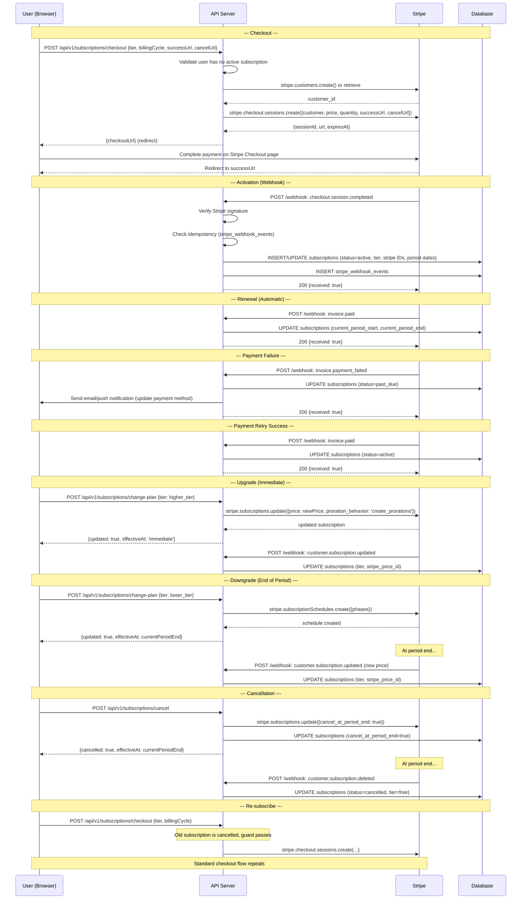

# Spec 11: Stripe Subscriptions

**Product:** Every Individual is a Brand -- Portable Individual Review App  
**Author:** Muthukumaran Navaneethakrishnan  
**Date:** 2026-04-14  
**Status:** Partial — backend (checkout / webhook / cancel / getMe) implemented; frontend `BillingPage` shipped 2026-04-19; `change-plan` and `portal` endpoints still pending.  
**References:** PRD 05 (Monetization), Spec 02 (Database Schema -- `subscriptions` table), Spec 03 (API Endpoints -- Subscription Module)

---

## 1. Stripe Products & Prices

Three Stripe products map to the application's paid tiers. Each product has one or more Stripe Price objects. Price IDs are stored as environment variables so they can differ across environments (test, staging, production).

### 1.1 Product: Review App Pro (Individual)

| Price | Billing | Env Var |
|-------|---------|---------|
| $10/month | Monthly | `STRIPE_PRICE_PRO_MONTHLY` |
| $5/month ($60/year) | Annual | `STRIPE_PRICE_PRO_ANNUAL` |

Stripe product metadata: `{ app_tier: 'pro' }`

### 1.2 Product: Employer Dashboard (Per Location)

| Price | Employee Count | Billing | Env Var |
|-------|---------------|---------|---------|
| $50/month | < 25 employees | Monthly | `STRIPE_PRICE_EMPLOYER_SMALL` |
| $100/month | 25-100 employees | Monthly | `STRIPE_PRICE_EMPLOYER_MEDIUM` |
| $200/month | 100+ employees | Monthly | `STRIPE_PRICE_EMPLOYER_LARGE` |

Stripe product metadata: `{ app_tier: 'employer' }`

Quantity = number of locations. Volume discounts (10+ locations: 20% off, 50+ locations: 35% off) are handled via Stripe Coupons applied at checkout time, not separate Price objects.

### 1.3 Product: Recruiter Access (Per Seat)

| Price | Tier | Billing | Env Var |
|-------|------|---------|---------|
| $500/month | Basic (search + view) | Monthly | `STRIPE_PRICE_RECRUITER_BASIC` |
| $1,000/month | Premium (search + view + contact + references) | Monthly | `STRIPE_PRICE_RECRUITER_PREMIUM` |

Stripe product metadata: `{ app_tier: 'recruiter' }`

Quantity = number of seats.

### 1.4 Environment Variables Summary

```bash
# Stripe keys
STRIPE_SECRET_KEY=sk_...
STRIPE_PUBLISHABLE_KEY=pk_...
STRIPE_WEBHOOK_SECRET=whsec_...

# Pro Individual prices
STRIPE_PRICE_PRO_MONTHLY=price_...
STRIPE_PRICE_PRO_ANNUAL=price_...

# Employer Dashboard prices
STRIPE_PRICE_EMPLOYER_SMALL=price_...
STRIPE_PRICE_EMPLOYER_MEDIUM=price_...
STRIPE_PRICE_EMPLOYER_LARGE=price_...

# Recruiter Access prices
STRIPE_PRICE_RECRUITER_BASIC=price_...
STRIPE_PRICE_RECRUITER_PREMIUM=price_...
```

### 1.5 Tier-to-Price Mapping

The server resolves the correct Stripe Price ID from the `tier` + `billingCycle` provided in the checkout request:

```typescript
const PRICE_MAP: Record<string, string> = {
  'pro_individual:monthly':  process.env.STRIPE_PRICE_PRO_MONTHLY!,
  'pro_individual:annual':   process.env.STRIPE_PRICE_PRO_ANNUAL!,
  'employer_small:monthly':  process.env.STRIPE_PRICE_EMPLOYER_SMALL!,
  'employer_medium:monthly': process.env.STRIPE_PRICE_EMPLOYER_MEDIUM!,
  'employer_large:monthly':  process.env.STRIPE_PRICE_EMPLOYER_LARGE!,
  'recruiter_basic:monthly': process.env.STRIPE_PRICE_RECRUITER_BASIC!,
  'recruiter_premium:monthly': process.env.STRIPE_PRICE_RECRUITER_PREMIUM!,
};
```

---

## 2. Checkout Flow

### POST `/api/v1/subscriptions/checkout`

Defined in Spec 03. This section specifies the Stripe integration details.

**Input (from Spec 03):**

```typescript
const checkoutSchema = z.object({
  tier: z.enum([
    'pro_individual',
    'employer_small', 'employer_medium', 'employer_large',
    'recruiter_basic', 'recruiter_premium',
  ]),
  billingCycle: z.enum(['monthly', 'annual']).default('monthly'),
  successUrl: z.string().url(),
  cancelUrl: z.string().url(),
  locationCount: z.coerce.number().int().min(1).optional(),
  seatCount: z.coerce.number().int().min(1).optional(),
});
```

**Server-Side Logic (`SubscriptionController.createCheckout`):**

1. Verify user does not have an active subscription (return 409 `ACTIVE_SUBSCRIPTION_EXISTS` if so).
2. Look up or create a Stripe Customer using the user's email. Store the `stripe_customer_id` on the subscription record.
3. Resolve the Stripe Price ID from `PRICE_MAP[tier:billingCycle]`. Return 400 if the combination is invalid.
4. Determine `quantity`:
   - `pro_individual`: quantity = 1
   - `employer_*`: quantity = `locationCount` (required, validated)
   - `recruiter_*`: quantity = `seatCount` (required, validated)
5. Apply volume discount coupons for employer tiers if `locationCount >= 10`.
6. Create a Stripe Checkout Session:

```typescript
const session = await stripe.checkout.sessions.create({
  customer: stripeCustomerId,
  mode: 'subscription',
  line_items: [{
    price: priceId,
    quantity,
  }],
  subscription_data: {
    metadata: {
      user_id: user.id,
      app_tier: tier,
    },
  },
  success_url: successUrl,
  cancel_url: cancelUrl,
  metadata: {
    user_id: user.id,
    app_tier: tier,
  },
});
```

7. Return `{ checkoutSessionId: session.id, checkoutUrl: session.url, expiresAt: session.expires_at }`.

**After payment:** The user is redirected to `successUrl`. The subscription is NOT activated at this point. Activation happens only via the webhook (see Section 3).

---

## 3. Webhook Handling

### POST `/api/v1/subscriptions/webhook`

Defined in Spec 03. This section specifies the event handling logic.

**Signature Verification:**

```typescript
const event = stripe.webhooks.constructEvent(
  req.body,          // raw body (Buffer)
  req.headers['stripe-signature']!,
  process.env.STRIPE_WEBHOOK_SECRET!,
);
```

If verification fails, return 400 `INVALID_WEBHOOK_SIGNATURE`.

**Idempotency:** Every webhook event has a unique `event.id`. Store processed event IDs in a `stripe_webhook_events` table (or use the `stripe_subscription_id` + `event.type` + timestamp as a dedup key). If an event ID has already been processed, return 200 immediately without re-processing.

### 3.1 Event: `checkout.session.completed`

Triggered when a customer completes the Stripe Checkout flow.

**Handler Logic:**

1. Extract `user_id` and `app_tier` from `session.metadata`.
2. Retrieve the Stripe Subscription from `session.subscription`.
3. Create or update the `subscriptions` record:
   - `user_id` = metadata user_id
   - `tier` = map `app_tier` to DB tier (`pro_individual` -> `pro`, `employer_*` -> `employer`, `recruiter_*` -> `recruiter`)
   - `stripe_customer_id` = session.customer
   - `stripe_subscription_id` = session.subscription
   - `status` = `active`
   - `current_period_start` = subscription.current_period_start
   - `current_period_end` = subscription.current_period_end
4. Log audit event: `subscription_activated`.

### 3.2 Event: `customer.subscription.updated`

Triggered on plan changes, status transitions, or period renewals.

**Handler Logic:**

1. Look up local subscription by `stripe_subscription_id`.
2. If not found, log warning and return 200 (no-op).
3. Update fields:
   - `status` = map Stripe status (`active`, `past_due`, `canceled`, `trialing`, `incomplete`) to app status
   - `current_period_start` = subscription.current_period_start
   - `current_period_end` = subscription.current_period_end
   - `tier` = derive from subscription price metadata if plan changed
4. If this is an upgrade (tier increased), the change is already effective (Stripe applies it immediately with proration).
5. If this is a downgrade, Stripe schedules it for period end via `subscription_schedule`; the webhook fires again at period end with the new price.
6. Log audit event: `subscription_updated`.

### 3.3 Event: `customer.subscription.deleted`

Triggered when a subscription is fully cancelled (after the billing period ends, or on immediate cancellation).

**Handler Logic:**

1. Look up local subscription by `stripe_subscription_id`.
2. Set `status` = `cancelled`.
3. Set `tier` = `free` (revert to free tier).
4. Clear `current_period_start` and `current_period_end`.
5. Log audit event: `subscription_deactivated`.

### 3.4 Event: `invoice.payment_failed`

Triggered when a recurring payment attempt fails.

**Handler Logic:**

1. Look up local subscription by the invoice's `subscription` field.
2. Set `status` = `past_due`.
3. Send notification to user (email + in-app) with a link to update payment method via Stripe Customer Portal.
4. Log audit event: `payment_failed`.

**Note:** Stripe's automatic retry schedule (Smart Retries) will attempt the charge again. If all retries fail, Stripe will eventually fire `customer.subscription.deleted`.

### 3.5 Event: `invoice.paid`

Triggered when a payment succeeds (including retries after a previous failure).

**Handler Logic:**

1. Look up local subscription by the invoice's `subscription` field.
2. If `status` is `past_due`, set `status` = `active` (clear the payment failure flag).
3. Update `current_period_start` and `current_period_end` from the invoice's `period_start` and `period_end`.
4. Log audit event: `payment_succeeded`.

---

## 4. Upgrade/Downgrade Logic

### 4.1 Upgrade (Immediate, Prorated)

User upgrades from a lower tier to a higher tier (e.g., `pro` -> `employer`, or `recruiter_basic` -> `recruiter_premium`).

**Flow:**

1. Client calls `POST /api/v1/subscriptions/checkout` with the new tier.
   - If user has an active subscription, the server does NOT create a new Checkout Session.
   - Instead, use `stripe.subscriptions.update()` to change the price:

```typescript
await stripe.subscriptions.update(stripeSubscriptionId, {
  items: [{
    id: existingItemId,
    price: newPriceId,
  }],
  proration_behavior: 'create_prorations',  // charge difference immediately
  metadata: { app_tier: newTier },
});
```

2. Stripe calculates the prorated charge and creates an invoice.
3. The `customer.subscription.updated` webhook fires, and the handler updates the local record.

**Dedicated endpoint for upgrades/downgrades:**

### POST `/api/v1/subscriptions/change-plan`

```typescript
const changePlanSchema = z.object({
  tier: z.enum([
    'pro_individual',
    'employer_small', 'employer_medium', 'employer_large',
    'recruiter_basic', 'recruiter_premium',
  ]),
  billingCycle: z.enum(['monthly', 'annual']).optional(),
});
```

| Status | Body |
|--------|------|
| 200 | `{ updated: true, tier, effectiveAt: 'immediate', proratedAmount }` |
| 400 | `{ error: 'NO_ACTIVE_SUBSCRIPTION' }` |
| 400 | `{ error: 'SAME_TIER' }` |

### 4.2 Downgrade (End of Billing Period)

User downgrades to a lower tier.

**Flow:**

1. Client calls `POST /api/v1/subscriptions/change-plan` with the lower tier.
2. Server uses Stripe Subscription Schedules to schedule the change at period end:

```typescript
await stripe.subscriptionSchedules.create({
  from_subscription: stripeSubscriptionId,
  phases: [
    {
      items: [{ price: currentPriceId, quantity: currentQuantity }],
      end_date: currentPeriodEnd,
    },
    {
      items: [{ price: newPriceId, quantity: newQuantity }],
    },
  ],
});
```

3. The user keeps their current tier until the billing period ends.
4. At period end, Stripe fires `customer.subscription.updated` with the new price, and the handler updates the local record.

### 4.3 Cancel (End of Billing Period)

Handled by `POST /api/v1/subscriptions/cancel` (Spec 03).

**Flow:**

1. If `immediate: false` (default): call `stripe.subscriptions.update(id, { cancel_at_period_end: true })`.
   - User retains access until `current_period_end`.
   - At period end, Stripe fires `customer.subscription.deleted`, and the handler reverts to free tier.
2. If `immediate: true`: call `stripe.subscriptions.cancel(id)`.
   - Stripe fires `customer.subscription.deleted` immediately.
   - Handler reverts to free tier.

### 4.4 Re-subscribe

A user who previously cancelled can subscribe again.

**Flow:**

1. Client calls `POST /api/v1/subscriptions/checkout` with the desired tier.
2. Since the old subscription is `cancelled`, the active-subscription guard passes.
3. A new Stripe Checkout Session is created. Standard checkout flow applies.
4. On `checkout.session.completed`, a new subscription record is created (or the existing cancelled one is updated with the new Stripe IDs and set to `active`).

---

## 5. Tier Enforcement Middleware

### 5.1 `requireTier(tier: string | string[])`

Express middleware that checks whether the authenticated user has an active subscription at the required tier level.

```typescript
export function requireTier(requiredTier: string | string[]) {
  const tiers = Array.isArray(requiredTier) ? requiredTier : [requiredTier];

  return async (req: Request, res: Response, next: NextFunction) => {
    const userId = req.user!.id;

    const subscription = await Subscription.findOne({
      where: {
        userId,
        status: ['active', 'trialing'],
        tier: tiers,
      },
    });

    if (!subscription) {
      return res.status(402).json({
        error: 'SUBSCRIPTION_REQUIRED',
        message: 'This feature requires an active subscription.',
        requiredTier: tiers,
        upgradeUrl: '/pricing',
      });
    }

    // Verify the subscription period has not expired (belt-and-suspenders check)
    if (subscription.currentPeriodEnd && subscription.currentPeriodEnd < new Date()) {
      return res.status(402).json({
        error: 'SUBSCRIPTION_EXPIRED',
        message: 'Your subscription has expired. Please renew.',
        upgradeUrl: '/pricing',
      });
    }

    req.subscription = subscription;
    next();
  };
}
```

### 5.2 Application to Routes

| Feature | Required Tier | Middleware |
|---------|--------------|-----------|
| Analytics dashboard | `pro` | `requireTier('pro')` |
| Reputation report (PDF) | `pro` | `requireTier('pro')` |
| Custom QR designs | `pro` | `requireTier('pro')` |
| Video highlights reel | `pro` | `requireTier('pro')` |
| Recruiter visibility toggle | `pro` | `requireTier('pro')` |
| Team dashboard | `employer` | `requireTier('employer')` |
| Employee leaderboard | `employer` | `requireTier('employer')` |
| Retention risk alerts | `employer` | `requireTier('employer')` |
| Recruiter search | `recruiter` | `requireTier('recruiter')` |
| Recruiter contact/messaging | `recruiter` | `requireTier('recruiter')` |
| Verifiable references | `recruiter` | `requireTier('recruiter')` |

### 5.3 Free Tier Behavior

Free-tier users who hit a paid endpoint receive a 402 response:

```json
{
  "error": "SUBSCRIPTION_REQUIRED",
  "message": "This feature requires an active subscription.",
  "requiredTier": ["pro"],
  "upgradeUrl": "/pricing"
}
```

The frontend uses this response to show an upgrade prompt with pricing details.

---

## 6. Seat Management

### 6.1 Employer: Location-Based Pricing

Employer subscriptions are priced per location. The Stripe subscription `quantity` equals the number of locations.

**Adding locations:**

```typescript
await stripe.subscriptions.update(stripeSubscriptionId, {
  items: [{
    id: existingItemId,
    quantity: newLocationCount,
  }],
  proration_behavior: 'create_prorations',
});
```

**Removing locations:** Same API call with a lower quantity. Stripe prorates the credit.

**Employee count determines the price tier**, not the seat count. If a location grows from 20 to 30 employees, the employer must upgrade from `employer_small` ($50) to `employer_medium` ($100). This is a plan change, not a quantity change.

### 6.2 Recruiter: Per-Seat Pricing

Recruiter subscriptions use Stripe's per-seat model. The `quantity` on the subscription item equals the number of seats.

**Adding seats:**

### POST `/api/v1/subscriptions/seats`

```typescript
const updateSeatsSchema = z.object({
  seatCount: z.coerce.number().int().min(1),
});
```

**Handler:**

```typescript
await stripe.subscriptions.update(stripeSubscriptionId, {
  items: [{
    id: existingItemId,
    quantity: newSeatCount,
  }],
  proration_behavior: 'create_prorations',
});
```

| Status | Body |
|--------|------|
| 200 | `{ updated: true, seatCount, proratedAmount }` |
| 400 | `{ error: 'NO_ACTIVE_SUBSCRIPTION' }` |
| 400 | `{ error: 'INVALID_SEAT_COUNT' }` |

**Removing seats:** Same endpoint with a lower `seatCount`. Stripe prorates the credit. Minimum 1 seat.

---

## 7. Database

### 7.1 `subscriptions` Table (from Spec 02)

The existing schema from Spec 02 is sufficient:

| Column | Type | Notes |
|--------|------|-------|
| `id` | UUID | PK |
| `user_id` | UUID | FK -> users.id |
| `tier` | VARCHAR(20) | `free`, `pro`, `employer`, `recruiter` |
| `stripe_customer_id` | VARCHAR(255) | Stripe Customer ID |
| `stripe_subscription_id` | VARCHAR(255) | Stripe Subscription ID (unique) |
| `status` | VARCHAR(20) | `active`, `past_due`, `cancelled`, `trialing`, `incomplete` |
| `current_period_start` | TIMESTAMP | From Stripe |
| `current_period_end` | TIMESTAMP | From Stripe |
| `created_at` | TIMESTAMP | |
| `updated_at` | TIMESTAMP | |

### 7.2 Additional Columns (Migration Required)

The following columns should be added to `subscriptions` to support the full Stripe integration:

```typescript
// Migration: 20260414-0015-add-subscription-stripe-fields.ts
{
  billingCycle: {
    type: DataTypes.STRING(10),
    allowNull: true,
    field: 'billing_cycle',
    validate: { isIn: [['monthly', 'annual']] },
  },
  stripePriceId: {
    type: DataTypes.STRING(255),
    allowNull: true,
    field: 'stripe_price_id',
  },
  quantity: {
    type: DataTypes.INTEGER,
    allowNull: false,
    defaultValue: 1,
  },
  cancelAtPeriodEnd: {
    type: DataTypes.BOOLEAN,
    allowNull: false,
    defaultValue: false,
    field: 'cancel_at_period_end',
  },
  cancelledAt: {
    type: DataTypes.DATE,
    allowNull: true,
    field: 'cancelled_at',
  },
}
```

### 7.3 `stripe_webhook_events` Table (New)

For idempotent webhook processing:

```typescript
// Migration: 20260414-0016-create-stripe-webhook-events.ts
{
  id: { type: DataTypes.UUID, primaryKey: true, defaultValue: DataTypes.UUIDV4 },
  stripeEventId: {
    type: DataTypes.STRING(255),
    allowNull: false,
    unique: true,
    field: 'stripe_event_id',
  },
  eventType: {
    type: DataTypes.STRING(100),
    allowNull: false,
    field: 'event_type',
  },
  processedAt: {
    type: DataTypes.DATE,
    allowNull: false,
    defaultValue: DataTypes.NOW,
    field: 'processed_at',
  },
}
```

### 7.4 Sync Strategy

- **Webhook is the source of truth.** All subscription state changes flow through Stripe webhooks. The app never assumes a subscription is active based solely on a successful checkout redirect.
- **Polling as backup.** A scheduled job runs every 6 hours to reconcile:
  1. Fetch all subscriptions with `status = 'active'` from the DB.
  2. For each, call `stripe.subscriptions.retrieve(stripeSubscriptionId)`.
  3. If the Stripe status differs from the local status, update the local record and log the discrepancy.
  4. This catches any missed webhooks (network failures, deployment gaps).
- **Manual sync endpoint** (admin only): `POST /api/v1/admin/subscriptions/:id/sync` -- fetches current state from Stripe and overwrites the local record.

---

## 8. Subscription Lifecycle Sequence Diagram



---

## 9. Stripe Customer Portal

Provide a self-service portal link so users can update their payment method, view invoices, and manage their subscription directly on Stripe.

### POST `/api/v1/subscriptions/portal`

```typescript
const portalSession = await stripe.billingPortal.sessions.create({
  customer: stripeCustomerId,
  return_url: returnUrl,
});
```

| Status | Body |
|--------|------|
| 200 | `{ portalUrl }` |
| 400 | `{ error: 'NO_STRIPE_CUSTOMER' }` |

---

## 10. Unit Tests

All tests use Vitest + Supertest. Stripe calls are mocked using `vi.mock('stripe')`.

### 10.1 Checkout Tests

| Test | Description |
|------|-------------|
| `creates checkout session for pro_individual monthly` | Valid tier + billing cycle returns 201 with `checkoutUrl` |
| `creates checkout session for pro_individual annual` | Annual billing resolves correct price ID |
| `creates checkout session for employer_small with locationCount` | Employer tier requires `locationCount`, sets quantity |
| `creates checkout session for recruiter_basic with seatCount` | Recruiter tier requires `seatCount`, sets quantity |
| `rejects invalid tier` | Unknown tier returns 400 `VALIDATION_ERROR` |
| `rejects employer tier without locationCount` | Missing required field returns 400 |
| `rejects checkout when active subscription exists` | Returns 409 `ACTIVE_SUBSCRIPTION_EXISTS` |
| `applies volume discount coupon for 10+ locations` | Coupon attached to checkout session |

### 10.2 Webhook Tests

| Test | Description |
|------|-------------|
| `rejects invalid signature` | Tampered signature returns 400 `INVALID_WEBHOOK_SIGNATURE` |
| `handles checkout.session.completed` | Creates subscription record with correct tier, status=active, Stripe IDs |
| `handles customer.subscription.updated (renewal)` | Updates period dates, status unchanged |
| `handles customer.subscription.updated (upgrade)` | Tier changes immediately |
| `handles customer.subscription.updated (downgrade at period end)` | Tier changes only after period end |
| `handles customer.subscription.deleted` | Status set to cancelled, tier reverted to free |
| `handles invoice.payment_failed` | Status set to past_due, notification triggered |
| `handles invoice.paid after failure` | Status reverted to active |
| `ignores duplicate event (idempotent)` | Same event ID processed twice, DB unchanged on second call |
| `handles unknown event type gracefully` | Returns 200, logs warning, no DB changes |

### 10.3 Tier Enforcement Tests

| Test | Description |
|------|-------------|
| `blocks free user from pro feature` | Returns 402 `SUBSCRIPTION_REQUIRED` with `upgradeUrl` |
| `allows active pro user to access pro feature` | Returns 200, proceeds to controller |
| `blocks expired subscription` | `current_period_end` in the past returns 402 `SUBSCRIPTION_EXPIRED` |
| `allows trialing user to access feature` | Trialing status is treated as active |
| `blocks past_due user` | Past-due status returns 402 |
| `blocks employer feature for pro user` | Wrong tier returns 402 |
| `blocks recruiter feature for employer user` | Wrong tier returns 402 |

### 10.4 Upgrade/Downgrade Tests

| Test | Description |
|------|-------------|
| `upgrade calculates proration correctly` | Stripe API called with `proration_behavior: 'create_prorations'` |
| `upgrade applies immediately` | New tier reflected in response |
| `downgrade scheduled at period end` | Subscription schedule created, user keeps current tier |
| `rejects change to same tier` | Returns 400 `SAME_TIER` |
| `rejects change-plan without active subscription` | Returns 400 `NO_ACTIVE_SUBSCRIPTION` |

### 10.5 Cancellation Tests

| Test | Description |
|------|-------------|
| `cancel at period end` | Stripe called with `cancel_at_period_end: true`, user retains access |
| `cancel immediately` | Stripe subscription cancelled, tier reverted to free |
| `revert to free at period end` | After `customer.subscription.deleted` webhook, tier = free |
| `cancel without active subscription` | Returns 400 `NO_ACTIVE_SUBSCRIPTION` |

### 10.6 Re-subscribe Tests

| Test | Description |
|------|-------------|
| `re-subscribe after cancellation` | New checkout session created, no 409 conflict |
| `re-subscribe creates new Stripe subscription` | Old `stripe_subscription_id` replaced with new one |

### 10.7 Seat Management Tests

| Test | Description |
|------|-------------|
| `add recruiter seats` | Stripe quantity updated, proration created |
| `remove recruiter seats (min 1)` | Quantity decreased, proration credit |
| `reject 0 seats` | Returns 400 `INVALID_SEAT_COUNT` |
| `add employer locations` | Stripe quantity updated |

### 10.8 Edge Case Tests

| Test | Description |
|------|-------------|
| `webhook replay is idempotent` | Replaying the same event has no side effects |
| `out-of-order events handled` | `invoice.paid` before `checkout.session.completed` does not crash |
| `concurrent checkout requests` | Only one succeeds, other gets 409 |
| `Stripe API timeout` | Returns 503 with retry hint |
| `polling reconciliation catches missed webhook` | Scheduled job corrects stale local state |

---

## 10a. Frontend UX (`apps/ui/src/pages/BillingPage.tsx`)

Implemented 2026-04-19. The dashboard's `/billing` route shows the logged-in
user a Stripe-backed plan picker. No `/api/v1/subscriptions/plans` endpoint
exists today — the plan catalogue is hard-coded in `PLANS` inside the page
and mirrors §1 of this spec. Keep them in sync if a price tier is added
or removed.

**Layout:**

```
NavBar
─────────────────────────
Heading: "Billing & plans"
Error banner (conditional)            [data-testid="billing-error"]
─────────────────────────
Current plan card                     [data-testid="billing-current-plan"]
  - tier (free | pro | employer | recruiter)
  - status                            [data-testid="billing-status"]
  - "Cancel subscription" button      [data-testid="billing-cancel-btn"]
─────────────────────────
Available plans grid (filtered by user.role)
  Plan card  ×N                       [data-testid="billing-plan-card"]
    - name, price, blurb
    - CTA: Subscribe / Upgrade / Switch plan / Current plan
                                      [data-testid="billing-upgrade-btn"]
─────────────────────────
Footer hint: dev test card 4242 4242 4242 4242
```

**Role → visible plan group:**

| `user.role`   | Plans shown                                              |
|---------------|----------------------------------------------------------|
| `INDIVIDUAL`  | `pro_individual` monthly + annual                        |
| `EMPLOYER`    | `employer_small`, `employer_medium`, `employer_large`    |
| `RECRUITER`   | `recruiter_basic`, `recruiter_premium`                   |
| `ADMIN`       | Individual catalogue (preview only)                      |

**Wire flow:**

1. Page mounts → React Query fetches `GET /api/v1/subscriptions/me`.
2. User clicks a plan → `useMutation` posts to
   `POST /api/v1/subscriptions/checkout` with
   `{ tier, billingCycle, successUrl, cancelUrl, locationCount?, seatCount? }`.
   Defaults: `locationCount = 1` for employer tiers, `seatCount = 1` for
   recruiter tiers (multi-location / multi-seat editor is a follow-up).
3. On success → `window.location.assign(checkoutUrl)` redirects to
   Stripe-hosted Checkout. We do **not** use `@stripe/stripe-js` /
   Elements — the redirect URL from the API is sufficient and avoids
   pulling another dependency.
4. After payment Stripe redirects back to
   `${origin}/billing?status=success`. The page re-mounts, `me` query
   refetches, current-plan card shows the new tier (provided the webhook
   has already been processed — see §3 / §7.4).

**Cancel** → `POST /api/v1/subscriptions/cancel` with `{ immediate: false }`,
then invalidate the `['subscription', 'me']` query.

**data-testid map:**

| testid                    | Purpose                                            |
|---------------------------|----------------------------------------------------|
| `billing-root`            | Page root, used by Playwright to wait on mount     |
| `billing-current-plan`    | Top card with current tier + status                |
| `billing-status`          | The status string (`active`, `none`, …)            |
| `billing-cancel-btn`      | Cancel-subscription button (only when active)      |
| `billing-plan-card`       | Each plan tile in the grid                         |
| `billing-upgrade-btn`     | The CTA button on every plan card                  |
| `billing-error`           | Error banner shown on API failures                 |

**Dev / test card:** `4242 4242 4242 4242`, any future expiry, any CVC
(Stripe test mode — `pk_test_…` / `sk_test_…` are wired via `.env.dev`).

**Regression coverage:** `apps/regression/src/flows/06-subscription.spec.ts`
exercises login → /billing → plan render → POST /checkout returns a
Stripe `checkoutUrl`. The full Stripe-iframe → webhook → `status=active`
loop is parked under `test.fixme` because the cross-origin Stripe page is
flaky in headless Chromium and CI lacks `stripe listen` forwarding.

---

## 11. Error Codes Summary

| Code | HTTP Status | When |
|------|-------------|------|
| `ACTIVE_SUBSCRIPTION_EXISTS` | 409 | User tries to create checkout with active subscription |
| `NO_ACTIVE_SUBSCRIPTION` | 400 | User tries to cancel/change-plan without a subscription |
| `SAME_TIER` | 400 | User tries to change to their current tier |
| `SUBSCRIPTION_REQUIRED` | 402 | Free user accesses paid feature |
| `SUBSCRIPTION_EXPIRED` | 402 | Subscription period has ended |
| `INVALID_WEBHOOK_SIGNATURE` | 400 | Webhook signature verification failed |
| `INVALID_SEAT_COUNT` | 400 | Seat count < 1 |
| `NO_STRIPE_CUSTOMER` | 400 | User has no Stripe customer ID (portal request) |
| `STRIPE_API_ERROR` | 503 | Stripe API call failed |
