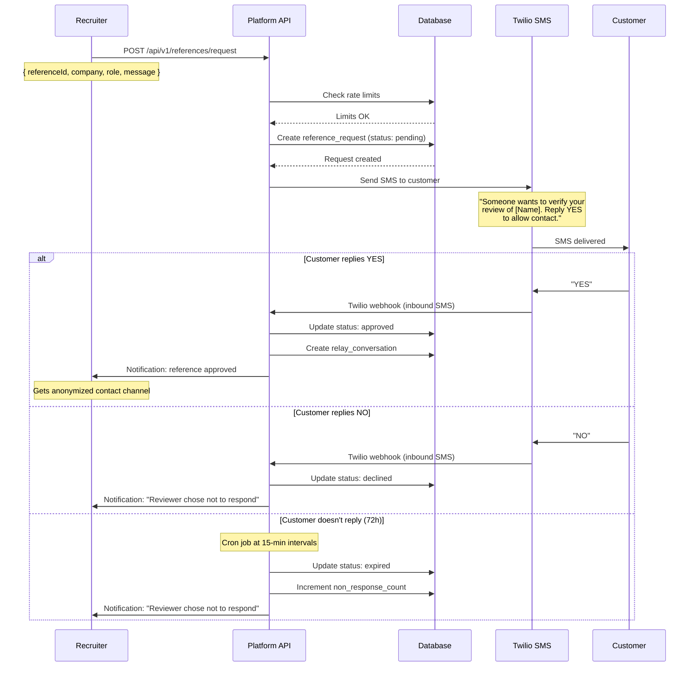
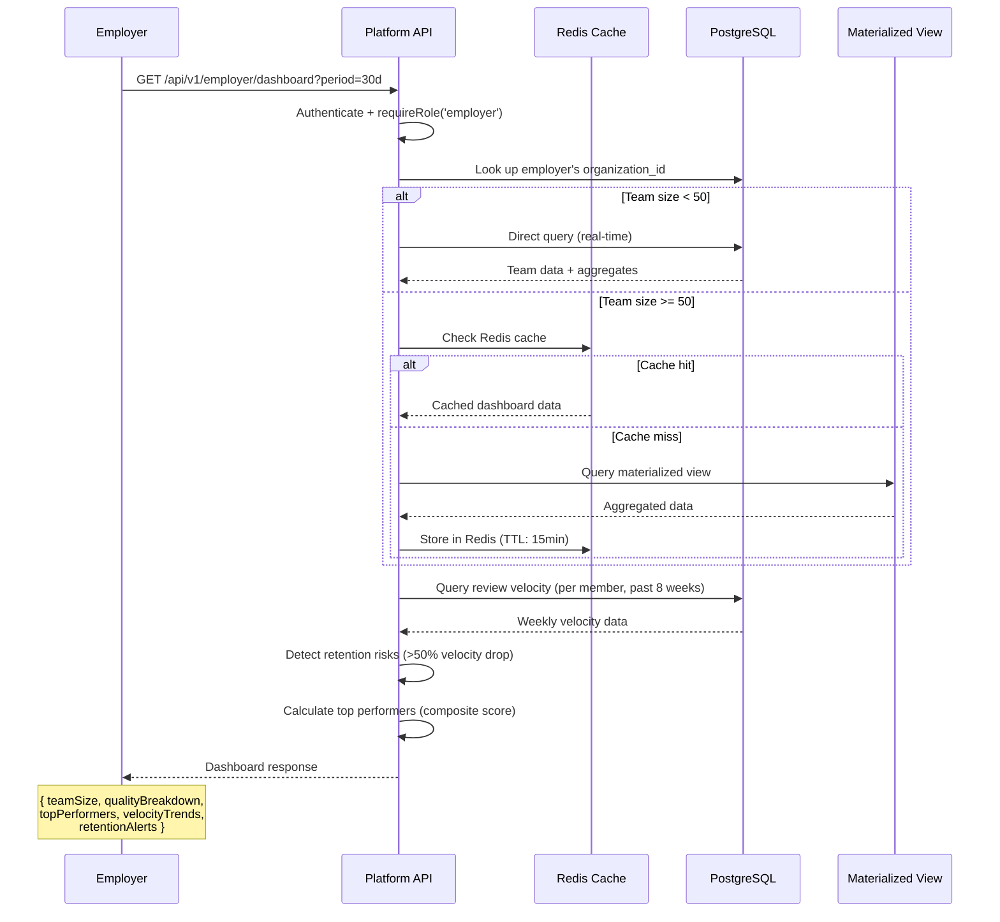
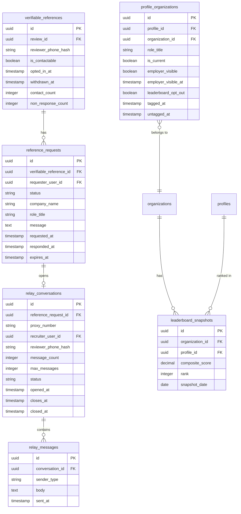

# Spec 13: Verifiable References Flow & Employer Dashboard

**Product:** Every Individual is a Brand -- Portable Individual Review App
**Author:** Muthukumaran Navaneethakrishnan
**Date:** 2026-04-14
**Status:** Part 2 (Employer Dashboard) frontend in dev — backend per-tab endpoints still partial; references-inbox approve/decline endpoints not yet exposed (see §20).
**PRD References:** PRD-07 (Verifiable References), PRD-05 (Monetization -- Employer Dashboard)
**Spec Dependencies:** Spec-02 (Database Schema), Spec-03 (API Endpoints), Spec-06 (QR Review & Anti-Fraud)

---

## 1. Scope

This spec covers two related features:

1. **Verifiable References Flow** -- the end-to-end lifecycle from customer opt-in after review submission, through recruiter verification requests, to privacy-preserving contact via anonymized relay.
2. **Employer Dashboard** -- team data aggregation, dashboard metrics, leaderboard, and access control for employer accounts.

Both features depend on the existing `verifiable_references`, `reference_requests`, and `profile_organizations` tables defined in Spec-02. This spec extends those schemas, defines new tables, details the service logic, and specifies unit tests.

---

## Part 1: Verifiable References Flow

---

### 2. Opt-In Flow (Customer Side)

#### 2.1 When It Happens

The opt-in prompt appears **after** the review submission endpoint (`POST /api/v1/reviews`) returns successfully. The review is fully committed before the customer sees the opt-in screen. The opt-in is a separate API call -- if the customer closes the browser after submitting the review, the review is saved but no opt-in is recorded.

#### 2.2 Opt-In Screen

After review submission, the frontend displays:

> **Would you vouch for [Name] to a future employer?**
>
> If you say yes, a potential employer may contact you through our platform to verify this review. Your phone number and personal details are never shared directly.
>
> [ Yes, I'd vouch for them ] [ No thanks ]

- `[Name]` is populated from the `profiles.display_name` of the individual being reviewed (passed in the review submission response).
- The individual's name is the only identifying information shown. No employer name, no organization context.
- The prompt must not be pre-checked, incentivized, or required.

#### 2.3 Opt-In Data Model

On "Yes", the system creates a row in `verifiable_references`:

| Field | Value |
|-------|-------|
| `id` | UUID v4 (generated) |
| `review_id` | The review just submitted |
| `reviewer_phone_hash` | SHA-256 of the customer's verified phone number (from `review_tokens.phone_hash`) |
| `is_contactable` | `true` |
| `opted_in_at` | `now()` |
| `withdrawn_at` | `null` |
| `contact_count` | `0` |
| `non_response_count` | `0` (new column -- see Section 2.5) |

On "No", nothing is stored. No record is created. The absence of a `verifiable_references` row for a review means the customer declined or was never asked.

#### 2.4 Opt-In Validation Rules

| Rule | Implementation |
|------|---------------|
| Review must exist | `WHERE id = :reviewId AND used_at IS NOT NULL` |
| Review must belong to the phone hash | `reviews.reviewer_phone_hash = :phoneHash` |
| No duplicate opt-in | `UNIQUE` constraint on `verifiable_references.review_id` rejects duplicates (409 response) |
| Only post-review | Opt-in endpoint requires valid `review_token_id` that has `used_at IS NOT NULL` |

#### 2.5 Schema Extension: `verifiable_references`

The existing schema from Spec-02 needs one additional column:

```sql
ALTER TABLE verifiable_references
  ADD COLUMN non_response_count INTEGER NOT NULL DEFAULT 0;
```

```typescript
// Addition to VerifiableReferenceAttributes
nonResponseCount: number;

// Addition to VerifiableReference.init()
nonResponseCount: {
  type: DataTypes.INTEGER,
  allowNull: false,
  defaultValue: 0,
  field: 'non_response_count',
},
```

---

### 3. Contact Request Flow (Recruiter Side)

#### 3.1 Profile View

The recruiter sees verifiable reference information on the individual's profile:

- **Badge count**: "X Verifiable References" displayed prominently.
- Each review with a verifiable reference shows a "Verifiable" badge.
- Badge states:
  - **Active (green)**: Customer is contactable and responsive.
  - **Greyed out**: Customer has 3+ non-responses (see Section 7).
  - **No badge**: Customer declined or withdrew.

#### 3.2 Verification Request Flow



#### 3.3 Request Status Flow

```
pending ──> approved ──> completed (conversation closed)
   │
   ├──> declined
   │
   └──> expired (72h timeout)
```

#### 3.4 Schema Extension: `reference_requests`

The existing `reference_requests` table from Spec-02 needs additional columns for the recruiter context and the `declined` status:

```sql
ALTER TABLE reference_requests
  ADD COLUMN company_name VARCHAR(200),
  ADD COLUMN role_title VARCHAR(200),
  ADD COLUMN message TEXT,
  ADD COLUMN expires_at TIMESTAMPTZ;

-- Update status enum to include 'declined'
-- (Sequelize validate update)
```

```typescript
// Updated ReferenceRequestAttributes
export interface ReferenceRequestAttributes {
  id: string;
  verifiableReferenceId: string;
  requesterUserId: string;
  status: 'pending' | 'approved' | 'declined' | 'completed' | 'expired';
  companyName: string | null;
  roleTitle: string | null;
  message: string | null;
  requestedAt: Date;
  respondedAt: Date | null;
  expiresAt: Date;    // requestedAt + 72 hours
}
```

---

### 4. Privacy-Preserving Contact

#### 4.1 Anonymized Relay

When a customer approves a verification request, the system creates a relay conversation. The recruiter **never** sees the customer's phone number, name, or any PII.

#### 4.2 New Table: `relay_conversations`

```sql
CREATE TABLE relay_conversations (
    id                  UUID PRIMARY KEY DEFAULT gen_random_uuid(),
    reference_request_id UUID NOT NULL REFERENCES reference_requests(id) ON DELETE CASCADE,
    proxy_number        VARCHAR(20) NOT NULL,      -- Twilio proxy number assigned
    recruiter_user_id   UUID NOT NULL REFERENCES users(id) ON DELETE CASCADE,
    reviewer_phone_hash VARCHAR(128) NOT NULL,
    message_count       INTEGER NOT NULL DEFAULT 0,
    max_messages        INTEGER NOT NULL DEFAULT 5,
    status              VARCHAR(20) NOT NULL DEFAULT 'active',  -- active, closed, expired
    opened_at           TIMESTAMPTZ NOT NULL DEFAULT now(),
    closes_at           TIMESTAMPTZ NOT NULL,       -- opened_at + 7 days
    closed_at           TIMESTAMPTZ
);

CREATE INDEX relay_conversations_reference_request_id_idx ON relay_conversations(reference_request_id);
CREATE INDEX relay_conversations_recruiter_user_id_idx ON relay_conversations(recruiter_user_id);
CREATE INDEX relay_conversations_status_idx ON relay_conversations(status);
CREATE UNIQUE INDEX relay_conversations_proxy_reviewer_idx ON relay_conversations(proxy_number, reviewer_phone_hash);
```

```typescript
export interface RelayConversationAttributes {
  id: string;
  referenceRequestId: string;
  proxyNumber: string;
  recruiterUserId: string;
  reviewerPhoneHash: string;
  messageCount: number;
  maxMessages: number;
  status: 'active' | 'closed' | 'expired';
  openedAt: Date;
  closesAt: Date;       // openedAt + 7 days
  closedAt: Date | null;
}

export class RelayConversation extends Model<RelayConversationAttributes> implements RelayConversationAttributes {
  declare id: string;
  declare referenceRequestId: string;
  declare proxyNumber: string;
  declare recruiterUserId: string;
  declare reviewerPhoneHash: string;
  declare messageCount: number;
  declare maxMessages: number;
  declare status: 'active' | 'closed' | 'expired';
  declare openedAt: Date;
  declare closesAt: Date;
  declare closedAt: Date | null;
}

export function initRelayConversationModel(sequelize: Sequelize): void {
  RelayConversation.init(
    {
      id: {
        type: DataTypes.UUID,
        primaryKey: true,
        defaultValue: DataTypes.UUIDV4,
      },
      referenceRequestId: {
        type: DataTypes.UUID,
        allowNull: false,
        references: { model: 'reference_requests', key: 'id' },
        onDelete: 'CASCADE',
        field: 'reference_request_id',
      },
      proxyNumber: {
        type: DataTypes.STRING(20),
        allowNull: false,
        field: 'proxy_number',
      },
      recruiterUserId: {
        type: DataTypes.UUID,
        allowNull: false,
        references: { model: 'users', key: 'id' },
        onDelete: 'CASCADE',
        field: 'recruiter_user_id',
      },
      reviewerPhoneHash: {
        type: DataTypes.STRING(128),
        allowNull: false,
        field: 'reviewer_phone_hash',
      },
      messageCount: {
        type: DataTypes.INTEGER,
        allowNull: false,
        defaultValue: 0,
        field: 'message_count',
      },
      maxMessages: {
        type: DataTypes.INTEGER,
        allowNull: false,
        defaultValue: 5,
        field: 'max_messages',
      },
      status: {
        type: DataTypes.STRING(20),
        allowNull: false,
        defaultValue: 'active',
        validate: { isIn: [['active', 'closed', 'expired']] },
      },
      openedAt: {
        type: DataTypes.DATE,
        allowNull: false,
        defaultValue: DataTypes.NOW,
        field: 'opened_at',
      },
      closesAt: {
        type: DataTypes.DATE,
        allowNull: false,
        field: 'closes_at',
      },
      closedAt: {
        type: DataTypes.DATE,
        allowNull: true,
        field: 'closed_at',
      },
    },
    {
      sequelize,
      tableName: 'relay_conversations',
      timestamps: false,
    },
  );
}
```

#### 4.3 New Table: `relay_messages`

```sql
CREATE TABLE relay_messages (
    id                  UUID PRIMARY KEY DEFAULT gen_random_uuid(),
    conversation_id     UUID NOT NULL REFERENCES relay_conversations(id) ON DELETE CASCADE,
    sender_type         VARCHAR(20) NOT NULL,     -- 'recruiter' or 'customer'
    body                TEXT NOT NULL,
    sent_at             TIMESTAMPTZ NOT NULL DEFAULT now()
);

CREATE INDEX relay_messages_conversation_id_idx ON relay_messages(conversation_id);
```

```typescript
export interface RelayMessageAttributes {
  id: string;
  conversationId: string;
  senderType: 'recruiter' | 'customer';
  body: string;
  sentAt: Date;
}

export class RelayMessage extends Model<RelayMessageAttributes> implements RelayMessageAttributes {
  declare id: string;
  declare conversationId: string;
  declare senderType: 'recruiter' | 'customer';
  declare body: string;
  declare sentAt: Date;
}

export function initRelayMessageModel(sequelize: Sequelize): void {
  RelayMessage.init(
    {
      id: {
        type: DataTypes.UUID,
        primaryKey: true,
        defaultValue: DataTypes.UUIDV4,
      },
      conversationId: {
        type: DataTypes.UUID,
        allowNull: false,
        references: { model: 'relay_conversations', key: 'id' },
        onDelete: 'CASCADE',
        field: 'conversation_id',
      },
      senderType: {
        type: DataTypes.STRING(20),
        allowNull: false,
        validate: { isIn: [['recruiter', 'customer']] },
        field: 'sender_type',
      },
      body: {
        type: DataTypes.TEXT,
        allowNull: false,
      },
      sentAt: {
        type: DataTypes.DATE,
        allowNull: false,
        defaultValue: DataTypes.NOW,
        field: 'sent_at',
      },
    },
    {
      sequelize,
      tableName: 'relay_messages',
      timestamps: false,
    },
  );
}
```

#### 4.4 Relay Rules

| Rule | Enforcement |
|------|-------------|
| Recruiter never sees customer phone | Proxy number used for all SMS. API responses never include `reviewer_phone_hash` or decrypted phone. |
| 5-message limit | `relay_conversations.message_count` incremented on each message. Rejects with 403 when `message_count >= max_messages`. |
| 7-day auto-close | Cron job checks `closes_at < now()` every 15 minutes. Sets `status = 'expired'`, `closed_at = now()`. |
| Customer identified as "Verified Customer #XXXX" | Anonymized identifier derived from `verifiable_references.id` (last 4 hex chars). |
| Conversation data retention | Deleted 90 days after `closed_at` (per PRD-07 data retention policy). |

#### 4.5 Twilio Proxy Implementation

```typescript
// relay.service.ts

interface RelayConfig {
  twilioAccountSid: string;
  twilioAuthToken: string;
  proxyServiceSid: string;     // Twilio Proxy Service SID
}

class RelayService {
  /**
   * Called when customer replies YES to a verification request.
   * Creates a Twilio Proxy session and relay_conversation record.
   */
  async openChannel(referenceRequestId: string): Promise<RelayConversation> {
    // 1. Look up reference_request + verifiable_reference + recruiter
    // 2. Create Twilio Proxy session with two participants:
    //    - Recruiter (identified by recruiter's phone from users table)
    //    - Customer (identified by phone looked up from reviewer_phone_hash)
    // 3. Twilio assigns a proxy number to each participant
    // 4. Create relay_conversations record with proxy_number, closes_at = now() + 7 days
    // 5. Update reference_request.status = 'approved', responded_at = now()
    // 6. Return conversation details (proxy number for recruiter, NO customer phone)
  }

  /**
   * Called on each inbound message via Twilio webhook.
   * Validates limits and forwards the message.
   */
  async relayMessage(conversationId: string, senderType: string, body: string): Promise<void> {
    // 1. Check conversation status is 'active'
    // 2. Check message_count < max_messages
    // 3. Insert relay_messages record
    // 4. Increment message_count
    // 5. Forward via Twilio Proxy (automatic with proxy sessions)
    // 6. If message_count === max_messages, auto-close conversation
  }

  /**
   * Cron: close expired conversations.
   */
  async closeExpiredConversations(): Promise<number> {
    // UPDATE relay_conversations
    // SET status = 'expired', closed_at = now()
    // WHERE status = 'active' AND closes_at < now()
    // Also: end Twilio Proxy sessions for closed conversations
  }
}
```

---

### 5. Withdrawal

#### 5.1 Withdrawal Mechanism

Every SMS sent to the customer includes a withdrawal link:

```
Don't want to be contacted? Tap here: https://{domain}/ref/withdraw/{withdrawToken}
```

The `withdrawToken` is a signed JWT (HS256, 1-year expiry) encoding `{ verifiableReferenceId }`.

#### 5.2 Withdrawal Effects

When a customer withdraws:

| Effect | Implementation |
|--------|---------------|
| Badge removed from review | `UPDATE verifiable_references SET is_contactable = false, withdrawn_at = now() WHERE id = :id` |
| Pending requests cancelled | `UPDATE reference_requests SET status = 'expired' WHERE verifiable_reference_id = :id AND status = 'pending'` |
| Active conversations closed | `UPDATE relay_conversations SET status = 'closed', closed_at = now() WHERE reference_request_id IN (SELECT id FROM reference_requests WHERE verifiable_reference_id = :id) AND status = 'active'` |
| Future requests blocked | `is_contactable = false` prevents new requests from being created |

#### 5.3 Withdrawal Is Permanent Per Review

Per PRD-07: withdrawal is permanent for that specific review. The customer cannot re-opt-in for the same review. They would need to leave a new review and opt in again.

---

### 6. Rate Limiting

| Limit | Value | Scope | Implementation |
|-------|-------|-------|---------------|
| Recruiter daily requests | 10 per day | Per `requester_user_id` | `COUNT(*) FROM reference_requests WHERE requester_user_id = :id AND requested_at > now() - interval '24 hours'` |
| Per review total requests | 3 lifetime | Per `verifiable_reference_id` | `COUNT(*) FROM reference_requests WHERE verifiable_reference_id = :id` |
| Customer monthly inbound | 5 per month | Per `reviewer_phone_hash` | `COUNT(*) FROM reference_requests rr JOIN verifiable_references vr ON rr.verifiable_reference_id = vr.id WHERE vr.reviewer_phone_hash = :hash AND rr.requested_at > now() - interval '30 days'` |

**Error responses:**

| Limit hit | Status | Error code |
|-----------|--------|------------|
| Recruiter daily | 429 | `RECRUITER_DAILY_LIMIT` |
| Per review total | 429 | `REVIEW_REQUEST_LIMIT` |
| Customer monthly | 429 | `CUSTOMER_MONTHLY_LIMIT` |

---

### 7. Unresponsive Tracking

#### 7.1 Non-Response Counting

When a verification request expires (72h with no reply), the `verifiable_references.non_response_count` is incremented.

#### 7.2 Badge Downgrade

| `non_response_count` | Badge state |
|---------------------|-------------|
| 0-2 | Active (green "Verifiable" badge) |
| 3+ | Greyed out ("Verifiable (unresponsive)" -- badge shown but greyed, tooltip: "This reviewer has not responded to recent verification requests") |

#### 7.3 Re-Activation

When a customer with `non_response_count >= 3` responds to a future request (YES or NO), the counter resets to 0 and the badge returns to active state.

```sql
-- On customer response (YES or NO):
UPDATE verifiable_references
SET non_response_count = 0
WHERE id = :verifiableReferenceId
  AND non_response_count >= 3;
```

---

### 8. API Endpoints (Reference Flow)

#### 8.1 POST `/api/v1/references/opt-in`

Existing endpoint from Spec-03. No changes to the contract. Validation additions:

```typescript
const optInSchema = z.object({
  reviewId: z.string().uuid(),
  reviewerPhoneHash: z.string().min(64).max(128),
});
```

**Controller logic:**

```typescript
async optIn(req: Request, res: Response): Promise<void> {
  const { reviewId, reviewerPhoneHash } = req.body;

  // 1. Verify review exists and reviewer_phone_hash matches
  const review = await Review.findOne({
    where: { id: reviewId, reviewerPhoneHash },
  });
  if (!review) throw new AppError(404, 'REVIEW_NOT_FOUND');

  // 2. Verify review has been submitted (review_token used_at is set)
  const token = await ReviewToken.findOne({
    where: { id: review.reviewTokenId, usedAt: { [Op.ne]: null } },
  });
  if (!token) throw new AppError(400, 'REVIEW_NOT_SUBMITTED');

  // 3. Create verifiable_reference (unique constraint handles duplicates)
  try {
    const ref = await VerifiableReference.create({
      reviewId,
      reviewerPhoneHash,
      isContactable: true,
      optedInAt: new Date(),
      nonResponseCount: 0,
    });
    res.status(201).json({
      referenceId: ref.id,
      reviewId: ref.reviewId,
      status: 'active',
      createdAt: ref.optedInAt,
    });
  } catch (err) {
    if (err.name === 'SequelizeUniqueConstraintError') {
      throw new AppError(409, 'ALREADY_OPTED_IN');
    }
    throw err;
  }
}
```

#### 8.2 POST `/api/v1/references/request`

Extended from Spec-03 with recruiter context fields:

```typescript
const requestReferenceSchema = z.object({
  referenceId: z.string().uuid(),
  companyName: z.string().max(200),
  roleTitle: z.string().max(200),
  message: z.string().max(300),
});
```

**Controller logic:**

```typescript
async request(req: Request, res: Response): Promise<void> {
  const { referenceId, companyName, roleTitle, message } = req.body;
  const recruiterId = req.user.id;

  // 1. Verify reference exists and is contactable
  const ref = await VerifiableReference.findOne({
    where: { id: referenceId, isContactable: true },
  });
  if (!ref) throw new AppError(404, 'REFERENCE_NOT_FOUND');

  // 2. Check rate limits
  const dailyCount = await ReferenceRequest.count({
    where: {
      requesterUserId: recruiterId,
      requestedAt: { [Op.gte]: new Date(Date.now() - 24 * 60 * 60 * 1000) },
    },
  });
  if (dailyCount >= 10) throw new AppError(429, 'RECRUITER_DAILY_LIMIT');

  const reviewLifetimeCount = await ReferenceRequest.count({
    where: { verifiableReferenceId: referenceId },
  });
  if (reviewLifetimeCount >= 3) throw new AppError(429, 'REVIEW_REQUEST_LIMIT');

  const customerMonthlyCount = await ReferenceRequest.count({
    where: {
      requestedAt: { [Op.gte]: new Date(Date.now() - 30 * 24 * 60 * 60 * 1000) },
    },
    include: [{
      model: VerifiableReference,
      where: { reviewerPhoneHash: ref.reviewerPhoneHash },
    }],
  });
  if (customerMonthlyCount >= 5) throw new AppError(429, 'CUSTOMER_MONTHLY_LIMIT');

  // 3. Create reference_request
  const expiresAt = new Date(Date.now() + 72 * 60 * 60 * 1000);
  const request = await ReferenceRequest.create({
    verifiableReferenceId: referenceId,
    requesterUserId: recruiterId,
    status: 'pending',
    companyName,
    roleTitle,
    message,
    requestedAt: new Date(),
    expiresAt,
  });

  // 4. Send SMS to customer
  // Look up the individual's display name from the review's profile
  const review = await Review.findByPk(ref.reviewId, {
    include: [{ model: Profile, attributes: ['displayName'] }],
  });
  const individualName = review?.Profile?.displayName ?? 'someone';

  await smsService.send(ref.reviewerPhoneHash, {
    body: `Someone wants to verify your review of ${individualName}. Reply YES to allow contact. Don't want to be contacted? Tap here: https://${domain}/ref/withdraw/${generateWithdrawToken(ref.id)}`,
  });

  // 5. Return request (without any customer PII)
  res.status(201).json({
    requestId: request.id,
    referenceId,
    status: 'pending',
    expiresAt,
  });
}
```

#### 8.3 POST `/api/v1/references/respond` (Twilio Webhook)

Handles inbound SMS replies from customers:

```typescript
// reference.routes.ts
referenceRouter.post(
  '/respond',
  validateBody(twilioWebhookSchema),
  controller.handleSmsResponse
);
```

```typescript
async handleSmsResponse(req: Request, res: Response): Promise<void> {
  const { From, Body } = req.body;  // Twilio webhook payload
  const phoneHash = sha256(normalizePhone(From));
  const responseText = Body.trim().toUpperCase();

  // Find the most recent pending request for this phone hash
  const pendingRequest = await ReferenceRequest.findOne({
    where: { status: 'pending' },
    include: [{
      model: VerifiableReference,
      where: { reviewerPhoneHash: phoneHash, isContactable: true },
    }],
    order: [['requestedAt', 'DESC']],
  });

  if (!pendingRequest) {
    res.status(200).send('<Response></Response>');  // Twilio expects TwiML
    return;
  }

  // Reset non-response counter on any response
  await VerifiableReference.update(
    { nonResponseCount: 0 },
    { where: { id: pendingRequest.verifiableReferenceId, nonResponseCount: { [Op.gte]: 3 } } }
  );

  if (responseText === 'YES') {
    pendingRequest.status = 'approved';
    pendingRequest.respondedAt = new Date();
    await pendingRequest.save();

    // Open anonymized relay channel
    const conversation = await relayService.openChannel(pendingRequest.id);

    // Notify recruiter
    await notificationService.notifyRecruiter(pendingRequest.requesterUserId, {
      type: 'reference_approved',
      requestId: pendingRequest.id,
      conversationId: conversation.id,
    });
  } else {
    // Treat any non-YES response as decline
    pendingRequest.status = 'declined';
    pendingRequest.respondedAt = new Date();
    await pendingRequest.save();

    // Notify recruiter (generic message, no detail)
    await notificationService.notifyRecruiter(pendingRequest.requesterUserId, {
      type: 'reference_declined',
      requestId: pendingRequest.id,
      message: 'The reviewer chose not to respond at this time.',
    });
  }

  res.status(200).send('<Response></Response>');
}
```

#### 8.4 DELETE `/api/v1/references/withdraw/:referenceId`

Existing endpoint from Spec-03. Extended controller logic:

```typescript
async withdraw(req: Request, res: Response): Promise<void> {
  const { referenceId } = req.params;

  const ref = await VerifiableReference.findByPk(referenceId);
  if (!ref) throw new AppError(404, 'REFERENCE_NOT_FOUND');
  if (!ref.isContactable) throw new AppError(400, 'ALREADY_WITHDRAWN');

  await sequelize.transaction(async (t) => {
    // 1. Mark reference as withdrawn
    await ref.update(
      { isContactable: false, withdrawnAt: new Date() },
      { transaction: t }
    );

    // 2. Cancel all pending requests
    await ReferenceRequest.update(
      { status: 'expired' },
      { where: { verifiableReferenceId: referenceId, status: 'pending' }, transaction: t }
    );

    // 3. Close active relay conversations
    const activeRequests = await ReferenceRequest.findAll({
      where: { verifiableReferenceId: referenceId },
      attributes: ['id'],
      transaction: t,
    });
    const requestIds = activeRequests.map(r => r.id);

    if (requestIds.length > 0) {
      await RelayConversation.update(
        { status: 'closed', closedAt: new Date() },
        { where: { referenceRequestId: requestIds, status: 'active' }, transaction: t }
      );
    }
  });

  res.status(200).json({ referenceId, status: 'withdrawn', withdrawnAt: ref.withdrawnAt });
}
```

#### 8.5 GET `/api/v1/references/withdraw/:withdrawToken` (Public)

Public endpoint for the one-tap withdrawal link in SMS messages:

```typescript
referenceRouter.get(
  '/withdraw/:withdrawToken',
  controller.handleWithdrawLink
);
```

Decodes the JWT, calls the same withdrawal logic as 8.4, and renders a confirmation page.

---

### 9. Cron Jobs (Reference Flow)

#### 9.1 Expire Pending Requests

Runs every 15 minutes.

```typescript
async expirePendingRequests(): Promise<number> {
  const [affectedCount, affectedRows] = await ReferenceRequest.update(
    { status: 'expired' },
    {
      where: {
        status: 'pending',
        expiresAt: { [Op.lt]: new Date() },
      },
      returning: true,
    }
  );

  // Increment non_response_count for each expired request
  for (const request of affectedRows) {
    await VerifiableReference.increment('nonResponseCount', {
      where: { id: request.verifiableReferenceId },
    });
  }

  return affectedCount;
}
```

#### 9.2 Close Expired Relay Conversations

Runs every 15 minutes.

```typescript
async closeExpiredConversations(): Promise<number> {
  const [affectedCount] = await RelayConversation.update(
    { status: 'expired', closedAt: new Date() },
    {
      where: {
        status: 'active',
        closesAt: { [Op.lt]: new Date() },
      },
    }
  );
  return affectedCount;
}
```

#### 9.3 Delete Expired Conversation Data

Runs daily. Deletes relay messages and conversation records 90 days after closure.

```typescript
async deleteExpiredConversationData(): Promise<number> {
  const cutoff = new Date(Date.now() - 90 * 24 * 60 * 60 * 1000);
  const expired = await RelayConversation.findAll({
    where: {
      status: { [Op.in]: ['closed', 'expired'] },
      closedAt: { [Op.lt]: cutoff },
    },
    attributes: ['id'],
  });

  const ids = expired.map(c => c.id);
  if (ids.length === 0) return 0;

  await RelayMessage.destroy({ where: { conversationId: ids } });
  const count = await RelayConversation.destroy({ where: { id: ids } });
  return count;
}
```

---

### 10. Unit Tests (Part 1: Verifiable References)

#### 10.1 Opt-In Tests

```typescript
describe('Reference Opt-In', () => {
  it('should create verifiable reference on valid opt-in', async () => {
    // Given: a submitted review with reviewer_phone_hash
    // When: POST /api/v1/references/opt-in { reviewId, reviewerPhoneHash }
    // Then: 201, verifiable_references row created with is_contactable=true
  });

  it('should reject duplicate opt-in for same review', async () => {
    // Given: an existing verifiable_reference for reviewId
    // When: POST /api/v1/references/opt-in with same reviewId
    // Then: 409 ALREADY_OPTED_IN
  });

  it('should reject opt-in if review does not exist', async () => {
    // Given: non-existent reviewId
    // When: POST /api/v1/references/opt-in
    // Then: 404 REVIEW_NOT_FOUND
  });

  it('should reject opt-in if review is not yet submitted', async () => {
    // Given: a review_token with used_at = null
    // When: POST /api/v1/references/opt-in
    // Then: 400 REVIEW_NOT_SUBMITTED
  });

  it('should reject opt-in if phone hash does not match review', async () => {
    // Given: valid reviewId but mismatched reviewerPhoneHash
    // When: POST /api/v1/references/opt-in
    // Then: 404 REVIEW_NOT_FOUND
  });
});
```

#### 10.2 Withdrawal Tests

```typescript
describe('Reference Withdrawal', () => {
  it('should withdraw reference and remove badge', async () => {
    // Given: an active verifiable_reference
    // When: DELETE /api/v1/references/withdraw/:referenceId
    // Then: 200, is_contactable=false, withdrawn_at set
  });

  it('should cancel pending requests on withdrawal', async () => {
    // Given: verifiable_reference with 2 pending reference_requests
    // When: withdraw
    // Then: both requests have status='expired'
  });

  it('should close active relay conversations on withdrawal', async () => {
    // Given: verifiable_reference with an active relay_conversation
    // When: withdraw
    // Then: conversation status='closed', closed_at set
  });

  it('should reject withdrawal for already-withdrawn reference', async () => {
    // Given: verifiable_reference with is_contactable=false
    // When: DELETE /api/v1/references/withdraw/:referenceId
    // Then: 400 ALREADY_WITHDRAWN
  });

  it('should handle withdraw link token correctly', async () => {
    // Given: valid JWT withdraw token
    // When: GET /api/v1/references/withdraw/:withdrawToken
    // Then: reference withdrawn, confirmation page rendered
  });
});
```

#### 10.3 Contact Request Tests

```typescript
describe('Reference Request', () => {
  it('should create pending request and send SMS', async () => {
    // Given: active verifiable_reference, authenticated recruiter
    // When: POST /api/v1/references/request { referenceId, companyName, roleTitle, message }
    // Then: 201, reference_request created with status='pending', SMS sent
  });

  it('should enforce recruiter daily limit (10/day)', async () => {
    // Given: recruiter has made 10 requests today
    // When: POST /api/v1/references/request
    // Then: 429 RECRUITER_DAILY_LIMIT
  });

  it('should enforce per-review lifetime limit (3 total)', async () => {
    // Given: reference has 3 total requests (any status)
    // When: POST /api/v1/references/request
    // Then: 429 REVIEW_REQUEST_LIMIT
  });

  it('should enforce customer monthly limit (5/month)', async () => {
    // Given: customer phone hash has 5 requests in past 30 days
    // When: POST /api/v1/references/request
    // Then: 429 CUSTOMER_MONTHLY_LIMIT
  });

  it('should expire request after 72 hours', async () => {
    // Given: pending request with expiresAt in the past
    // When: cron job runs expirePendingRequests()
    // Then: status='expired', non_response_count incremented
  });

  it('should reject request for withdrawn reference', async () => {
    // Given: verifiable_reference with is_contactable=false
    // When: POST /api/v1/references/request
    // Then: 404 REFERENCE_NOT_FOUND
  });
});
```

#### 10.4 Privacy Tests

```typescript
describe('Privacy Enforcement', () => {
  it('should never expose phone number in opt-in response', async () => {
    // When: POST /api/v1/references/opt-in
    // Then: response body does not contain reviewerPhoneHash or any phone-like string
  });

  it('should never expose phone number in request response', async () => {
    // When: POST /api/v1/references/request
    // Then: response body does not contain any customer PII
  });

  it('should never expose phone number in profile references endpoint', async () => {
    // When: GET /api/v1/references/profile/:profileId
    // Then: response contains only counts, no individual reference details
  });

  it('should use anonymized identifier in relay conversations', async () => {
    // Given: active relay conversation
    // When: recruiter views conversation
    // Then: customer identified as "Verified Customer #XXXX", not by name or phone
  });
});
```

#### 10.5 Relay Messaging Tests

```typescript
describe('Relay Messaging', () => {
  it('should deliver message through relay', async () => {
    // Given: active relay conversation
    // When: recruiter sends message via proxy number
    // Then: relay_messages record created, message_count incremented, customer receives SMS
  });

  it('should enforce 5-message limit', async () => {
    // Given: relay conversation with message_count=5
    // When: recruiter sends another message
    // Then: 403, message not delivered, conversation auto-closed
  });

  it('should auto-close conversation after 7 days', async () => {
    // Given: relay conversation with closes_at in the past
    // When: cron job runs closeExpiredConversations()
    // Then: status='expired', closed_at set
  });

  it('should delete conversation data after 90 days', async () => {
    // Given: closed conversation with closed_at 91 days ago
    // When: cron job runs deleteExpiredConversationData()
    // Then: relay_messages and relay_conversations rows deleted
  });
});
```

#### 10.6 Unresponsive Tracking Tests

```typescript
describe('Unresponsive Tracking', () => {
  it('should increment non_response_count on request expiry', async () => {
    // Given: pending request expires
    // When: cron job runs
    // Then: verifiable_reference.non_response_count += 1
  });

  it('should grey out badge after 3 non-responses', async () => {
    // Given: verifiable_reference with non_response_count=3
    // When: GET profile with references
    // Then: badge state is 'unresponsive' (greyed)
  });

  it('should re-activate badge on customer response', async () => {
    // Given: verifiable_reference with non_response_count=3
    // When: customer replies YES or NO to a new request
    // Then: non_response_count reset to 0, badge returns to active
  });
});
```

---

## Part 2: Employer Dashboard

---

### 11. Team Data Aggregation

#### 11.1 Consent Model

An individual must explicitly opt-in to employer visibility. The consent is stored on the `profile_organizations` table as a new column:

```sql
ALTER TABLE profile_organizations
  ADD COLUMN employer_visible BOOLEAN NOT NULL DEFAULT false,
  ADD COLUMN employer_visible_at TIMESTAMPTZ,
  ADD COLUMN leaderboard_opt_out BOOLEAN NOT NULL DEFAULT false;
```

```typescript
// Additions to ProfileOrganizationAttributes
employerVisible: boolean;
employerVisibleAt: Date | null;
leaderboardOptOut: boolean;

// Additions to ProfileOrganization.init()
employerVisible: {
  type: DataTypes.BOOLEAN,
  allowNull: false,
  defaultValue: false,
  field: 'employer_visible',
},
employerVisibleAt: {
  type: DataTypes.DATE,
  allowNull: true,
  field: 'employer_visible_at',
},
leaderboardOptOut: {
  type: DataTypes.BOOLEAN,
  allowNull: false,
  defaultValue: false,
  field: 'leaderboard_opt_out',
},
```

**Indexes:**

| Index Name | Columns | Type | Notes |
|------------|---------|------|-------|
| `profile_organizations_employer_visible_idx` | `organization_id, employer_visible` | B-TREE | Filter consented members per org |

**Consent rules:**
- Default is `false`. Individual must actively toggle it on.
- Changing is instant and reversible.
- When `employer_visible = false`, the employer cannot see this individual in their dashboard, team list, leaderboard, or any aggregate.
- When an individual untags an organization (`is_current = false`), `employer_visible` is automatically set to `false`.

#### 11.2 Team Query

The base query for all employer dashboard features filters by consent:

```sql
-- Base team query (used by all dashboard endpoints)
SELECT p.*, po.role_title, po.employer_visible, po.leaderboard_opt_out
FROM profiles p
JOIN profile_organizations po ON po.profile_id = p.id
WHERE po.organization_id = :organizationId
  AND po.is_current = true
  AND po.employer_visible = true;
```

---

### 12. Dashboard Metrics

#### 12.1 Metrics Summary

| Metric | Calculation | Source |
|--------|------------|--------|
| **Team size** | `COUNT(*)` of consented individuals | `profile_organizations WHERE employer_visible = true` |
| **Average quality scores** | Per quality: `SUM(quality_count) / team_size` | `profiles.{expertise,care,delivery,initiative,trust}_count` |
| **Total reviews** | `SUM(total_reviews)` across team | `profiles.total_reviews` |
| **Avg reviews per member** | `total_reviews / team_size` | Derived |
| **Top performers** | Ranked by composite score (see Section 13) | Derived |
| **Review velocity** | Reviews per individual per week over the selected period | `reviews.created_at` grouped by week |
| **Retention signals** | Individuals with >50% velocity drop over 4 weeks | Derived from velocity trend |

#### 12.2 Review Velocity Calculation

```sql
-- Weekly review velocity for a single individual over past 8 weeks
SELECT
  date_trunc('week', r.created_at) AS week,
  COUNT(*) AS review_count
FROM reviews r
WHERE r.profile_id = :profileId
  AND r.created_at >= now() - interval '8 weeks'
GROUP BY date_trunc('week', r.created_at)
ORDER BY week;
```

**Retention signal detection:**

```typescript
function detectRetentionRisk(weeklyVelocity: { week: Date; count: number }[]): boolean {
  if (weeklyVelocity.length < 4) return false;

  const recent2 = weeklyVelocity.slice(-2);
  const previous2 = weeklyVelocity.slice(-4, -2);

  const recentAvg = recent2.reduce((sum, w) => sum + w.count, 0) / 2;
  const previousAvg = previous2.reduce((sum, w) => sum + w.count, 0) / 2;

  if (previousAvg === 0) return false;

  const dropPercent = ((previousAvg - recentAvg) / previousAvg) * 100;
  return dropPercent > 50;
}
```

#### 12.3 Aggregation Strategy

| Team size | Strategy | Cache TTL |
|-----------|----------|-----------|
| < 50 members | Real-time query | No cache |
| 50-500 members | Redis cache | 15 minutes |
| 500+ members | Materialized view + Redis | View refreshed every 15 min, Redis 5 min |

**Materialized view (for large teams):**

```sql
CREATE MATERIALIZED VIEW employer_dashboard_cache AS
SELECT
  po.organization_id,
  COUNT(DISTINCT p.id) AS team_size,
  SUM(p.total_reviews) AS total_reviews,
  SUM(p.expertise_count) AS total_expertise,
  SUM(p.care_count) AS total_care,
  SUM(p.delivery_count) AS total_delivery,
  SUM(p.initiative_count) AS total_initiative,
  SUM(p.trust_count) AS total_trust,
  AVG(p.total_reviews) AS avg_reviews_per_member
FROM profiles p
JOIN profile_organizations po ON po.profile_id = p.id
WHERE po.is_current = true
  AND po.employer_visible = true
GROUP BY po.organization_id;

CREATE UNIQUE INDEX employer_dashboard_cache_org_idx ON employer_dashboard_cache(organization_id);
```

**Refresh cron (every 15 minutes):**

```sql
REFRESH MATERIALIZED VIEW CONCURRENTLY employer_dashboard_cache;
```

#### 12.4 Multi-Location Aggregation

Employers with multiple locations see data grouped by `organization_id`. The employer user is linked to an organization via `users.id` -> `profile_organizations.organization_id` (through an employer-org mapping).

```sql
-- Multi-location roll-up
SELECT
  o.id AS organization_id,
  o.name AS location_name,
  o.location,
  COUNT(DISTINCT p.id) AS team_size,
  SUM(p.total_reviews) AS total_reviews,
  AVG(p.expertise_count) AS avg_expertise,
  AVG(p.care_count) AS avg_care,
  AVG(p.delivery_count) AS avg_delivery,
  AVG(p.initiative_count) AS avg_initiative,
  AVG(p.trust_count) AS avg_trust
FROM organizations o
JOIN profile_organizations po ON po.organization_id = o.id
JOIN profiles p ON p.id = po.profile_id
WHERE o.id IN (:employerOrgIds)
  AND po.is_current = true
  AND po.employer_visible = true
GROUP BY o.id, o.name, o.location;
```

---

### 13. Leaderboard

#### 13.1 Composite Score

```
composite_score = (total_reviews_normalized * 0.40)
                + (top_quality_percentage * 0.30)
                + (verified_rate * 0.30)
```

| Component | Calculation |
|-----------|------------|
| `total_reviews_normalized` | `min(individual.total_reviews / max(team.total_reviews), 1.0)` -- normalized to 0-1 within the team |
| `top_quality_percentage` | `max(quality_counts) / total_reviews` -- what percentage of reviews tagged the individual's strongest quality |
| `verified_rate` | `COUNT(verifiable_references WHERE is_contactable=true) / total_reviews` -- percentage of reviews that are verifiable |

#### 13.2 Leaderboard Query

```sql
WITH team_max AS (
  SELECT MAX(p.total_reviews) AS max_reviews
  FROM profiles p
  JOIN profile_organizations po ON po.profile_id = p.id
  WHERE po.organization_id = :orgId
    AND po.is_current = true
    AND po.employer_visible = true
),
team_scores AS (
  SELECT
    p.id AS profile_id,
    p.display_name,
    p.total_reviews,
    po.leaderboard_opt_out,
    -- total_reviews_normalized (40%)
    CASE WHEN tm.max_reviews > 0
      THEN LEAST(p.total_reviews::float / tm.max_reviews, 1.0) * 0.40
      ELSE 0
    END AS reviews_component,
    -- top_quality_percentage (30%)
    CASE WHEN p.total_reviews > 0
      THEN GREATEST(p.expertise_count, p.care_count, p.delivery_count, p.initiative_count, p.trust_count)::float
           / p.total_reviews * 0.30
      ELSE 0
    END AS quality_component,
    -- verified_rate (30%)
    CASE WHEN p.total_reviews > 0
      THEN (SELECT COUNT(*)::float FROM verifiable_references vr
            JOIN reviews r ON r.id = vr.review_id
            WHERE r.profile_id = p.id AND vr.is_contactable = true)
           / p.total_reviews * 0.30
      ELSE 0
    END AS verified_component
  FROM profiles p
  JOIN profile_organizations po ON po.profile_id = p.id
  CROSS JOIN team_max tm
  WHERE po.organization_id = :orgId
    AND po.is_current = true
    AND po.employer_visible = true
)
SELECT
  profile_id,
  display_name,
  total_reviews,
  leaderboard_opt_out,
  (reviews_component + quality_component + verified_component) AS composite_score,
  CASE WHEN leaderboard_opt_out THEN NULL
       ELSE RANK() OVER (
         PARTITION BY (NOT leaderboard_opt_out)
         ORDER BY (reviews_component + quality_component + verified_component) DESC
       )
  END AS rank
FROM team_scores
ORDER BY composite_score DESC;
```

#### 13.3 Leaderboard Refresh

Updated daily via cron. Stored in a `leaderboard_snapshots` table for historical comparison:

```sql
CREATE TABLE leaderboard_snapshots (
    id              UUID PRIMARY KEY DEFAULT gen_random_uuid(),
    organization_id UUID NOT NULL REFERENCES organizations(id) ON DELETE CASCADE,
    profile_id      UUID NOT NULL REFERENCES profiles(id) ON DELETE CASCADE,
    composite_score DECIMAL(5, 4) NOT NULL,
    rank            INTEGER,                    -- NULL if opted out
    snapshot_date   DATE NOT NULL DEFAULT CURRENT_DATE,
    UNIQUE (organization_id, profile_id, snapshot_date)
);

CREATE INDEX leaderboard_snapshots_org_date_idx ON leaderboard_snapshots(organization_id, snapshot_date);
```

---

### 14. Access Control (Employer)

#### 14.1 What Employers CAN Do

| Action | Endpoint | Constraint |
|--------|----------|------------|
| View team dashboard | `GET /api/v1/employer/dashboard` | Only consented individuals in their org |
| View team list | `GET /api/v1/employer/team` | Only consented individuals |
| View individual detail | `GET /api/v1/employer/team/:profileId` | Only if `employer_visible = true` for that profile-org link |
| View leaderboard | `GET /api/v1/employer/leaderboard` | Only consented, non-opted-out individuals ranked |
| View multi-location roll-up | `GET /api/v1/employer/dashboard?groupBy=location` | Only their own org IDs |

#### 14.2 What Employers CANNOT Do

| Restriction | Enforcement |
|------------|-------------|
| Cannot see reviews for non-consented individuals | `WHERE employer_visible = true` on all queries |
| Cannot edit, hide, or dispute any reviews | No write endpoints for review data in employer module |
| Cannot take reviews if individual leaves | When `is_current` becomes false, `employer_visible` auto-resets to false. Reviews remain on the individual's profile. |
| Cannot see reviewer identity | Reviewer data is always anonymized. `reviewer_phone_hash` never included in employer API responses. |
| Cannot access other org's team | `WHERE organization_id = :employerOrgId` enforced at service layer + `requireResourceOwnership` middleware |

---

### 15. Employer Dashboard Data Flow



---

### 16. API Endpoints (Employer Dashboard)

#### 16.1 GET `/api/v1/employer/dashboard`

Existing endpoint from Spec-03. Extended response to include all metrics defined in Section 12.

**Response structure (extended):**

```typescript
interface DashboardResponse {
  organizationId: string;
  organizationName: string;
  teamSize: number;
  period: '7d' | '30d' | '90d' | '12m';
  aggregateQualityBreakdown: {
    expertise: number;    // average across team
    care: number;
    delivery: number;
    initiative: number;
    trust: number;
  };
  totalReviews: number;
  avgReviewsPerMember: number;
  topPerformers: Array<{
    profileId: string;
    name: string;
    reviewCount: number;
    compositeScore: number;
    dominantQuality: string;
  }>;
  qualityTrend: Array<{
    date: string;
    expertise: number;
    care: number;
    delivery: number;
    initiative: number;
    trust: number;
  }>;
  retentionAlerts: Array<{
    profileId: string;
    name: string;
    signal: 'velocity_drop';
    detail: string;       // e.g., "Review velocity dropped 62% over past 4 weeks"
    currentVelocity: number;
    previousVelocity: number;
    dropPercent: number;
  }>;
  reviewVelocity: {
    current: number;      // reviews per member per week (current 2 weeks)
    previous: number;     // reviews per member per week (previous 2 weeks)
    changePercent: number;
  };
}
```

#### 16.2 GET `/api/v1/employer/leaderboard` (New)

```typescript
// employer.routes.ts
employerRouter.get(
  '/leaderboard',
  validateQuery(leaderboardQuerySchema),
  controller.getLeaderboard
);
```

| Attribute | Value |
|-----------|-------|
| **Auth** | `authenticate` + `requireRole(['employer'])` |
| **Middleware** | `validateQuery(leaderboardQuerySchema)` -> `controller.getLeaderboard` |
| **Rate Limit** | Standard API rate limit |

**Query Parameters:**

```typescript
const leaderboardQuerySchema = z.object({
  limit: z.coerce.number().int().min(1).max(100).default(25),
  includeOptedOut: z.coerce.boolean().default(false),  // Show opted-out members (unranked)
});
```

**Response:**

```typescript
interface LeaderboardResponse {
  organizationId: string;
  updatedAt: string;    // Last snapshot date
  entries: Array<{
    profileId: string;
    name: string;
    rank: number | null;      // null if leaderboard_opt_out
    compositeScore: number;
    totalReviews: number;
    topQualityPercentage: number;
    verifiedRate: number;
    isOptedOut: boolean;
  }>;
}
```

| Status | Body |
|--------|------|
| 200 | Leaderboard entries |
| 401 | `{ error: 'UNAUTHORIZED' }` |
| 403 | `{ error: 'SUBSCRIPTION_REQUIRED' }` |

#### 16.3 PATCH `/api/v1/profiles/organizations/:profileOrgId/employer-visibility` (New)

Individual toggles employer visibility for a specific organization.

```typescript
// profile.routes.ts (individual-facing)
profileRouter.patch(
  '/organizations/:profileOrgId/employer-visibility',
  authenticate,
  requireRole(['individual']),
  validateParams(profileOrgIdParamSchema),
  requireResourceOwnership({ resourceType: 'profile_organization' }),
  validateBody(employerVisibilitySchema),
  auditLog('employer_visibility_changed', 'profile_organization'),
  controller.updateEmployerVisibility
);
```

```typescript
const employerVisibilitySchema = z.object({
  employerVisible: z.boolean(),
});
```

| Status | Body |
|--------|------|
| 200 | `{ profileOrgId, employerVisible, updatedAt }` |
| 403 | `{ error: 'NOT_YOUR_PROFILE_ORG' }` |
| 404 | `{ error: 'PROFILE_ORG_NOT_FOUND' }` |

#### 16.4 PATCH `/api/v1/profiles/organizations/:profileOrgId/leaderboard-opt-out` (New)

Individual toggles leaderboard opt-out for a specific organization.

```typescript
profileRouter.patch(
  '/organizations/:profileOrgId/leaderboard-opt-out',
  authenticate,
  requireRole(['individual']),
  validateParams(profileOrgIdParamSchema),
  requireResourceOwnership({ resourceType: 'profile_organization' }),
  validateBody(leaderboardOptOutSchema),
  auditLog('leaderboard_opt_out_changed', 'profile_organization'),
  controller.updateLeaderboardOptOut
);
```

```typescript
const leaderboardOptOutSchema = z.object({
  leaderboardOptOut: z.boolean(),
});
```

| Status | Body |
|--------|------|
| 200 | `{ profileOrgId, leaderboardOptOut, updatedAt }` |
| 403 | `{ error: 'NOT_YOUR_PROFILE_ORG' }` |
| 404 | `{ error: 'PROFILE_ORG_NOT_FOUND' }` |

---

### 17. Unit Tests (Part 2: Employer Dashboard)

#### 17.1 Dashboard Aggregate Tests

```typescript
describe('Employer Dashboard', () => {
  it('should return correct aggregate calculation for team of 5', async () => {
    // Given: 5 consented individuals with known quality counts and review totals
    // When: GET /api/v1/employer/dashboard
    // Then: teamSize=5, aggregateQualityBreakdown averages are correct,
    //       totalReviews = sum of all, avgReviewsPerMember = totalReviews / 5
  });

  it('should return zeros for empty team', async () => {
    // Given: employer with no consented individuals
    // When: GET /api/v1/employer/dashboard
    // Then: teamSize=0, all quality averages=0, totalReviews=0, avgReviewsPerMember=0,
    //       topPerformers=[], retentionAlerts=[]
  });

  it('should use cached data for large teams (50+ members)', async () => {
    // Given: org with 60 consented members, Redis cache populated
    // When: GET /api/v1/employer/dashboard
    // Then: response served from cache, no direct DB query for aggregates
  });
});
```

#### 17.2 Top Performers Tests

```typescript
describe('Top Performers', () => {
  it('should rank by composite score correctly', async () => {
    // Given: 3 individuals with known total_reviews, top_quality_percentage, verified_rate
    // Individual A: 20 reviews, 60% top quality, 50% verified → score
    // Individual B: 10 reviews, 80% top quality, 30% verified → score
    // Individual C: 15 reviews, 40% top quality, 70% verified → score
    // When: GET /api/v1/employer/dashboard
    // Then: topPerformers ordered by composite_score descending
    //       with correct 40/30/30 weighting
  });

  it('should normalize total_reviews against team maximum', async () => {
    // Given: team max reviews = 50, individual has 25 reviews
    // Then: total_reviews_normalized = 0.5
  });
});
```

#### 17.3 Retention Signal Tests

```typescript
describe('Retention Signals', () => {
  it('should detect velocity drop exceeding 50%', async () => {
    // Given: individual with weekly velocity [8, 7, 3, 2] over 4 weeks
    // previous 2-week avg = 7.5, recent 2-week avg = 2.5
    // Drop = 66.7% > 50%
    // When: dashboard calculates retention signals
    // Then: retentionAlerts includes this individual with dropPercent=66.7
  });

  it('should not flag velocity drop below 50%', async () => {
    // Given: individual with weekly velocity [8, 7, 6, 5] over 4 weeks
    // previous avg = 7.5, recent avg = 5.5 → 26.7% drop
    // Then: no retention alert
  });

  it('should not flag individuals with fewer than 4 weeks of data', async () => {
    // Given: new individual with only 2 weeks of review data
    // Then: no retention alert regardless of velocity pattern
  });
});
```

#### 17.4 Consent Tests

```typescript
describe('Employer Consent', () => {
  it('should exclude non-consented individuals from dashboard', async () => {
    // Given: org with 3 individuals, only 2 have employer_visible=true
    // When: GET /api/v1/employer/dashboard
    // Then: teamSize=2, aggregates computed over 2 individuals only
  });

  it('should remove individual from dashboard when consent revoked', async () => {
    // Given: individual with employer_visible=true in dashboard
    // When: PATCH /api/v1/profiles/organizations/:id/employer-visibility { employerVisible: false }
    // Then: subsequent GET /api/v1/employer/dashboard excludes this individual
  });

  it('should auto-revoke employer visibility when individual untags org', async () => {
    // Given: individual with employer_visible=true
    // When: individual untags the organization (is_current becomes false)
    // Then: employer_visible automatically set to false
  });

  it('should not allow employer to see individual detail without consent', async () => {
    // Given: individual with employer_visible=false
    // When: GET /api/v1/employer/team/:profileId
    // Then: 403 EMPLOYEE_NOT_CONSENTED
  });
});
```

#### 17.5 Multi-Location Tests

```typescript
describe('Multi-Location Aggregation', () => {
  it('should aggregate correctly per location', async () => {
    // Given: employer with 2 locations
    //   Location A: 3 consented individuals, 30 total reviews
    //   Location B: 2 consented individuals, 20 total reviews
    // When: GET /api/v1/employer/dashboard?groupBy=location
    // Then: response contains 2 location groups with correct team_size and totals
  });

  it('should only include locations belonging to employer', async () => {
    // Given: employer owns org A and org B, org C belongs to someone else
    // When: GET /api/v1/employer/dashboard?groupBy=location
    // Then: only org A and org B appear, org C excluded
  });
});
```

#### 17.6 Leaderboard Tests

```typescript
describe('Leaderboard', () => {
  it('should respect leaderboard opt-out', async () => {
    // Given: 5 individuals, 1 has leaderboard_opt_out=true
    // When: GET /api/v1/employer/leaderboard
    // Then: opted-out individual has rank=null, isOptedOut=true
    //       remaining 4 are ranked 1-4
  });

  it('should not include opted-out in ranking calculation', async () => {
    // Given: opted-out individual would be #1 by composite score
    // When: GET /api/v1/employer/leaderboard
    // Then: next highest individual is ranked #1
  });

  it('should include opted-out members when includeOptedOut=true', async () => {
    // Given: 5 individuals, 1 opted out
    // When: GET /api/v1/employer/leaderboard?includeOptedOut=true
    // Then: all 5 returned, opted-out has rank=null
  });

  it('should exclude opted-out members when includeOptedOut=false', async () => {
    // Given: 5 individuals, 1 opted out
    // When: GET /api/v1/employer/leaderboard?includeOptedOut=false
    // Then: only 4 returned
  });
});
```

#### 17.7 Access Control Tests

```typescript
describe('Employer Access Control', () => {
  it('should only show employer their own org team', async () => {
    // Given: employer A owns org X, employer B owns org Y
    // When: employer A calls GET /api/v1/employer/team
    // Then: only org X members returned
  });

  it('should reject non-employer role', async () => {
    // Given: authenticated user with role='individual'
    // When: GET /api/v1/employer/dashboard
    // Then: 403 FORBIDDEN
  });

  it('should reject employer without active subscription', async () => {
    // Given: employer with expired subscription
    // When: GET /api/v1/employer/dashboard
    // Then: 403 SUBSCRIPTION_REQUIRED
  });

  it('should never include reviewer identity in employer responses', async () => {
    // When: GET /api/v1/employer/team/:profileId
    // Then: recentReviews contain review content but no reviewer_phone_hash,
    //       no reviewer name, no reviewer contact info
  });
});
```

---

### 18. Migration Plan

| Order | Migration File | Description |
|-------|---------------|-------------|
| 1 | `20260414-0013-add-non-response-count-to-verifiable-references.ts` | Add `non_response_count` column to `verifiable_references` |
| 2 | `20260414-0014-extend-reference-requests.ts` | Add `company_name`, `role_title`, `message`, `expires_at` columns; add `declined` to status enum |
| 3 | `20260414-0015-create-relay-conversations.ts` | Create `relay_conversations` table with indexes |
| 4 | `20260414-0016-create-relay-messages.ts` | Create `relay_messages` table with indexes |
| 5 | `20260414-0017-add-employer-visibility-to-profile-organizations.ts` | Add `employer_visible`, `employer_visible_at`, `leaderboard_opt_out` columns |
| 6 | `20260414-0018-create-leaderboard-snapshots.ts` | Create `leaderboard_snapshots` table with indexes |
| 7 | `20260414-0019-create-employer-dashboard-materialized-view.ts` | Create `employer_dashboard_cache` materialized view |

---

### 20. Frontend UX (Employer Dashboard)

Implemented in `apps/ui/src/pages/EmployerPage.tsx`. Allowed roles: `EMPLOYER`, `ADMIN`. Other roles get a client-side redirect to `/dashboard`.

#### 20.1 Layout

```
┌─ NavBar ────────────────────────────────────────────────┐
├─ "Employer dashboard"   <organizationName from API>      │
├─ Tabs: [References inbox] [Team reviews] [Organization]  │
│        (References inbox is the default)                 │
├─ Tab body                                                │
│   ├─ References inbox                                    │
│   │   • Amber notice: "Employer-side approve/decline of  │
│   │     verifiable references is not yet exposed by the  │
│   │     API. This tab surfaces team retention signals." │
│   │   • List of retention alerts with disabled           │
│   │     Approve/Decline buttons (testids stable for the  │
│   │     day the API ships).                              │
│   ├─ Team reviews                                        │
│   │   • Table of consented team members from             │
│   │     GET /api/v1/employer/team                        │
│   ├─ Organization                                        │
│   │   • Stat cards (team size, total reviews, avg/member,│
│   │     velocity Δ) + quality breakdown + top performers │
│   │     from GET /api/v1/employer/dashboard              │
└──────────────────────────────────────────────────────────┘
```

#### 20.2 API surface used

| Endpoint | Tab | Notes |
|---|---|---|
| `GET /api/v1/employer/dashboard` | Organization (and header) | Eager — fetched on mount so the header can show `organizationName`. |
| `GET /api/v1/employer/team?limit=50` | Team reviews | Lazy — `enabled: tab === 'team'`. |
| `GET /api/v1/employer/team/retention` | References inbox | Lazy — `enabled: tab === 'references'`. |

All GETs go through React Query (5-min stale window inherited from `App.tsx`'s `QueryClient`). Mutations are not wired today — there is no employer-side approve/decline endpoint yet.

#### 20.3 testid map

| testid | Element |
|---|---|
| `employer-root` | Page root `<div>` |
| `employer-tab-references` | "References inbox" tab button |
| `employer-tab-team` | "Team reviews" tab button |
| `employer-tab-org` | "Organization" tab button |
| `employer-references` | References tab body container |
| `employer-team` | Team tab body container |
| `employer-org` | Organization tab body container |
| `employer-reference-row` | One retention-alert row |
| `employer-approve-ref-btn` | Approve button (disabled — API gap) |
| `employer-decline-ref-btn` | Decline button (disabled — API gap) |
| `employer-team-review-row` | One team-member row |

#### 20.4 API gaps (logged, not invented)

- **Employer references inbox.** The recruiter-driven flow in §3 has no employer-side counterpart. The dashboard cannot list pending verifiable references for "my org" or approve/decline them. Add `GET /api/v1/employer/references` + `POST /:id/approve|decline` to ship this tab properly.
- **Per-employee review feed.** §16 promises team aggregates but no per-employee review timeline. The "Team reviews" tab currently lists members only; clicking through to a member's reviews is gated on `GET /api/v1/employer/team/:profileId` returning `recentReviews`.

Regression coverage lives in `apps/regression/src/flows/08-employer.spec.ts` (dashboard project in `playwright.config.ts`).

---

### 21. ER Diagram (New Tables)


